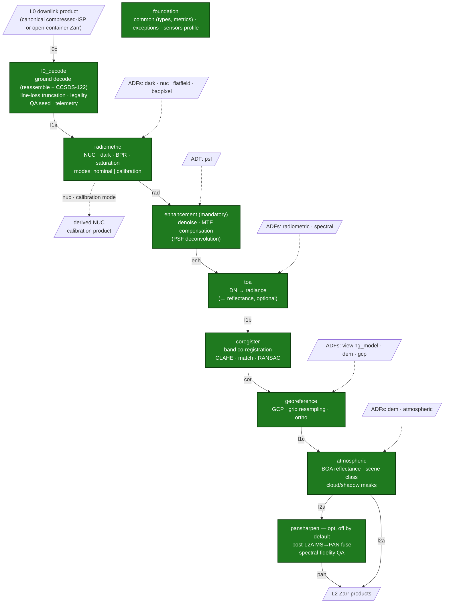
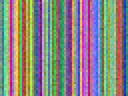

<!--
  Copyright 2026 ESA

  Licensed under the Apache License, Version 2.0 (the "License");
  you may not use this file except in compliance with the License.
  You may obtain a copy of the License at

    http://www.apache.org/licenses/LICENSE-2.0

  Unless required by applicable law or agreed to in writing, software
  distributed under the License is distributed on an "AS IS" BASIS,
  WITHOUT WARRANTIES OR CONDITIONS OF ANY KIND, either express or implied.
  See the License for the specific language governing permissions and
  limitations under the License.
-->

# msi-processor

This repository contains the **msi-processor** project: a generic high-resolution
pushbroom multispectral imager (MSI) ground-segment data processor that turns downlinked
raw (Level-0) instrument data into calibrated, geophysically usable products up to Level 2.
It is built on the ESA EOPF Core Python Modules (CPM, `eopf == 2.8.1`, Zarr output) and
developed under an ECSS-E-ST-40C Rev.1 (software criticality Category C),
documentation-first software lifecycle.

## Processing chain & status

End-to-end L0 → L2 processing chain — all units implemented (CI-green). 🟢

Each unit is an EOPF `EOProcessingUnit`: it consumes the previous unit's product under a
named **input key**, takes its Auxiliary Data Files (**ADFs**) as run inputs, and emits its
product under a named **output key** (the edge labels below). All units run in the
**`nominal`** mode; `radiometric` additionally offers a **`calibration`** mode (derive the
NUC from `dark` + `flatfield` acquisitions and emit it as a calibration product), and
`pansharpen` is **off by default** (CR-4).



`l0_decode` and `coregister` consume no ADFs; `toa`'s `spectral` ADF is required only when
reflectance is emitted; `georeference`'s `gcp` and `radiometric`'s `badpixel` are optional.

**Implemented (CI-green):** the foundation (common types/metrics, exception hierarchy, sensor
profile) and all eight processing units — `l0_decode` (Level-0 → L1A: bit-exact ground decode of the
canonical compressed-ISP form, line-loss truncation, legality, QA seeding, telemetry pass-through), `radiometric` (NUC / dark / BPR / saturation),
`enhancement` (MTF compensation / PSF deconvolution + configurable denoise), `toa`
(DN → radiance → reflectance), `coregister` (SIFT + homography), `georeference` (GCP refinement +
cartographic-grid resampling) and `atmospheric` (6S TOA → BOA inversion + spectral-threshold scene
classification with cloud / cloud-shadow masks) — the **L0c → L2A** chain — plus the optional,
default-off `pansharpen` (**post-L2A** MS↔PAN fusion with per-band spectral-fidelity QA — runs after
atmospheric correction, not at L1C) terminal derivative — each with synthetic unit tests. The
sensor-private Level-0 source-packet decode body for non-documented on-wire forms (the public
paths are the canonical compressed-ISP L0 — ground-decoded bit-exactly — and the open-container
layout), the rigorous viewing-model / DEM orthorectification, the
radiative-transfer engine that builds the atmospheric LUT, image-based atmospheric-parameter
retrieval and the component-substitution fusion methods (Brovey / GS / IHS / à-trous; only
simple-mean is operational) are private `[impl]` interfaces.

**ECSS lifecycle:** SRR ✅ · PDR ✅ · CDR ✅ · QR ✅ · AR ⬜ — see `compliance/` for the
baselined document set (SDP, SRS, SDD, ICD, DPM, ATBD, V&V Plan, traceability matrix, …). The
QR data package (SVR, SUITR, SRN, CIDL, SCF + the QR review report) concluded **pass with
actions** — the Tier-C numeric performance budgets are validated on operator data at AR.

## Results — real L0→L1B run

Output of the real **L0→L1B** end-to-end run (`l0_decode → radiometric → enhancement → toa`,
`eopf==2.8.1`, `nominal` mode): a persisted **L1B TOA-reflectance** EOPF product, produced from
the **Sentinel-2 MSI Synthetic Raw Data Generator**'s open-container L0 + cal-DB ADFs
(inputs from the shared `ipf/data-store`). Full analysis on the docs site: *Results* page.



RGB = B04/B03/B02, per-channel percentile stretch. The demo scene is a flat field, so the
stretch reveals the residual PRNU striping + noise texture rather than a landscape.

Per-band statistics of the produced product (the pipeline's `stats` phase — the
non-referential ALG-QA metrics of `msi_processor/common/metrics.py`):

| Band | mean (refl.) | std | variance | SNR (dB) |
|---|---|---|---|---|
| B02 | 0.1753 | 0.0053 | 0.000029 | 30.3 |
| B03 | 0.1888 | 0.0066 | 0.000044 | 29.1 |
| B04 | 0.1911 | 0.0070 | 0.000049 | 28.7 |
| B08 | 0.2648 | 0.0094 | 0.000089 | 29.0 |
| B11 | 0.0434 | 0.0017 | 0.000003 | 28.3 |
| B12 | 0.0535 | 0.0019 | 0.000004 | 28.8 |

Reading them: the reflectance means are the levels impressed by the generator's flat-field
scene — the absolute radiometric scale survives the full DN → radiance → reflectance chain;
on a flat field the std *is* the residual instrument texture, so SNR ranks the bands by their
noise model + PRNU amplitude. The **referential** accuracy figures (RMSE vs a calibrated
reference — `RAD_ACC`, `GEO_CE90`/`BAND_COREG`, `BOA_ACC`) are AR-gated and validated on
operator data (V&V report). A second E2E result — the real-L1A **bit-identity** run through `l0_decode`
(L1A′ ≡ L1A, 13/13 bands) — is documented in the generator's validation pages.

Reproduce with the manual **`pipeline-nominal`** CI job, or locally:
`python scripts/run_pipeline.py <store>` — the repository's single driver (phases
`fetch-store → l0-decode → radiometric → enhancement → toa → stats → report`; inputs pulled
from the shared `ipf/data-store` registry).
`--mode calibration` runs the radiometric **calibration mode** instead: it derives the NUC
from the producer's dark+flatfield acquisitions and cross-validates it against the
producer-derived coefficients (`cal-validate`).

## Codespaces + private dataset setup

Use **public code + private data repo** for GitHub Codespaces:

- `AstroCan17/msi-processor` (public): code
- `AstroCan17/ipf-data` (private): MSI release tag `datasets-msi-v1`

The devcontainer fetches `input-data.tar.gz` into `data/` when `DATA_REPO_PAT` is set.
Run the pipeline against the fetched store:

```bash
python scripts/run_pipeline.py data
make data-sync    # force refresh from the private release
```

## Pipeline

Everything runs through the **single driver** `scripts/run_pipeline.py`: a phase-structured,
idempotent pipeline over one data-store working copy (inputs pulled from the shared
`ipf/data-store` registry; products carry
EOPF PSFD §3 names).

| Mode | Phases | Products |
|---|---|---|
| **`--mode nominal`** (default) | `fetch-store → l0-decode → radiometric → enhancement → toa → stats → report` | PSFD-named L1A + L1B (TOA reflectance) + QA statistics |
| nominal + **`--full`** | … `toa → coregister → georeference → atmospheric → pansharpen → stats …` | + L1C / L2A (demo geo/atmospheric ADFs — flagged in the report) |
| **`--mode calibration`** | `fetch-store → cal-decode → radiometric-cal → cal-validate → report` | derived-NUC product (PSFD `_NUC`) + consumer-vs-producer coefficient cross-check |

```bash
python scripts/run_pipeline.py <store>                        # nominal chain
python scripts/run_pipeline.py <store> --full                 # + L1C/L2A (demo geo ADFs)
python scripts/run_pipeline.py <store> --mode calibration     # derive + cross-validate the NUC
python scripts/run_pipeline.py <store> --phases stats         # QA table of the persisted L1B
python scripts/run_pipeline.py <store> --phases publish-store --publish-version <X.Y.Z>
```

The calibration mode consumes the producer's raw calibration *acquisitions*
(`inputs/calibration/{dark,flatfield}.zarr` from the data-store), derives the NUC in the
`radiometric` unit's **calibration mode** and cross-checks it against the producer-derived
coefficients — on the shared synthetic set the two agree to float32 precision
(gain RMSE ≈ 6e-08). CI: the manual **`pipeline-nominal`** / **`pipeline-calibration`** jobs.

## Project Structure

This project is organized as follows:

* `docs` contains the source of the `msi-processor` documentation.
* `msi_processor` contains the source code of the
  project's main Python package.
* `tests` contains the unit and integration tests of the `msi-processor`
  project.

## Tools

The following tools are used by this project:

* `.github/workflows/`: GitHub Actions pipelines.
  * `ci.yml` — lint & format (flake8 / black / isort), unit tests (pytest,
    coverage) and wheel build.
  * `docs.yml` — Sphinx build and deploy to GitHub Pages.
* Local quality tooling (declared in `pyproject.toml` extras): mypy (typing),
  bandit (security), xenon (complexity), pip-audit (dependency CVEs).
* `pre-commit-config.yaml`: Pre-commit hooks executed on commits.
* `pyproject.toml`: Build system requirements for Python.
* `docs/conf.py`: Sphinx documentation generator configuration.

## Documentation

The `msi-processor` documentation is available online at
https://astrocan17.github.io/msi-processor/.

## Build

To build the Python module of the msi-processor project using `wheel`, run:

``` python
pip wheel -w dist --no-deps .
```

The `build` job in `ci.yml` also builds the wheel on every push.

## Run tests

To execute the tests locally using `pytest`, run:

``` python
python -m pytest -m unit tests/
```

The `test` job in `ci.yml` also runs the unit tests on every push and pull
request.

## Documentation generation

The project's documentation is generated with Sphinx. The `docs.yml` GitHub
Actions workflow builds the site and deploys it to **GitHub Pages** on pushes to
`main` (and build-only validation on pull requests), serving the content from
the project's `docs` folder.

The generation of the API documentation from the Python docstrings included in
the source code is included in the documentation generation process.
