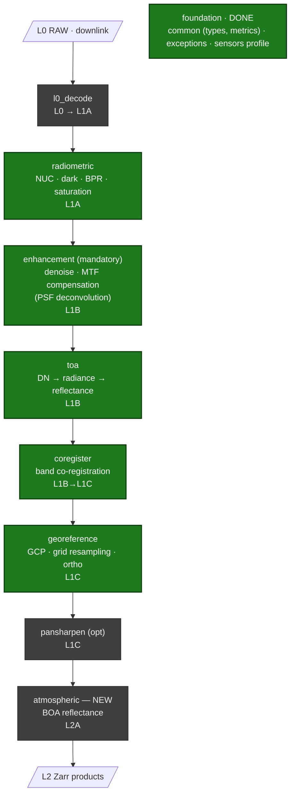

<!--
  Copyright 2026 ESA

  Licensed under the Apache License, Version 2.0 (the "License");
  you may not use this file except in compliance with the License.
  You may obtain a copy of the License at

    http://www.apache.org/licenses/LICENSE-2.0

  Unless required by applicable law or agreed to in writing, software
  distributed under the License is distributed on an "AS IS" BASIS,
  WITHOUT WARRANTIES OR CONDITIONS OF ANY KIND, either express or implied.
  See the License for the specific language governing permissions and
  limitations under the License.
-->

# msi-processor

This repository contains the **msi-processor** project: a generic high-resolution
pushbroom multispectral imager (MSI) ground-segment data processor that turns downlinked
raw (Level-0) instrument data into calibrated, geophysically usable products up to Level 2.
It is built on the ESA EOPF Core Python Modules (CPM, `eopf == 2.8.1`, Zarr output) and
developed under an ECSS-E-ST-40C Rev.1 (software criticality Category C),
documentation-first software lifecycle.

## Processing chain & status

End-to-end L0 → L2 processing chain. 🟢 implemented (CI-green) · ⬜ planned.



**Implemented (CI-green):** the foundation (common types/metrics, exception hierarchy, sensor
profile) and the `radiometric` (NUC / dark / BPR / saturation), `enhancement` (MTF compensation /
PSF deconvolution + configurable denoise), `toa` (DN → radiance → reflectance), `coregister`
(SIFT + homography) and `georeference` (GCP refinement + cartographic-grid resampling) processing
units — the **L0c → L1C** chain — each with synthetic unit tests. The rigorous viewing-model / DEM
orthorectification is a private `[impl]` interface.
**Planned:** `atmospheric` (Level-2 BOA surface reflectance, new), `pansharpen` (optional), and
`l0_decode` (L0 decode; the proprietary codec body stays a private `[impl]`).

**ECSS lifecycle:** SRR ✅ · PDR ✅ · CDR ✅ · QR ⬜ · AR ⬜ — see `compliance/` for the
baselined document set (SDP, SRS, SDD, ICD, DPM, ATBD, V&V Plan, traceability matrix, …).

## Project Structure

This project is organized as follows:

* `docs` contains the source of the `msi-processor` documentation.
* `msi_processor` contains the source code of the
  project's main Python package.
* `tests` contains the unit and integration tests of the `msi-processor`
  project.

## Tools

The following tools are used by this project:

* `.gitlab-ci.yml`: GitLab CI pipeline including the following tools:
  * mypy: Static type checker.
  * isort: Import formatter.
  * black: Python code formatter.
  * bandit: Common security issuer.
  * flake8: Python code linter.
  * xenon: Complexity monitor.
  * Sonarqube: Quality check.
  * trivy: Scanner for vulnerabilities.
  * sphinx: Document generation.
* `pre-commit-config.yaml`: Pre-commit hooks executed on commits.
* `pyproject.toml`: Build system requirements for Python.
* `docs/conf.py`: Sphinx documentation generator configuration.

## Documentation

The `msi-processor` documentation is available online at
https://ipf.pages.eopf.copernicus.eu/msi-processor.

## Build

To build the Python module of the msi-processor project using `wheel`, run:

``` python
pip wheel -w dist --no-deps .
```

The GitLab CI pipeline will also automatically build the package.

## Run tests

To execute the tests locally using `pytests`, run:

``` python
python -m pytest tests/
```

The GitLab CI pipeline will also automatically run the unit and
integration tests of the project.

## Packaging

The project's Python package can be uploaded into GitLab's package registry
using `twine`. Please see GitLab's project settings for the TWINE credentials
and the other environment variables:

``` python
TWINE_PASSWORD=${CI_REGISTRY_PASSWORD}
TWINE_USERNAME=${CI_REGISTRY_USER}
python -m twine upload --repository-url ${CI_API_V4_URL}/projects/${CI_PROJECT_ID}/packages/pypi dist/*
```

The GitLab CI pipeline will also automatically publish the package to
GitLab's package registry when the pipeline is run for a tag.

## Documentation generation

The project's documentation can be generated using Sphinx. The GitLab CI
pipeline will generate and deploy the documentation when run for the
default branch. It will generate the documentation accessible through
Gitlab Pages from project's `docs` folder.

The generation of the API documentation from the Python docstrings included in
the source code is included in the documentation generation process.
