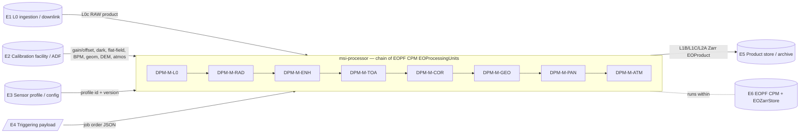
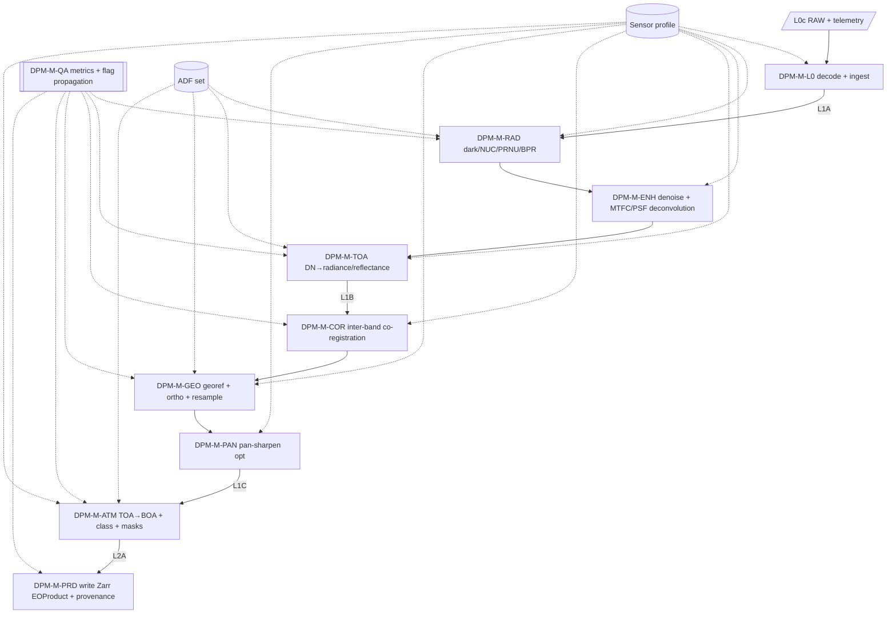
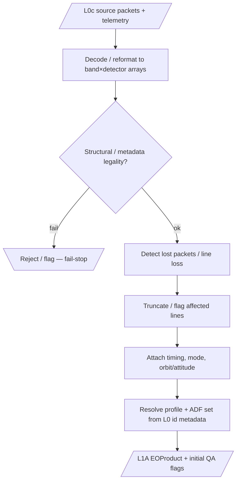
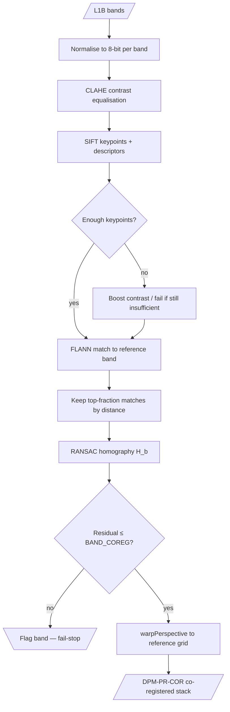
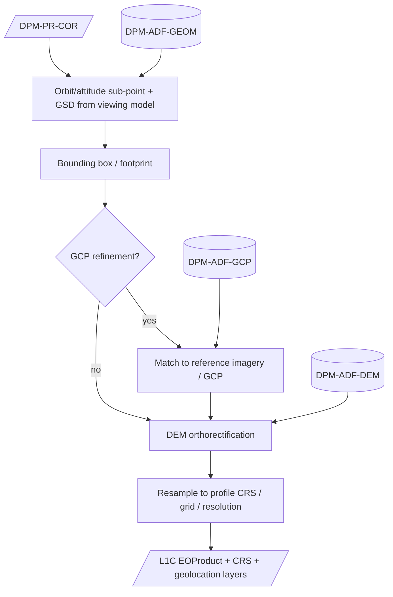
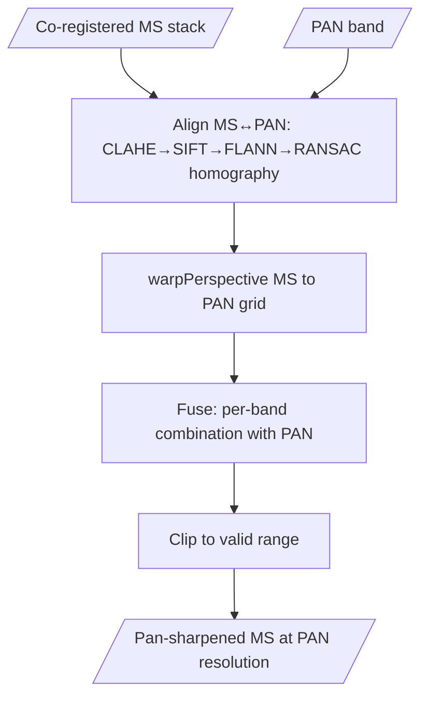
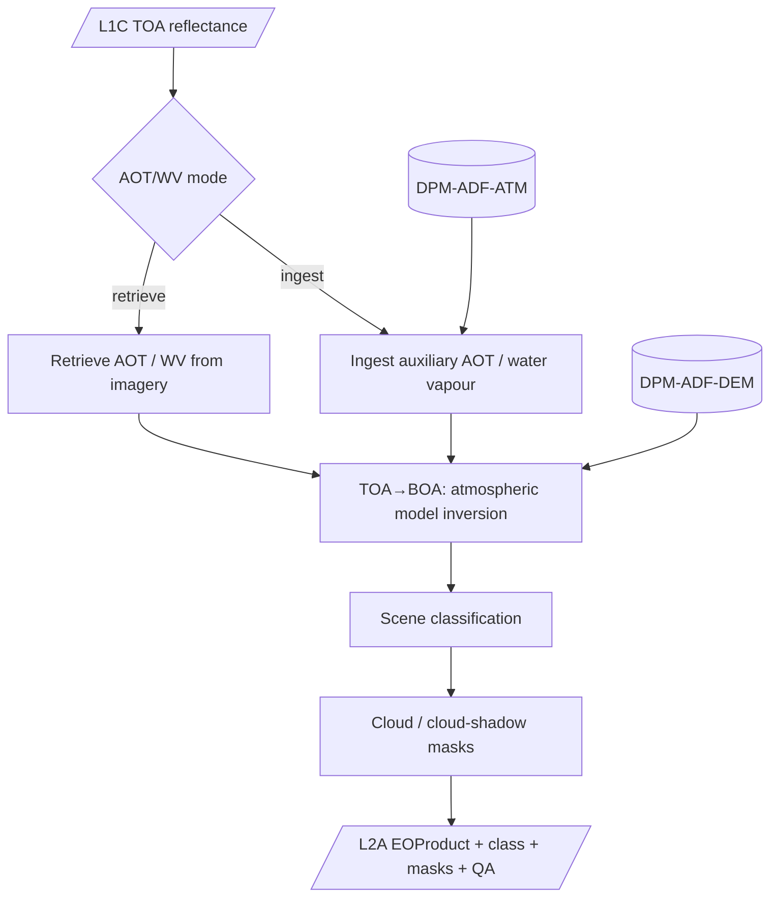

# Data Processing Model (DPM)

| Field | Value |
|---|---|
| **Document** | DPM — Data Processing Model |
| **DRD ref** | EOPF Data Processor (DPR) concept — Detailed Processing Model (no ECSS-E-ST-40C annex; complements the ATBD per AD-1 §5.4) |
| **Container** | Technical Specification (TS) — authoritative source in `compliance/drd/`, rendered subset published in `docs/dpm/` |
| **Project** | `msi-processor` (gitlab.eopf.copernicus.eu/ipf/msi-processor) |
| **Software criticality** | Category C (ECSS-Q-ST-80C Rev.2 / ECSS-E-ST-40C Annex R) |
| **Baselined at** | PDR (Preliminary Design Review) |
| **Status** | Draft for PDR |

> This DPM is the **engineering processing model** of `msi-processor`: the end-to-end transformation
> of downlinked RAW Level-0 (`L0c`) MSI data into Level-2 (`L2A`) products, decomposed into
> processing levels and modules, with the data, auxiliary data files (ADF), processing parameters
> and breakpoints that each module consumes and produces. It is the EOPF Detailed Processing Model
> counterpart of the ECSS document set: it sits **below** the SRS (RD-2, *what* the software shall
> do) and **alongside** the ATBD (RD-3, the algorithm theoretical/physical basis), and it is the
> input from which the SDD (RD-4) derives the concrete `EOProcessingUnit` design. The mathematical
> basis is grounded in the prior-work pushbroom MSI pipeline (RD-7, see SRF); this DPM reuses that
> basis and does **not** re-derive new algorithms. Numerical instrument constants (radiometric
> coefficients, ESUN, detector/focal-plane geometry, accuracy budgets) are **per-profile / per-ADF**
> and held privately; they are referenced here by identifier, not reproduced, in conformance with
> the data policy (SRS <5.8>, SSS <4.3>).

---

## <1> Introduction

**Purpose.** This document provides a complete functional description of the processing algorithms
and the data they exchange, as implemented (after CDR) in `msi-processor`. It gives a top-down
decomposition of the processor into processing **levels** and **modules**, the logical flow and
governing equations of each module, the **data/parameters list** (inputs, ADFs, intermediate and
output products, per-stage parameters) and the **breakpoints** at which intermediate products can be
dumped and from which processing can be resumed.

**Scope.** The DPM covers the full `L0c → L1A → L1B → L1C → L2A` chain for a generic
high-resolution pushbroom multispectral imager (MSI). It is **sensor-agnostic**: the chain is fixed,
the instrument-specific data is supplied through the active sensor **profile** and the private ADFs.
The first instantiated profile is the project owner's own sensor (heritage instrument designated
*Colombus* in RD-7); its constants are private profile data and are not reproduced here.

**Relation to the other documents.** Each DPM **module** (clause <8>) realises one or more SRS
functional requirements (`REQ-F-*`, RD-2) and is implemented as a CPM `EOProcessingUnit`
(`REQ-F-ORC-01`). The physical/theoretical justification of each equation is the ATBD (RD-3); the
concrete product structure, ADF schemas and triggering payload are controlled in the ICD (RD-5) with
the EOPF PSFD (RD-6) as the normative product-structure reference. Where this document writes
"(ICD)" the field-level detail is controlled there.

**Reason for preparation.** Produced at PDR to baseline the processing model before detailed design,
so that the SDD, the per-stage verification (RD-8) and the numerical validation against reference
products are anchored to a stable, traceable algorithm decomposition.

---

## <2> Applicable and reference documents

### Applicable documents (AD)

| Id | Document | Reference |
|---|---|---|
| AD-1 | ECSS Space engineering — Software | ECSS-E-ST-40C Rev.1 (30 April 2025) |
| AD-2 | ECSS Space product assurance — Software product assurance | ECSS-Q-ST-80C Rev.2 |
| AD-3 | EOPF CPM — Product Structure & Format Definition (PSFD) / common data model | EOPF CPM docs (`eopf == 2.8.1`) |

### Reference documents (RD)

| Id | Document | Reference |
|---|---|---|
| RD-1 | `msi-processor` Software Development Plan (SDP) | `compliance/software-development-plan.md` |
| RD-2 | `msi-processor` Software Requirements Specification (SRS) — `REQ-*` | `compliance/drd/srs-software-requirements.md` |
| RD-3 | `msi-processor` Algorithm Theoretical Basis Document (ATBD) | `docs/atbd/` |
| RD-4 | `msi-processor` Software Design Document (SDD) | `compliance/drd/sdd-software-design.md` (CDR) |
| RD-5 | `msi-processor` Interface Control Document (ICD) | `compliance/drd/icd-interface-control.md` (PDR/CDR) |
| RD-6 | EOPF Product Structure & Format Definition (PSFD) | EOPF CPM (`eopf == 2.8.1`) |
| RD-7 | Prior work — multispectral pushbroom preprocessing pipeline (algorithm/calibration heritage) | SRF (RD-9); `02_scripts/` `level_0.py`, `level_1.py`, `band_coreg.py`, `georeferencing_v1.py`, `pansharp.py`, `metrics_ips.py` |
| RD-8 | `msi-processor` V&V plan (SVerP/SValP/SUITP merged) | `compliance/drd/vv-plan.md` |
| RD-9 | `msi-processor` Software Reuse File (SRF) | `compliance/drd/srf-software-reuse-file.md` |
| RD-10 | `msi-processor` Software System Specification (SSS) — `SYS-*` | `compliance/drd/sss-software-system-specification.md` |
| RD-11 | `msi-processor` Interface Requirements Document (IRD) — `REQ-IF-*` | `compliance/drd/ird-interface-requirements.md` |
| RD-12 | Cloud-native data conventions | Zarr v2/v3, CF metadata, STAC |

---

## <3> Terms, definitions and abbreviated terms

The SSS <3>, IRD <3> and SRS <3> glossaries apply in full. Only terms used specifically in this DPM
and not already defined there are added.

| Term / abbr. | Definition |
|---|---|
| Module | A functional processing element of the DPM realised as one CPM `EOProcessingUnit`; identifier `DPM-M-*` |
| Level | A processing level boundary at which a self-describing product exists (`L0c`, `L1A`, `L1B`, `L1C`, `L2A`) |
| Breakpoint | A point in the chain at which an intermediate product can be persisted (dumped) and from which a sub-chain can be resumed; identifier `DPM-BKP-*` |
| Along-track / across-track | Pushbroom scan directions: along-track = line/time dimension (rows); across-track = detector dimension (columns/samples) |
| Detector | One across-track sample element of the focal plane; for a pushbroom one image column ≈ one detector |
| FPN | Fixed-pattern noise (column/detector-correlated structured noise) |
| LUT | Look-up table (here: radiometric gain/offset and dark-offset references supplied as ADF) |
| CLAHE | Contrast-Limited Adaptive Histogram Equalisation (feature-matching pre-conditioning) |
| SIFT / FLANN / RANSAC | Feature detector / approximate matcher / robust model estimator (co-registration & fusion) |
| DN | Digital number (raw/quantised detector count) |
| `DPM-PR-*` / `DPM-ADF-*` / `DPM-PRM-*` | DPM-assigned identifiers for products / auxiliary data files / processing parameters |
| Profile | Per-sensor configuration set specialising the generic chain (SSS <5.4>, SRS <5.17>) |

---

## <4> Notations and conventions

### <4.1> Block-diagram symbols

Logical-flow diagrams use Mermaid flowcharts with the EOPF DPM symbol convention (see
`docs/dpm/conventions`):

- `step[Algorithm step]` — a processing step;
- `func[[Function]]` — a step with a further breakdown;
- `data[/Internal data/]` — internal / intermediate data;
- `ext[(External data)]` — external data (e.g. ADF / database);
- `dec{Decision}` — a decision step;
- arrows denote data input/output or logical precedence.

### <4.2> Data conventions

| Aspect | Convention |
|---|---|
| Dimensions | `(line, sample)` per band in instrument geometry up to `L1B`; `(y, x)` on the cartographic grid from `L1C`. Optional `band` and `detector` coordinates per the EOPF data model. |
| Axis meaning | `line` = along-track (acquisition time order); `sample`/`detector` = across-track focal-plane position. |
| Band naming | `b1 … bN` for multispectral bands; the panchromatic band is identified by the profile (heritage: `b6`). Names and centre wavelengths come from the profile (SRS REQ-AD-01); no band set is hard-coded. |
| Raw / DN dtype | Unsigned integer at the instrument bit depth; heritage dynamic range is **12-bit**, stored in `uint16` with valid range `[0, 2¹²−1]`. The bit depth is a profile parameter (`DPM-PRM-GEN-01`). |
| Radiometric dtype | `float32` for physical radiance/reflectance kernels; clipped and optionally re-quantised to `uint16` for storage (SRS REQ-D-05). |
| No-data / fill | A reserved fill value carried in metadata; zero-filled lines from packet loss are flagged, not interpreted as signal (see `DPM-M-L0`). |
| QA flags | A per-pixel bit-mask layer carried and accumulated through every module (clause <8.9>): at least `saturated`, `defective`, `no_data`, `lost_packet`, `cloud`, `cloud_shadow`. |
| CRS / geolocation | From `L1C`: a profile-defined cartographic CRS with an affine geotransform; encoded per the ICD/PSFD with CF/STAC fields. |
| Orientation | A deterministic focal-plane→image orientation normalisation (heritage `orientation_tek`: vertical flip + horizontal flip) applied where the detector readout order differs from image convention; the transform is a profile constant. |
| Determinism | All kernels use explicit `float32`/`float64` precision and deterministic operations so the chain is reproducible (SRS REQ-F-DEP-02, REQ-D-05). |

### <4.3> Mathematical notation

| Symbol | Meaning |
|---|---|
| `DN(l,s)` | Raw digital number at line `l`, sample `s` |
| `g(s)`, `o(s)` | Per-detector (per-column) NUC gain and offset |
| `d(s)` | Per-detector dark/offset (DSNU) reference |
| `G_b`, `O_b` | Per-band absolute radiometric gain / offset (radiance conversion) |
| `L_b` | At-sensor (TOA) spectral radiance for band `b` |
| `ρ_b` | Reflectance (TOA or BOA) for band `b` |
| `E_b` | Band-integrated exo-atmospheric solar irradiance (ESUN) |
| `θ_s` | Solar zenith angle; `d_es` Earth–Sun distance (AU) |
| `H`, `M` | Homography / affine transform between bands or to a reference |
| `⌊·⌋`, `clip(x,a,b)` | Floor; clamp to `[a,b]` |

---

## <5> Processing context

`msi-processor` occupies the **payload-data processing** function of an EO ground segment
(SSS <4.1>, IRD <4.1>). The DPM context — the role of the processor and the external data it
exchanges — is:



- The chain is **triggered** (E4) with a payload that names the `L0c` input, the ADF set, the
  output target, the active profile and the run parameters/breakpoints (IRD REQ-IF-COM-01).
- Every module is a CPM `EOProcessingUnit` declaring its mandatory inputs, ADFs, outputs and
  parameters in the CPM computing-model description (IRD REQ-IF-SW-01; SRS REQ-F-ORC-01).
- The chain can be run as the **full** `L0c → L2A`, as a **sub-chain** between two levels, or as a
  **single level**, starting/stopping at the breakpoints of clause <9>.
- Each module is a thin CPM adapter over a **pure algorithmic core** callable without the CPM
  runtime, so the equations of clause <8> are unit-testable in isolation (SRS REQ-D-03,
  IRD REQ-IF-SW-04).
- Processing is **chunked/tiled** along the line dimension within a bounded per-worker memory
  budget, optionally distributed via Dask (SRS REQ-F-ORC-02). Modules `DPM-M-COR`, `DPM-M-GEO` and
  `DPM-M-PAN` require a sufficient spatial context for feature matching / resampling and therefore
  operate on overlapping tiles or full bands as set by the profile.

---

## <6> End-to-end processing model

### <6.1> Processing levels

| Transition | Product produced | Modules | SRS reqs |
|---|---|---|---|
| `L0c → L1A` | `L1A` — reformatted, geo-annotated detector samples in focal-plane geometry, radiometrically uncorrected | `DPM-M-L0` | REQ-F-L0-* |
| `L1A → L1B` | `L1B` — at-sensor TOA radiance (and optional TOA reflectance) in instrument geometry | `DPM-M-RAD`, `DPM-M-ENH`, `DPM-M-TOA` | REQ-F-RAD-*, REQ-F-ENH-*, REQ-F-TOA-* |
| `L1B → L1C` | `L1C` — orthorectified TOA reflectance on the profile cartographic grid, band-co-registered (optionally pan-sharpened) | `DPM-M-COR`, `DPM-M-GEO`, `DPM-M-PAN` *(opt)* | REQ-F-COR-*, REQ-F-GEO-*, REQ-F-PAN-* |
| `L1C → L2A` | `L2A` — BOA surface reflectance + scene classification + cloud/cloud-shadow masks | `DPM-M-ATM` | REQ-F-ATM-* |
| all levels | QA flags & metrics, Zarr product, provenance, orchestration | `DPM-M-QA`, `DPM-M-PRD` | REQ-F-QA-*, REQ-F-PRD-*, REQ-F-ORC-* |

> **Level vs. module.** `L1B` is reached only after `DPM-M-TOA`; `DPM-M-RAD`/`DPM-M-ENH` outputs are
> *intra-level* intermediate products usable as optional breakpoints (clause <9>). `L1A`, `L1B`,
> `L1C`, `L2A` are the **mandatory level products** persisted as Zarr `EOProduct`s.
>
> **Change note (CR).** Enhancement (`DPM-M-ENH`) is **promoted to mandatory**: its sharpening
> sub-step is **MTF Compensation (MTFC) via PSF deconvolution**, a critical Level-1 image-quality
> restoration step that recovers high-spatial-frequency content attenuated by the instrument MTF. The
> stage always runs (MTFC mandatory); denoise remains a sensor-profile-configurable sub-step.
> Pan-sharpening (`DPM-M-PAN`) is unchanged (still optional).

### <6.2> Module decomposition and data flow



### <6.3> Module list

| Module id | Name | Realises | Heritage (RD-7) | Optional |
|---|---|---|---|---|
| `DPM-M-L0` | L0 decode & ingestion | REQ-F-L0-01..05 | `level_0.py` `Decoder.decode`, `lost_package` | no |
| `DPM-M-RAD` | Radiometric correction (dark / NUC-PRNU / BPR) | REQ-F-RAD-01..05 | `level_1.py` `NUC.compute_nuc`, `apply_nuc_and_bpr`, `dark_noise_removal`, `noise_remover` | no |
| `DPM-M-ENH` | Image-quality enhancement (denoise + MTF compensation) | REQ-F-ENH-01..03 | `level_1.py` `Denoiser.*`, `sharpening.deconvolution_kernel` (MTFC/PSF deconvolution) | no |
| `DPM-M-TOA` | TOA radiance & reflectance | REQ-F-TOA-01..03 | `level_1.py` `TOA.dn_to_radiance`, `get_ESUN`, `get_sun_el_esdist`, `toa_rad_to_ref` | TOA-ref opt |
| `DPM-M-COR` | Inter-band co-registration | REQ-F-COR-01..03 | `band_coreg.py` `BandRegister.shifting_sift` | no |
| `DPM-M-GEO` | Geo-referencing / orthorectification | REQ-F-GEO-01..04 | `georeferencing_v1.py` `getSatelliteInfo`, `geoReferencing`, `reprojection` | no |
| `DPM-M-PAN` | Pan-sharpening | REQ-F-PAN-01..02 | `pansharp.py` `PanSharpening.pan_sharpen` | **yes** |
| `DPM-M-ATM` | Atmospheric correction | REQ-F-ATM-01..04 | per ATBD (RD-3); no heritage code | no |
| `DPM-M-QA` | QA metrics & quality flags | REQ-F-QA-01..02 | `metrics_ips.py` `run_validation` (SNR/RMSE/PSNR/MSE/var) | no |
| `DPM-M-PRD` | Product generation & chain orchestration | REQ-F-PRD-01..02, REQ-F-ORC-01..02 | — (EOPF CPM) | no |

---

## <7> Data and parameters list

### <7.1> Input products

| Id | Product | Content | Reqs |
|---|---|---|---|
| `DPM-PR-L0c` | Consolidated Level-0 (input) | Per-band/per-detector source samples in focal-plane geometry + acquisition/ancillary telemetry (timing, instrument mode/configuration, orbit/attitude). Read-only. | REQ-IF-IN-L0-01..03, REQ-F-L0-01 |

### <7.2> Auxiliary data files (ADF)

All ADFs are **private**, referenced by URI at run time, versioned, validity-matched to the
acquisition, and read-only (IRD REQ-IF-IN-ADF-01..04; SRS REQ-S-01). Concrete schemas are in the ICD.

| Id | ADF | Consumed by | Role |
|---|---|---|---|
| `DPM-ADF-DARK` | Dark / offset (DSNU) reference `d(s)` | `DPM-M-RAD` | Dark-signal subtraction; FPN reference |
| `DPM-ADF-FLAT` | Flat-field / PRNU reference (or per-detector gain table) | `DPM-M-RAD` | Non-uniformity correction |
| `DPM-ADF-NUC` | Derived per-detector gain `g(s)` & offset `o(s)` (calibration product) | `DPM-M-RAD` | NUC application (may be produced by `DPM-M-RAD` calibration mode, REQ-F-RAD-05) |
| `DPM-ADF-BPM` | Bad/defective-pixel map | `DPM-M-RAD` | Defective-detector flag & replacement |
| `DPM-ADF-RAD` | Absolute radiometric gain `G_b` / offset `O_b` | `DPM-M-TOA` | DN → radiance |
| `DPM-ADF-SPEC` | Spectral calibration / ESUN `E_b` per band | `DPM-M-TOA` | Radiance → reflectance |
| `DPM-ADF-GEOM` | Viewing / geometric model (incl. detector pitch, focal length, boresight) | `DPM-M-GEO` | Geolocation / GSD |
| `DPM-ADF-DEM` | Digital elevation model | `DPM-M-GEO`, `DPM-M-ATM` | Orthorectification; terrain in atmospheric path |
| `DPM-ADF-GCP` | Ground-control / reference-image set | `DPM-M-GEO` | Geolocation refinement |
| `DPM-ADF-ATM` | Atmospheric auxiliaries (AOT, water vapour, atmospheric model parameters) | `DPM-M-ATM` | TOA → BOA |

### <7.3> Intermediate and output products

`B` = breakpoint id (clause <9>); `Persisted` = whether a Zarr `EOProduct` is the mandatory level product.

| Id | Product | Geometry | Produced by | Persisted | B |
|---|---|---|---|---|---|
| `DPM-PR-L1A` | Decoded, geo-annotated detector samples (uncorrected DN) | focal-plane | `DPM-M-L0` | **yes** (level) | `DPM-BKP-L1A` |
| `DPM-PR-NUC` | NUC/BPR-corrected detector array (DN) | focal-plane | `DPM-M-RAD` | optional | `DPM-BKP-RAD` |
| `DPM-PR-ENH` | Enhanced (denoised + MTF-compensated) array | focal-plane | `DPM-M-ENH` | optional | `DPM-BKP-ENH` |
| `DPM-PR-L1B` | TOA radiance (+ optional TOA reflectance) | instrument | `DPM-M-TOA` | **yes** (level) | `DPM-BKP-L1B` |
| `DPM-PR-COR` | Band-co-registered stack | instrument | `DPM-M-COR` | optional | `DPM-BKP-COR` |
| `DPM-PR-L1C` | Orthorectified TOA reflectance on cartographic grid (optionally pan-sharpened) | map (CRS) | `DPM-M-GEO` (+ `DPM-M-PAN`) | **yes** (level) | `DPM-BKP-L1C` |
| `DPM-PR-L2A` | BOA surface reflectance + scene class + cloud/shadow masks | map (CRS) | `DPM-M-ATM` | **yes** (level) | `DPM-BKP-L2A` |

All persisted products carry: measurement band(s), per-pixel QA/mask layer, geolocation (from
`L1C`), and processing metadata/provenance (input id(s), ADF id+version, profile id+version,
processor/baseline version, parameters, timestamp) — SRS REQ-F-PRD-01/02, REQ-F-QA-02.

### <7.4> Processing parameters per stage

Parameters are supplied through the profile (`DPM-PRM-*`) unless marked *derived* (computed at run
time) or *ADF* (carried in an ADF). Numeric values shown are **algorithmic defaults** observed in the
heritage code (RD-7) and are profile-overridable; instrument-calibration constants are **not** shown
(private).

| Id | Stage | Parameter | Source | Default / note |
|---|---|---|---|---|
| `DPM-PRM-GEN-01` | all | Instrument bit depth / valid range | profile | 12-bit → `[0, 4095]` |
| `DPM-PRM-GEN-02` | all | Chunk/tile size (line dimension) & worker memory budget | profile / run | `MEM_BUDGET` (private) |
| `DPM-PRM-GEN-03` | all | Reference/panchromatic band id, band list, centre wavelengths | profile | heritage PAN = `b6` |
| `DPM-PRM-L0-01` | L0 | Lost-packet detection rule + per-band line-loss factor | profile | non-zero→all-zero row transition; PAN factor ×2 |
| `DPM-PRM-RAD-01` | RAD | NUC mode: read ADF gain/offset vs. derive (calibration mode) | profile | read `DPM-ADF-NUC` |
| `DPM-PRM-RAD-02` | RAD | BPR thresholds `min_val`/`max_val` on gain | profile / ADF | enables bad-pixel detection |
| `DPM-PRM-RAD-03` | RAD | Dark/FPN removal enable (`remove_noise`) + FFT dark subtraction enable | profile | off by default |
| `DPM-PRM-RAD-04` | RAD | Dark cut rows (`cut_dark`/`cut_flat`), PAN factor ×2 | profile | calibration-frame trim |
| `DPM-PRM-ENH-01` | ENH | Denoise method selection (sub-step configurable; may be off) | profile | one of: Butterworth LP, wavelet VisuShrink, PCA, moving-average, Gaussian, FFT dark-noise; or disabled |
| `DPM-PRM-ENH-02` | ENH | Butterworth: `cutoff`, `order`, `squared_butterworth`, `npad` | profile | `cutoff=0.2`, `order=10`, `squared=False`, `npad=0` |
| `DPM-PRM-ENH-03` | ENH | Gaussian: kernel size, σ | profile / derived | `5×5`, σ = image std |
| `DPM-PRM-ENH-04` | ENH | PCA components; moving-average window `N` | profile | `N=60` (heritage) |
| `DPM-PRM-ENH-05` | ENH | MTF compensation (MTFC): PSF deconvolution kernel(s) (MS + larger PAN kernel) — **mandatory** | profile | per-band kernel from instrument MTF/PSF characterisation |
| `DPM-PRM-TOA-01` | TOA | ESUN `E_b` per band | ADF (`DPM-ADF-SPEC`) | private |
| `DPM-PRM-TOA-02` | TOA | Illumination-geometry source (`θ_s`, `d_es`) | derived (telemetry/TLE) / profile | from acquisition geometry |
| `DPM-PRM-TOA-03` | TOA | Emit TOA reflectance (on/off) | profile | optional |
| `DPM-PRM-COR-01` | COR | Reference band | profile | heritage `b2` |
| `DPM-PRM-COR-02` | COR | CLAHE clip limit / tile grid | profile | `2.0`, `(8,8)` |
| `DPM-PRM-COR-03` | COR | Match fraction kept; min keypoints; RANSAC reproj. threshold | profile | top `10%`; `≥20` (PAN `≥40`); `5.0 px` |
| `DPM-PRM-COR-04` | COR | Acceptance threshold on residual (`BAND_COREG`) | profile | private budget |
| `DPM-PRM-GEO-01` | GEO | Output CRS, grid, resolution, resampling | profile | e.g. heritage `~6.5 m` |
| `DPM-PRM-GEO-02` | GEO | GSD model inputs: pixel pitch, focal length, altitude | ADF (`DPM-ADF-GEOM`) / derived | `GSD = altitude·pitch/focal` |
| `DPM-PRM-GEO-03` | GEO | GCP refinement enable; acceptance (`GEO_CE90`) | profile | private budget |
| `DPM-PRM-PAN-01` | PAN | Enable; fusion method; MS↔PAN alignment params | profile | heritage simple-mean fusion |
| `DPM-PRM-ATM-01` | ATM | AOT/WV mode: retrieve vs. ingest | profile | per ATBD |
| `DPM-PRM-ATM-02` | ATM | Atmospheric model + scene-classification options | profile / ADF | per ATBD |
| `DPM-PRM-QA-01` | QA | Metric set; reference product for comparison | profile / run | SNR, RMSE, PSNR, MSE, variance |

---

## <8> Processing modules

Each module is described as: **Overview / role**, **Logical flow**, **Inputs**, **Parameters**,
**Mathematical description / equations**, **Outputs**, **Exception handling**, **Trace**.

### <8.1> DPM-M-L0 — L0 decoding and ingestion (`L0c → L1A`)

**Overview / role.** Decode/reformat the raw downlinked product into per-band, per-detector sample
arrays in focal-plane geometry, detect and handle packet/line loss, attach the acquisition telemetry,
resolve the profile and ADF set, and emit the `L1A` product. (Heritage: `level_0.py` `Decoder.decode`
— NDA-stubbed in RD-7 — and `lost_package`.)

**Logical flow.**


**Inputs.** `DPM-PR-L0c` (source samples + telemetry); active profile.
**Parameters.** `DPM-PRM-L0-01`, `DPM-PRM-GEN-03`.

**Mathematical description.** Decoding is a format transform (sensor-specific, profile-driven); no
radiometric operation occurs. **Lost-packet/line-loss detection** (heritage `lost_package`): scanning
the line dimension, a loss is the first index `l` where line `l` is non-zero and line `l+1` is
entirely zero:
`cut = min{ l+1 : DN[l,·] ≠ 0  ∧  DN[l+1,·] = 0 }`.
Affected trailing lines are truncated (`img[:-cut, :]`), with a per-band factor (heritage PAN `b6`
uses `2·cut` because the PAN band has a higher line count). The loss is recorded in the QA layer
(`lost_packet`) and the processing report.

**Outputs.** `DPM-PR-L1A` (uncorrected DN in focal-plane geometry, geo-annotated, initial QA flags).
**Exception handling.** Structural/metadata illegality or profile/ADF resolution failure ⇒ reject or
flag **before** any radiometric processing and apply fail-stop (REQ-F-DEP-01); the `L0c` input is
never modified (REQ-F-L0-05).
**Trace.** REQ-F-L0-01..05; SYS-CAP-01; REQ-IF-IN-L0-01..03.

---

### <8.2> DPM-M-RAD — Radiometric correction (dark, NUC/PRNU, BPR)

**Overview / role.** Convert raw detector samples into a uniform, defect-free detector response by
removing dark signal, equalising detector-to-detector response (combined flat-field + offset
normalisation, here called NUC) and replacing defective pixels. Optionally derives the NUC table from
calibration acquisitions (calibration mode, REQ-F-RAD-05). (Heritage: `level_1.py` `NUC.compute_nuc`,
`apply_nuc_and_bpr`, `dark_noise_removal`, `noise_remover`.)

**Logical flow.**
```mermaid
flowchart TD
  l1a[/L1A DN/] --> mode{NUC source}
  mode -- ADF --> rd[Read g(s), o(s) from DPM-ADF-NUC]
  mode -- calibrate --> cmp[[Derive g(s),o(s) from dark+flat fields]]
  rd --> app[Apply: DN·g + o − d]
  cmp --> app
  dark[(DPM-ADF-DARK)] --> app
  app --> bpr[Bad-pixel detect + neighbour interpolation]
  bpm[(DPM-ADF-BPM)] --> bpr
  bpr --> sat[Saturation / no-data detect + clip + flag]
  sat --> out[/DPM-PR-NUC + QA flags/]
```

**Inputs.** `DPM-PR-L1A`; ADFs `DPM-ADF-DARK`, `DPM-ADF-FLAT`/`DPM-ADF-NUC`, `DPM-ADF-BPM`.
**Parameters.** `DPM-PRM-RAD-01..04`, `DPM-PRM-GEN-01`.

**Mathematical description.**
- **NUC coefficient derivation** (calibration mode; per band, column-wise over detector `s`): with
  `f̄(s)`, `d̄(s)` the line-averaged flat-field and dark-field columns,
  `g(s) = ( mean(f̄) − mean(d̄) ) / ( f̄(s) − d̄(s) )`, `o(s) = mean(f̄) − g(s)·f̄(s)`.
- **NUC application** (per band): `C(l,s) = DN(l,s)·g(s) + o(s) − d(s)`, with `d(s)` the dark-offset
  reference (`DPM-ADF-DARK`).
- **Bad-pixel detection**: `bad(s) = [ g(s) ≥ max_val ] ∨ [ g(s) ≤ min_val ]` (and/or the `DPM-ADF-BPM`
  map). **Replacement** by across-track neighbour interpolation: an interior bad detector with a good
  right neighbour ⇒ `C(·,s) = ½(C(·,s−1)+C(·,s+1))`; if the right neighbour is also bad ⇒
  `C(·,s)=C(·,s−1)`; edge detectors copy the nearest valid detector. Each replaced detector is flagged
  `defective`.
- **Optional FPN / dark-noise removal** (`dark_noise_removal`, FFT domain):
  `C' = ℜ{ IFFT2( FFT2(C) − FFT2(d_cut) ) }`, then `clip(C', 0, 2¹²−1)`.
- **Saturation / no-data**: values at/above the saturation level or equal to the fill value are
  flagged (`saturated`, `no_data`) and clipped to the valid range.

**Outputs.** `DPM-PR-NUC` (radiometrically corrected detector array, DN domain) + updated QA flags;
optionally a versioned `DPM-ADF-NUC` calibration product.
**Exception handling.** Missing/validity-mismatched ADF ⇒ reject/flag (REQ-S-04); all values clipped
to the declared dynamic range (REQ-F-RAD-04, REQ-D-05).
**Trace.** REQ-F-RAD-01..05; SYS-CAP-02; REQ-IF-IN-ADF-01/02.

---

### <8.3> DPM-M-ENH — Image-quality enhancement (denoise + MTF compensation) *(mandatory)*

**Overview / role.** Restore Level-1 image quality without compromising radiometric integrity. This
stage is **mandatory** because it performs **MTF Compensation (MTFC)** — a critical Level-1
image-quality restoration step implemented as **PSF deconvolution** — which recovers the
high-spatial-frequency content attenuated by the instrument Modulation Transfer Function (combined
optics + detector footprint + platform-motion smear). MTFC materially affects both the spatial
sharpness and the radiometric/spatial fidelity of every Level-1 (and downstream) product, so the
stage **always runs**. Denoising is a **sensor-profile-configurable** sub-step applied before MTFC
(to avoid amplifying noise during deconvolution); its method — and whether it is active — is set by
the active profile. The radiometric impact of the stage is reported via QA metrics. (Heritage:
`level_1.py` `Denoiser` — Butterworth LP, wavelet VisuShrink, PCA, moving-average, Gaussian, FFT
dark-noise — for the denoise sub-step, and `sharpening.deconvolution_kernel` reused as the MTFC/PSF
deconvolution kernel.)

**Logical flow.**
```mermaid
flowchart TD
  nuc[/DPM-PR-NUC/] --> sel{Denoise enabled? (profile)}
  sel -- yes --> dn[Apply selected denoiser]
  sel -- no --> mtfc
  dn --> mtfc[MTF compensation: PSF deconvolution — mandatory]
  mtfc --> clip[Clip to valid range]
  clip --> qa[QA metric impact vs input]
  qa --> out[/DPM-PR-ENH/]
```

**Inputs.** `DPM-PR-NUC` (band(s)). **Parameters.** `DPM-PRM-ENH-01..05`.

**Mathematical description.**
- **Butterworth low-pass** (frequency domain): magnitude
  `B(f) = 1 / (1 + (f/f_c)^{2n})` (squared-Butterworth optional), parameters cutoff `f_c`, order `n`,
  padding `npad`.
- **Gaussian**: `value = GaussianBlur(value, k×k, σ)` with `σ = std(value)` (heritage default), kernel
  `k=5`.
- **Moving-average**: box filter over a window `N` (heritage `N=60`).
- **PCA**: project the band stack onto the leading components and reconstruct (denoise by truncation).
- **Wavelet VisuShrink**: soft-threshold the wavelet coefficients at the universal threshold.
- **FFT dark-noise removal**: as in <8.2> (shared kernel).
- **MTF compensation (PSF deconvolution)** *(mandatory)*: recover the high-spatial-frequency content
  attenuated by the instrument MTF by deconvolving the per-band point-spread function. The heritage
  realisation applies a restoration kernel `out = filter2D(value, kernel)` (the MTFC/PSF-deconvolution
  kernel), with a distinct (larger) kernel for the panchromatic band, then `clip(out, 0, 2¹²−1)`. The
  kernel set is a profile constant derived from the instrument MTF/PSF characterisation; the rigorous
  deconvolution formulation is the ATBD basis (RD-3).

**Outputs.** `DPM-PR-ENH` (denoised + MTF-compensated band(s), clipped) + QA metric deltas.
**Exception handling.** The stage is **mandatory** and always runs because MTFC is non-optional; the
denoise sub-step is sensor-profile-configurable (its method may be selected or left inactive per the
active profile, REQ-F-ENH-03); outputs are always clipped to the valid range.
**Trace.** REQ-F-ENH-01..03; SYS-CAP-02, SYS-ADP-01, SYS-QUA-04.

---

### <8.4> DPM-M-TOA — TOA radiance and reflectance (`→ L1B`)

**Overview / role.** Convert corrected DN to at-sensor (TOA) spectral radiance and, optionally, TOA
reflectance, and emit the `L1B` product. (Heritage: `level_1.py` `TOA.dn_to_radiance`, `get_ESUN`,
`get_sun_el_esdist`, `toa_rad_to_ref`.)

**Logical flow.**
```mermaid
flowchart TD
  inp[/DPM-PR-NUC or DPM-PR-ENH/] --> rad[Radiance: L = (DN − O_b)·G_b]
  radlut[(DPM-ADF-RAD)] --> rad
  rad --> ref{TOA reflectance?}
  ref -- yes --> geo[Sun geometry θ_s, d_es from telemetry/TLE]
  geo --> rho[ρ = π·L·d_es² / (E_b·cos θ_s)]
  spec[(DPM-ADF-SPEC: E_b)] --> rho
  ref -- no --> emit
  rho --> emit[/L1B EOProduct + QA + provenance/]
```

**Inputs.** `DPM-PR-NUC`/`DPM-PR-ENH`; ADFs `DPM-ADF-RAD`, `DPM-ADF-SPEC`.
**Parameters.** `DPM-PRM-TOA-01..03`.

**Mathematical description.**
- **DN → radiance** (per band): `L_b(l,s) = ( DN(l,s) − O_b ) · G_b`. Heritage normalises a residual
  offset (`L ← L − min L`) and clips to `[0, 2¹²−1]` before re-quantisation; the production model
  keeps `float32` radiance and applies clipping/scaling per `DPM-PRM-GEN-01`.
- **Radiance → TOA reflectance** (optional):
  `ρ_b = (π · L_b · d_es²) / (E_b · cos θ_s)`, with `E_b` from `DPM-ADF-SPEC`, and `θ_s`, `d_es`
  derived from the acquisition geometry (heritage uses the orbit TLE sub-point;
  `θ_s = 90° − sun_elevation`). The exact illumination model is the ATBD basis (RD-3).

**Outputs.** `DPM-PR-L1B` (TOA radiance, optional TOA reflectance, instrument geometry) with QA flags
and provenance.
**Exception handling.** Validity-mismatched radiometric/spectral ADF ⇒ reject/flag; non-physical
(negative) radiance clipped and flagged.
**Trace.** REQ-F-TOA-01..03; SYS-CAP-02/03/08; REQ-IF-IN-ADF-01, REQ-IF-OUT-02.

---

### <8.5> DPM-M-COR — Inter-band co-registration (`L1B →`)

**Overview / role.** Spatially align the spectral bands to a profile-defined reference band so a
pixel maps to the same ground location across bands. (Heritage: `band_coreg.py`
`BandRegister.shifting_sift` — CLAHE → SIFT → FLANN → RANSAC homography → `warpPerspective`.)

**Logical flow.**


**Inputs.** `DPM-PR-L1B` bands. **Parameters.** `DPM-PRM-COR-01..04`.

**Mathematical description.** Per non-reference band `b`: 8-bit normalisation
`I8 = 255·(I−min)/(max−min)`; CLAHE (clip `2.0`, tiles `(8,8)`); SIFT keypoints/descriptors; FLANN
matching to the reference band (heritage `b2`); keep the top fraction of matches (heritage `10%`)
ordered by descriptor distance; estimate a homography `H_b` by RANSAC (reproj. threshold `5.0 px`);
resample `I_b ← warpPerspective(I_b, H_b)`. Bands are cropped to the maximum across-track shift and
clipped to the valid range. The co-registration residual is computed and checked against the
per-profile `BAND_COREG` budget.

**Outputs.** `DPM-PR-COR` (co-registered band stack) + co-registration residual QA.
**Exception handling.** Insufficient keypoints/matches or a solution outside acceptance thresholds ⇒
flag the affected band and apply fail-stop (REQ-F-COR-03, REQ-F-DEP-01) rather than emit a
misregistered product.
**Trace.** REQ-F-COR-01..03; SYS-CAP-04/05; REQ-IF-CAP-01.

---

### <8.6> DPM-M-GEO — Geo-referencing / orthorectification (`→ L1C`)

**Overview / role.** Geolocate the imagery using the viewing/geometric model and orbit/attitude,
optionally refine with GCPs/reference imagery, orthorectify with a DEM, and resample onto the profile
cartographic grid/CRS. (Heritage: `georeferencing_v1.py` `getSatelliteInfo.get_satellite_info` (TLE
sub-point, GSD), `geoReferencing.band_registration`/`create_bounding_box`, `reprojection.projection`
— GDAL/`osr` CRS + geotransform.)

**Logical flow.**


**Inputs.** `DPM-PR-COR`; ADFs `DPM-ADF-GEOM`, `DPM-ADF-DEM`, `DPM-ADF-GCP`; orbit/attitude telemetry
from `L1A`. **Parameters.** `DPM-PRM-GEO-01..03`.

**Mathematical description.**
- **Geolocation / GSD** (heritage): from the orbit (TLE) sub-point at the capture time, altitude `h`;
  `GSD = (h · pixel_pitch) / focal_length`; ground-track velocity from the orbital rate. The
  rigorous viewing model (line-of-sight per detector intersected with the ellipsoid+DEM) is the ATBD
  basis (RD-3).
- **Orthorectification**: project each output grid cell through the viewing model and DEM to the
  source line/sample, then resample (profile resampling method).
- **Reprojection** (heritage `reprojection.projection`): build an affine geotransform
  `[ulx, xres, 0, uly, 0, −yres]` (heritage `xres = −yres ≈ 6.5 m`) and assign the target CRS
  (heritage: CRS inherited from the reference image), writing a georeferenced raster via GDAL.
- **GCP refinement** (optional): estimate a residual transform from matched control points and apply
  before resampling.

**Outputs.** `DPM-PR-L1C` (orthorectified TOA reflectance on the cartographic grid, CRS encoding,
geolocation layers) + QA + provenance.
**Exception handling.** Geolocation error checked against `GEO_CE90`; missing DEM/geometric-model
coverage ⇒ flag/fail-stop.
**Trace.** REQ-F-GEO-01..04; SYS-CAP-04/05/08; REQ-IF-IN-ADF-01, REQ-IF-OUT-02.

---

### <8.7> DPM-M-PAN — Pan-sharpening *(optional)*

**Overview / role.** Fuse the co-registered multispectral bands with the higher-resolution
panchromatic band to produce a high-resolution multispectral product. (Heritage: `pansharp.py`
`PanSharpening.pan_sharpen`.)

**Logical flow.**


**Inputs.** Co-registered MS stack (`DPM-PR-COR`/`DPM-PR-L1C`), PAN band.
**Parameters.** `DPM-PRM-PAN-01`.

**Mathematical description.** MS↔PAN alignment as in <8.5> (CLAHE → SIFT → FLANN top-10% → RANSAC
homography `5.0 px` → `warpPerspective` to PAN grid). Heritage fusion is a simple mean:
`P_b = ½·(MS_b + PAN)`, clipped to `[0, 2¹²−1]`; the production fusion method is profile-selectable.
Spectral fidelity is measured against the MS input and checked against the per-profile budget.

**Outputs.** Pan-sharpened MS product at PAN resolution + spectral-fidelity QA.
**Exception handling.** Enabled only when the profile sets it; alignment failure ⇒ flag and skip
fusion (product remains valid at MS resolution).
**Trace.** REQ-F-PAN-01..02; SYS-CAP-04, SYS-ADP-01, SYS-QUA-04.

---

### <8.8> DPM-M-ATM — Atmospheric correction (`L1C → L2A`)

**Overview / role.** Remove atmospheric effects to derive bottom-of-atmosphere (surface) reflectance
and classify the scene. No heritage code exists; the algorithm basis is the ATBD (RD-3). Specified
from SYS-CAP-06/07.

**Logical flow.**


**Inputs.** `DPM-PR-L1C` (TOA reflectance); ADFs `DPM-ADF-ATM`, `DPM-ADF-DEM`.
**Parameters.** `DPM-PRM-ATM-01..02`.

**Mathematical description.** Obtain atmospheric parameters (AOT, water vapour) by retrieval from the
imagery and/or ingest of auxiliary meteorological data; invert the atmospheric radiative-transfer
model to convert TOA to BOA surface reflectance `ρ_BOA` accounting for the terrain (DEM); produce a
scene classification and cloud/cloud-shadow masks. The radiative-transfer formulation, retrieval and
classification thresholds are the ATBD basis (RD-3) and are profile-/ADF-parametrised.

**Outputs.** `DPM-PR-L2A` (BOA surface reflectance + scene class + cloud/shadow masks) + QA +
provenance.
**Exception handling.** Missing atmospheric/DEM coverage for the footprint/epoch ⇒ flag/fail-stop;
cloud-masked pixels flagged (`cloud`, `cloud_shadow`).
**Trace.** REQ-F-ATM-01..04; SYS-CAP-06/07/08; REQ-IF-IN-ADF-01, REQ-IF-OUT-02.

---

### <8.9> DPM-M-QA — Quality metrics and quality flags

**Overview / role.** Compute quantitative quality metrics per band/stage and propagate the per-pixel
QA flag layer through the whole chain. (Heritage: `metrics_ips.py` `run_validation` — SNR, RMSE,
PSNR, MSE, variance.)

**Inputs.** Stage input/output products; optional reference/raw products.
**Parameters.** `DPM-PRM-QA-01`.

**Mathematical description** (per band, against a reference/input `R`):
- `SNR = 20·log₁₀( mean(I) / std(I) )` dB;
- `RMSE = sqrt( mean( (I − R)² ) )`;
- `MSE = mean( (I − R)² )`;
- `PSNR = 20·log₁₀( (2¹²−1) / sqrt(MSE) )` dB (∞ when `MSE = 0`);
- `variance = var(I)` (reported for `I` and `R`).
Shapes are aligned (crop to the common extent) before comparison. The QA **flag** layer
(bit-mask: `saturated`, `defective`, `no_data`, `lost_packet`, `cloud`, `cloud_shadow`) is created at
`DPM-M-L0` and OR-accumulated by every subsequent module to the output product.

**Outputs.** Per-stage metrics in the processing report; per-pixel QA flag layer in every persisted
product.
**Exception handling.** Metrics are observational and never abort the chain; a metric outside the
configured tolerance is recorded as a warning in the report.
**Trace.** REQ-F-QA-01..02; SYS-OBS-02/03, SYS-QUA-04.

---

### <8.10> DPM-M-PRD — Product generation and chain orchestration

**Overview / role.** Persist products in the EOPF Zarr data model with full provenance, and
orchestrate the modules as a chainable, breakpoint-able, chunked pipeline of `EOProcessingUnit`s.

**Inputs.** Module output `EOProduct`s; profile; triggering/run parameters.
**Parameters.** `DPM-PRM-GEN-02` (chunking/memory), breakpoint selection (clause <9>).

**Description.**
- **Product generation**: write each persisted product as a cloud-native Zarr `EOProduct` via the
  EOPF `EOZarrStore`, carrying measurement bands, QA/mask layers, geolocation (from `L1C`) and
  product/processing metadata. **Provenance** records: input product id(s), ADF id(s)+version(s),
  profile id+version, processor/baseline version, processing parameters and timestamp — and **no**
  private calibration coefficients (REQ-F-PRD-02, REQ-S-05).
- **Orchestration**: each module declares mandatory inputs/ADFs/outputs/parameters in the CPM
  computing model; the chain runs as a single level, a sub-chain or the full `L0c → L2A`, starting
  and stopping at the breakpoints of clause <9>; processing is chunked/tiled within the memory
  budget, optionally distributed via Dask, without a whole product resident in memory.

**Exception handling.** On any module failure, fail-stop: non-zero exit, affected outputs
flagged/withheld, no partial product published as complete (REQ-F-DEP-01).
**Trace.** REQ-F-PRD-01/02, REQ-F-ORC-01/02; SYS-CAP-08/10/11; REQ-IF-CAP-01/03/05, REQ-IF-OUT-01/02.

---

## <9> Processing breakpoints

A **breakpoint** is a point at which the current product can be **dumped** (persisted as a Zarr
`EOProduct`) and from which a sub-chain can be **resumed**, in addition to the in-memory hand-off
between consecutive modules. Level breakpoints (`L1A`, `L1B`, `L1C`, `L2A`) are **mandatory** product
boundaries; intra-level breakpoints are **optional** dump points enabled per run for debugging,
calibration support and reprocessing (SRS REQ-F-ORC-01, REQ-REL-02; IRD REQ-IF-CAP-01).

| Breakpoint id | After module | Product dumped | Level | Default | Resume target |
|---|---|---|---|---|---|
| `DPM-BKP-L1A` | `DPM-M-L0` | `DPM-PR-L1A` | `L1A` | **on** (level) | `DPM-M-RAD` |
| `DPM-BKP-RAD` | `DPM-M-RAD` | `DPM-PR-NUC` | intra-`L1B` | off | `DPM-M-ENH` |
| `DPM-BKP-ENH` | `DPM-M-ENH` | `DPM-PR-ENH` | intra-`L1B` | off | `DPM-M-TOA` |
| `DPM-BKP-L1B` | `DPM-M-TOA` | `DPM-PR-L1B` | `L1B` | **on** (level) | `DPM-M-COR` |
| `DPM-BKP-COR` | `DPM-M-COR` | `DPM-PR-COR` | intra-`L1C` | off | `DPM-M-GEO` |
| `DPM-BKP-L1C` | `DPM-M-GEO` (+`DPM-M-PAN`) | `DPM-PR-L1C` | `L1C` | **on** (level) | `DPM-M-ATM` |
| `DPM-BKP-L2A` | `DPM-M-ATM` | `DPM-PR-L2A` | `L2A` | **on** (level) | — (chain end) |

**Resume semantics.** Resuming from a breakpoint reads the persisted product (by URI) as the module
input and re-runs the downstream sub-chain with the same profile and ADF set; because the chain is
deterministic (REQ-F-DEP-02), a resumed run reproduces the equivalent full-chain output (bit-identical
where the algorithm is deterministic, otherwise within the documented tolerance). Enhancement
(`DPM-M-ENH`) is mandatory and always runs, so its breakpoint is always available as a dump point; the
optional pan-sharpening (`DPM-M-PAN`) breakpoint is absent from the path when that module is disabled
by the profile.

---

## <10> Traceability summary

This DPM realises the SRS functional requirements as follows (the maintained bidirectional matrix is
RD-9 at CDR; upstream `SYS-*`/`REQ-IF-*` are carried via the SRS):

| DPM module | SRS reqs | Levels |
|---|---|---|
| `DPM-M-L0` | REQ-F-L0-01..05 | `L0c → L1A` |
| `DPM-M-RAD` | REQ-F-RAD-01..05 | `L1A →` |
| `DPM-M-ENH` | REQ-F-ENH-01..03 | intra-`L1B` |
| `DPM-M-TOA` | REQ-F-TOA-01..03 | `→ L1B` |
| `DPM-M-COR` | REQ-F-COR-01..03 | `L1B →` |
| `DPM-M-GEO` | REQ-F-GEO-01..04 | `→ L1C` |
| `DPM-M-PAN` | REQ-F-PAN-01..02 | intra-`L1C` |
| `DPM-M-ATM` | REQ-F-ATM-01..04 | `L1C → L2A` |
| `DPM-M-QA` | REQ-F-QA-01..02 | all |
| `DPM-M-PRD` | REQ-F-PRD-01..02, REQ-F-ORC-01..02, REQ-F-DEP-01..02 | all |

DPM-assigned identifiers introduced here — modules `DPM-M-*`, products `DPM-PR-*`, auxiliary data
`DPM-ADF-*`, parameters `DPM-PRM-*`, breakpoints `DPM-BKP-*` — are the reference handles used by the
SDD (RD-4), the ICD (RD-5) and the V&V plan (RD-8).

---

*End of DPM. EOPF Detailed Processing Model for `msi-processor`; algorithm theoretical/physical basis
is the ATBD (RD-3), grounded in the prior-work pushbroom MSI pipeline (RD-7, SRF); concrete product/
ADF/payload structures are controlled in the ICD (RD-5). Numerical instrument constants are
per-profile/per-ADF and private (data policy, SRS <5.8>).*
</content>
</invoke>
