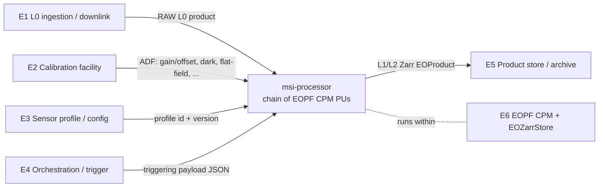

# Software Interface Requirements Document (IRD)

| | |
|---|---|
| **Document** | Software Interface Requirements Document (IRD) |
| **DRD** | ECSS-E-ST-40C Rev.1, Annex C |
| **Container** | Requirements Baseline (RB) |
| **Project** | `msi-processor` — generic high-resolution MSI data processor |
| **Configuration item** | `gitlab.eopf.copernicus.eu/ipf/msi-processor` |
| **Software criticality** | Category C (ECSS-Q-ST-80C Rev.2 / ECSS-E-ST-40C Annex R) |
| **Baselined at** | SRR |
| **Status** | Draft for SRR |

> This IRD is part of the **requirements baseline** of the `msi-processor` project and, together
> with the SSS, is a primary input for the System Requirements Review (SRR). It follows the
> ECSS-E-ST-40C Rev.1 Annex C section structure and the heading style of the SDP. It states the
> **interface requirements** imposed on the processor at its external boundary — the downlinked
> RAW (L0) input, the instrument calibration auxiliary data (ADF), the L1/L2 Zarr products, the
> EOPF CPM framework, the triggering payload, and the sensor-profile/configuration interface.
> The **concrete interface definitions** (field-level schemas, encodings, product structure,
> chunking, payload syntax) are *not* fixed here: they are produced in the **ICD** (Annex E) at
> PDR/CDR. The footprint is tailored to a Category C, single-developer ground-segment processor.

## <1> Introduction

The `msi-processor` is an operational ground-segment data processor that transforms **downlinked
RAW (Level-0) multispectral imager (MSI) data** into calibrated, geophysically usable products
**up to Level 2** (radiometric correction → geometric correction → atmospheric correction). It is
a **generic high-resolution pushbroom MSI processor**: the chain is sensor-agnostic and driven by
a per-sensor configuration/profile, the first instantiated profile being the project owner's own
sensor. The processor is built on the ESA Earth Observation Processing Framework (EOPF): each
stage is an EOPF CPM `EOProcessingUnit`, products are `EOProduct` objects, and outputs are
written as cloud-native **Zarr** via the EOPF `EOZarrStore`.

The **purpose** of this document is to specify the interfaces between `msi-processor` and the
external systems and data it exchanges with, as a set of uniquely identified, verifiable
**interface requirements**. It is the highest-level interface description of the software and,
with the SSS, provides criteria used to validate and accept the software (per AD-1 §5.2.4.3 and
the IRD DRD, Annex C).

The **reason prompting its preparation** is the SRR baseline of the requirements: before the
software requirements (SRS, Annex D) and the detailed interface control (ICD, Annex E) are
written, the external interface boundary of the processor must be fixed at requirements level so
that the requirements, data processing model and design downstream are anchored to a stable
interface envelope. This IRD is produced as a **standalone document** (the case for which the
present DRD applies, per Annex C.1.2).

## <2> Applicable and reference documents

**Applicable documents**

| Ref | Document |
|---|---|
| AD-1 | ECSS-E-ST-40C Rev.1 (30 April 2025) — Space engineering — Software |
| AD-2 | ECSS-Q-ST-80C Rev.2 (30 April 2025) — Space product assurance — Software product assurance |
| AD-3 | ECSS-E-ST-10-06C — Technical requirements specification (IRD context) |
| AD-4 | ECSS-M-ST-40C — Configuration and information management |

**Reference documents**

| Ref | Document |
|---|---|
| RD-1 | `msi-processor` Software Development Plan (SDP) — `compliance/software-development-plan.md` |
| RD-2 | `msi-processor` Software System Specification (SSS) — `compliance/drd/sss-software-system-specification.md` |
| RD-3 | `msi-processor` Interface Control Document (ICD) — `compliance/drd/icd-interface-control.md` (produced at PDR/CDR; defines the concrete interfaces) |
| RD-4 | EOPF Core Python Modules (CPM) documentation (`eopf == 2.8.1`) — `EOProduct`, `EOProcessingUnit`, `EOZarrStore`, triggering |
| RD-5 | EOPF Product Structure and Format Definition (PSFD) — Zarr product structure reference |
| RD-6 | EOPF Software Development Environment (SDE) — User Manual & Guidelines |
| RD-7 | Prior work — multispectral pushbroom preprocessing pipeline (algorithm/calibration heritage; see SRF) |

## <3> Terms, definitions and abbreviated terms

Terms and definitions follow AD-1, AD-2 and the EOPF SDE glossary. Abbreviations used in this
document and not already defined in the applicable/reference documentation:

| Abbreviation | Definition |
|---|---|
| ADF | Auxiliary Data File (instrument calibration / auxiliary input data) |
| BOA / TOA | Bottom / Top Of Atmosphere |
| CPM | (EOPF) Core Python Modules |
| CRS | Coordinate Reference System |
| DEM | Digital Elevation Model |
| ICD / IRD | Interface Control Document / Interface Requirements Document |
| L0 / L1 / L2 | Processing levels: raw, calibrated/geolocated, geophysical |
| MSI | Multispectral Imager |
| NUC | Non-Uniformity Correction |
| PRNU | Photo-Response Non-Uniformity (flat-field) |
| PSFD | (EOPF) Product Structure and Format Definition |
| PU | (EOPF CPM) Processing Unit (`EOProcessingUnit`) |
| RB | Requirements Baseline |
| SDE | (EOPF) Software Development Environment |
| URI | Uniform Resource Identifier (product/ADF locator) |

(ECSS review acronyms SRR/PDR/CDR/QR/AR and DRD acronyms per AD-1 and RD-1.)

## <4> General description

### <4.1> Product perspective

`msi-processor` is a batch, non-interactive component embedded in a larger EO ground segment. Its
**external interfaces to other systems** are:

| # | External system / actor | Direction | Exchange |
|---|---|---|---|
| E1 | **L0 ingestion / downlink chain** | → in | Downlinked RAW (Level-0) MSI product: instrument image source data + acquisition/ancillary telemetry |
| E2 | **Instrument calibration facility / ADF provider** | → in | Calibration auxiliary data (ADF): radiometric gain/offset, dark, flat-field/PRNU, and profile-dependent refs (bad-pixel map, spectral/geometric model, DEM/GCP, atmospheric aux) |
| E3 | **Sensor profile / configuration provider** | → in | Per-sensor profile + run configuration (identified and versioned) |
| E4 | **Processing orchestration / trigger** | → in | Triggering payload (job order) invoking a run / sub-chain |
| E5 | **Product store / archive / dissemination** | ← out | L1/L2 products as cloud-native Zarr `EOProduct` |
| E6 | **EOPF CPM framework + storage backend** | host | Runtime within which the processor executes; `EOProduct`/`EOProcessingUnit`/`EOZarrStore` API and the POSIX/object-store backend |

### <4.2> General constraints

Items that limit the supplier's options for designing and developing the interfaces:

- **EOPF CPM API is fixed.** Stage interfaces must be `EOProcessingUnit`s; products must be
  `EOProduct`s; persistence/access must use `EOZarrStore`. The processor may not define its own
  product/IO format outside the CPM abstractions.
- **Framework version is pinned to `eopf == 2.8.1`** (matching the SDE `cpm-build-environment`
  image). Interface compatibility is bound to that CPM API surface; the version is not upgraded.
- **Output format is mandated as cloud-native Zarr** (per EOPF / PSFD); other output product
  formats are out of scope.
- **Generic / sensor-agnostic design.** All sensor-specific interface content must be supplied
  through the sensor profile (§<5.4>); hardcoding any sensor's band set, detector geometry or
  calibration model into the interfaces is not permitted.
- **Data policy.** Source **code is public**; **RAW (L0) inputs and instrument calibration ADFs
  are private** — they are never committed and never used in public CI. Interfaces must therefore
  reference these inputs at runtime by identifier/URI, not embed them.
- **CI environment.** The CI runner is a **shell executor** (no container runtime, no Dask
  gateway, no S3). Interface paths that require those services are non-blocking in CI and must
  have a local-filesystem equivalent for verification.

### <4.3> Operational environment

a. The operational context is summarised by the context diagram in §<4.1>. `msi-processor` runs
   as one or more `EOProcessingUnit`s triggered by the orchestration layer (E4), reading the L0
   product (E1) and the ADF set (E2) selected via the sensor profile (E3), and writing Zarr
   products to the store (E5), all within the EOPF CPM runtime (E6).

b. **Nature of the exchanges with external systems:**
   - **File/object based** for data products and ADFs — Zarr stores and ADF files referenced by
     **URI**, on a POSIX filesystem or object storage, accessed through `EOZarrStore` / the EOPF
     store mapper.
   - **Structured payload (JSON)** for triggering — the job order declaring inputs, ADFs, output
     target, profile and parameters.
   - **Process status / logs** — completion status, structured diagnostics and quality flags
     surfaced to the orchestration layer.

c. **Activities supported by external systems** (parent ground segment): E1 produces and delivers
   the L0 product; E2 produces and maintains the calibration ADFs; E4 schedules and triggers
   processing; E5 stores and disseminates the L1/L2 products. `msi-processor` consumes E1–E4 and
   feeds E5.

d. **References to the interface control documents.** The concrete definition of every interface
   in §<5> (product structure, group/variable tree, band naming, dtypes, chunking, CRS encoding,
   ADF schemas, triggering-payload syntax, profile schema) is provided in the **ICD** (RD-3,
   ECSS-E-ST-40C Annex E), baselined at PDR (start) and CDR (final), with the EOPF **PSFD**
   (RD-5) as the normative product-structure reference. This IRD states the requirements; the ICD
   states the control.

### <4.4> Assumptions and dependencies

- **Assumptions:** the algorithm and calibration mathematical basis is available from prior work
  (RD-7, see SRF); the owner's RAW data and the corresponding calibration ADFs (gain/offset,
  dark, flat-field) are available for **local** numerical verification; the orchestration layer
  can supply a triggering payload in the CPM form.
- **Dependencies:** EOPF CPM (`eopf == 2.8.1`) and the SDE build image; the EOPF Zarr store
  backend (POSIX and, where available, object storage); availability and validity metadata of the
  calibration ADFs and the sensor profile.
- Further project-level assumptions/dependencies/constraints are listed in the SDP (RD-1 §<4.3>)
  and are not repeated here.

## <5> Specific requirements

### <5.1> General

Each interface requirement is **uniquely identified** by an identifier of the form `REQ-IF-*`.
Requirements are stated here (Statement + Rationale); the **validation method** for each is given
in §<6>. Concrete, field-level interface definitions are deferred to the ICD (RD-3) per §<4.3>d;
where this document writes "(ICD)" it means the detail is controlled there.

### <5.2> Capabilities requirements

External interface requirements specifying interface behaviour and associated performances.

#### REQ-IF-CAP-01 — Staged, decoupled product interfaces with breakpoints
- **Statement:** The processor shall expose the processing chain as a sequence of stages
  (decode/L0→L1 radiometric → L1 geometric → L2 atmospheric) in which **each stage boundary is a
  defined product interface**: a stage shall consume a defined set of input product(s), ADF(s) and
  parameters and produce a defined output product. The processor shall support starting and
  stopping at these boundaries (breakpoints), i.e. running a sub-chain from/to a given level.
- **Rationale:** Stage decoupling is the EOPF CPM design model and is required for incremental
  development, independent verification of each stage against its requirement, and reprocessing
  from intermediate levels.

#### REQ-IF-CAP-02 — Chunked / lazy access and processing granularity
- **Statement:** The product interfaces shall support **larger-than-memory** products through
  chunked, lazy read and write (Zarr chunking); the processor shall not require a whole product to
  be resident in memory. The interface shall operate on the sensor-defined acquisition granularity
  (e.g. granule/tile/scene as set by the sensor profile, §<5.4>).
- **Rationale:** High-resolution MSI scenes exceed memory; cloud-native Zarr + chunked access is
  the EOPF performance model and lets downstream consumers read partial products. Throughput and
  exact chunk sizes are profile-/deployment-dependent and refined in the ICD/DPM.

#### REQ-IF-CAP-03 — Metadata and provenance propagation across interfaces
- **Statement:** Every output product interface shall carry the processing metadata needed for
  traceability: the input product identifier(s), the ADF identifier(s) and version(s), the sensor
  profile identifier and version, the processor/baseline version, the processing parameters and
  the processing timestamp.
- **Rationale:** Traceability of a product to exactly the inputs, calibration and configuration
  used is required by the ECSS life cycle and by the data policy (provenance without exposing
  private calibration values, see REQ-IF-SEC-02).

#### REQ-IF-CAP-04 — Reproducible interface behaviour
- **Statement:** Given identical inputs, ADF set, sensor profile and processor version, the output
  product interface shall be reproducible (bit-identical where the algorithm is deterministic;
  otherwise within a documented numerical tolerance).
- **Rationale:** Reproducibility is a stated project priority (RD-1 §<4.1>) and the basis for
  regression verification of the interfaces.

#### REQ-IF-CAP-05 — Completion status and structured diagnostics
- **Statement:** The processor shall expose, at its external boundary, a completion status
  (success/failure) and structured diagnostics (errors, warnings and per-product quality flags)
  consumable by the orchestration layer.
- **Rationale:** The orchestration layer (E4) needs an unambiguous, machine-readable run outcome
  to drive scheduling, retries and quality control.

### <5.3> System interface requirements

Interface requirements imposed on the system, organised by the Annex C categories.

#### <5.3.1> System-level data interfaces

**Input — downlinked RAW (Level-0) MSI data**

#### REQ-IF-IN-L0-01 — L0 input product interface
- **Statement:** The processor shall ingest downlinked RAW (Level-0) MSI data as its primary input
  through a defined input product interface. The L0 interface shall provide at least: the
  instrument image source data (per spectral band and per detector/line samples) and the
  associated acquisition/ancillary telemetry required to drive the chain (timing, instrument mode
  and configuration, and orbit/attitude ancillary needed by the geometric stage). The concrete
  encoding/packetisation is defined in the ICD.
- **Rationale:** L0 is the entry point of the chain; the radiometric, geometric and atmospheric
  stages all derive from it and from the telemetry it carries.

#### REQ-IF-IN-L0-02 — L0 identification and selection metadata
- **Statement:** Each L0 input shall be uniquely identified and shall carry (or be accompanied by)
  the metadata required to select the applicable sensor profile and ADF set — at least the
  instrument/sensor identifier, the acquisition time and the instrument mode.
- **Rationale:** The generic chain must resolve the correct profile (§<5.4>) and the
  validity-matching ADFs (REQ-IF-IN-ADF-02) from the L0 itself, without operator guesswork.

#### REQ-IF-IN-L0-03 — L0 immutability
- **Statement:** The L0 input interface shall be **read-only** to the processor; the processor
  shall not modify its L0 input.
- **Rationale:** The L0 archive is authoritative and shared; reprocessing must always start from
  an unaltered input.

**Input — instrument calibration auxiliary data (ADF)**

#### REQ-IF-IN-ADF-01 — Calibration ADF input interface
- **Statement:** The processor shall ingest the instrument calibration auxiliary data as
  Auxiliary Data Files (ADF) through a defined auxiliary input interface. The ADF interface shall
  provide at least the **radiometric gain and offset** (absolute/relative radiometric
  calibration), the **dark-signal / dark-current** reference, and the **flat-field / PRNU
  non-uniformity** reference. It shall additionally support, as selected by the sensor profile:
  defective/bad-pixel map, spectral calibration, geometric/viewing-model and DEM/GCP references
  (geometric stage), and atmospheric/auxiliary meteorological data (L2 stage). Concrete ADF
  schemas are defined in the ICD.
- **Rationale:** Gain/offset, dark and flat-field are the minimum calibration inputs of the
  radiometric (NUC) stage; the additional ADFs feed the geometric and atmospheric stages of the
  full L0→L2 chain.

#### REQ-IF-IN-ADF-02 — ADF identification, versioning and validity
- **Statement:** Each ADF shall be uniquely identified and **versioned**, and the ADF interface
  shall expose its validity (applicable sensor/profile, applicability time range, version) so the
  processor can select the correct ADF for a given L0 input.
- **Rationale:** Calibration evolves over the instrument's life; selecting the ADF valid for the
  acquisition is required for radiometric correctness and for provenance (REQ-IF-CAP-03).

#### REQ-IF-IN-ADF-03 — Runtime-resolved, private ADF references
- **Statement:** The ADF interface shall reference calibration data by identifier/URI resolved at
  **run time**; ADF content shall **not** be embedded in the source code or committed to the
  repository, and shall not be required by public CI.
- **Rationale:** Calibration data are private per the data policy (§<4.2>); the interface must
  keep them external to the public code base.

#### REQ-IF-IN-ADF-04 — ADF immutability
- **Statement:** ADFs shall be **read-only** to the processor.
- **Rationale:** Calibration references are authoritative inputs maintained by E2, not processor
  outputs.

**Output — L1/L2 products**

#### REQ-IF-OUT-01 — Output product interface as cloud-native Zarr
- **Statement:** The processor shall produce its output products — L1 (radiometrically and
  geometrically corrected) and L2 (atmospherically corrected / geophysical) — through a defined
  output product interface written as **cloud-native Zarr** via the EOPF `EOZarrStore`.
- **Rationale:** Zarr output via the EOPF store is mandated by the framework (§<4.2>) and is the
  delivery format consumed by E5.

#### REQ-IF-OUT-02 — Self-describing output `EOProduct`
- **Statement:** Each output product shall be a self-describing `EOProduct` exposing, through the
  output interface: the measurement band variables, per-pixel quality/mask layers, geolocation /
  geo-referencing information, and the product + processing metadata (provenance per
  REQ-IF-CAP-03). The concrete product structure (group/variable tree, band naming, dtypes,
  chunking, CRS encoding) is defined in the ICD with the EOPF PSFD as the normative reference.
- **Rationale:** Downstream systems must interpret the product without out-of-band knowledge;
  self-description is the EOPF product principle.

#### REQ-IF-OUT-03 — Output storage backends and chunked access
- **Statement:** The output Zarr interface shall be writable to the supported storage backends —
  POSIX filesystem and, where available, object storage (S3-compatible) — through the EOPF store
  abstraction, and shall be chunked to support partial/lazy reads by downstream consumers.
- **Rationale:** Operational deployment uses object storage while local verification uses the
  filesystem; both must be served by the same interface (with the CI constraint of §<4.2>).

#### REQ-IF-OUT-04 — Output identification and versioning
- **Statement:** Each output product shall carry a unique product identifier and the processing
  baseline/version, and shall be linkable back to the inputs, ADFs and profile that produced it.
- **Rationale:** Product identity and baseline are required for catalogue management,
  reprocessing and traceability.

#### <5.3.2> Software interfaces

#### REQ-IF-SW-01 — Stages as EOPF CPM `EOProcessingUnit`s
- **Statement:** Each processing stage shall be exposed as an EOPF CPM `EOProcessingUnit`
  conforming to the CPM processing-unit interface, declaring its mandatory input products, ADFs,
  output products and parameters in the CPM computing-model description (JSON).
- **Rationale:** The `EOProcessingUnit` contract is the framework's software interface and the
  basis for orchestration, triggering and breakpoints (REQ-IF-CAP-01, REQ-IF-COM-01).

#### REQ-IF-SW-02 — `EOProduct` exchange and `EOZarrStore` persistence
- **Statement:** Products shall be exchanged across the software interface as EOPF `EOProduct`
  objects, and product persistence/access shall use the EOPF `EOZarrStore`. The processor shall
  not implement product I/O outside these CPM abstractions.
- **Rationale:** Uniform product handling and storage access via the CPM is mandated (§<4.2>) and
  guarantees interoperability with the rest of the EOPF ecosystem.

#### REQ-IF-SW-03 — Framework version binding
- **Statement:** The software interfaces shall be compatible with the pinned framework
  `eopf == 2.8.1` (the CPM API surface provided by the SDE `cpm-build-environment`). Interface
  compatibility is bound to that version.
- **Rationale:** The pinned CPM version defines the available API; a change would desynchronise
  the build environment and break the interfaces (RD-1 §<4.3>).

#### REQ-IF-SW-04 — Testable algorithmic core behind the PU wrapper
- **Statement:** The pure algorithmic core of each stage shall be callable independently of the
  CPM wrapper through a plain function/class interface, with the `EOProcessingUnit` acting as a
  thin adapter over it.
- **Rationale:** A framework-independent core interface enables deterministic unit testing and
  numerical verification of the algorithms without the full CPM runtime (RD-1 §<5.1>).

#### <5.3.3> Communication interfaces

#### REQ-IF-COM-01 — Triggering payload (job order) interface
- **Statement:** The processor shall be invocable through the EOPF CPM triggering mechanism via a
  **triggering payload** (JSON job order) that declares, for a run: the input product(s), the ADF
  set, the output target/store, the sensor profile/configuration, and the processing
  parameters/breakpoints. The concrete payload schema is defined in the ICD.
- **Rationale:** The triggering payload is the control interface between the orchestration layer
  (E4) and the processor and the single place where a run is fully specified.

#### REQ-IF-COM-02 — URI-referenced, location-transparent I/O
- **Statement:** The triggering and product interfaces shall reference input products, ADFs and
  output targets by **URI**, supporting both local (filesystem) and remote (object-store)
  locations, resolved through the EOPF store/mapper at run time.
- **Rationale:** Operational runs use remote stores; verification uses local paths; the interface
  must be location-transparent.

#### REQ-IF-COM-03 — Local-filesystem fallback for constrained environments
- **Statement:** The communication/I/O interfaces shall provide a local-filesystem path that does
  not require a container runtime, Dask gateway or S3, so that a run can be triggered and verified
  on the CI shell runner.
- **Rationale:** The CI runner lacks those services (§<4.2>); a degraded local path is needed for
  non-blocking verification until a Kubernetes runner is available.

#### <5.3.4> Software-hardware and hardware interfaces

#### REQ-IF-HW-01 — No direct hardware interface
- **Statement:** The processor shall have **no direct hardware interface**; it shall access compute
  and storage resources only through the host operating system and the EOPF store abstraction.
- **Rationale:** `msi-processor` is application-level ground-segment software; dedicated
  software-hardware and hardware interfaces are not applicable (Category C tailoring). Stated
  explicitly to close the Annex C system-interface categories.

#### <5.3.5> Human-machine interface (HMI)

#### REQ-IF-HMI-01 — Non-interactive invocation interface
- **Statement:** The processor shall provide a non-interactive command-line / programmatic
  invocation interface; it shall not require a graphical user interface. Operator interaction is
  limited to supplying the triggering payload and consuming logs and exit status.
- **Rationale:** A batch ground-segment processor is driven by orchestration, not by an
  interactive UI; this keeps the HMI footprint proportionate to a Category C processor.

#### <5.3.6> Security aspects of the external interfaces

#### REQ-IF-SEC-01 — Input identity and integrity
- **Statement:** The interfaces shall allow verification that the L0 input, ADFs and sensor profile
  used in a run are exactly those identified (by identifier/version), and the processor shall
  reject or flag inputs whose validity does not match the selected profile/acquisition.
- **Rationale:** Product correctness and traceability depend on using the right, unaltered inputs;
  mismatched calibration must not silently produce a product.

#### REQ-IF-SEC-02 — Confidentiality of private inputs (data policy)
- **Statement:** RAW (L0) inputs and instrument calibration ADFs are private: the interfaces shall
  reference them at run time only and shall never persist them into the public source repository or
  public CI artefacts. Output products shall not embed private calibration coefficients beyond the
  identifiers/versions required for provenance (REQ-IF-CAP-03).
- **Rationale:** Enforces the project data policy (§<4.2>) at the interface boundary.

#### REQ-IF-SEC-03 — Least-privilege access
- **Statement:** The processor shall require only **read** access to its inputs/ADFs/profile and
  **write** access to the designated output store; it shall require no other external access.
- **Rationale:** Minimising the access surface limits the impact of misconfiguration and is
  consistent with the immutability requirements (REQ-IF-IN-L0-03, REQ-IF-IN-ADF-04).

### <5.4> Adaptation / missionization requirements

External data that varies according to operational needs and sensor/site-dependent data — the
**sensor-profile / configuration interface**.

#### REQ-IF-AD-01 — Sensor-agnostic chain driven by a profile interface
- **Statement:** The processing chain shall be sensor-agnostic and parametrised through a
  **sensor profile / configuration interface**. All sensor-specific data — detector geometry,
  number of detectors and spectral bands, spectral band definitions, nominal radiometric model,
  default ADF bindings, and per-stage processing options/thresholds — shall be supplied via the
  profile and shall not be hardcoded.
- **Rationale:** A single generic processor must serve multiple sensors; externalising all
  sensor-specific content to the profile is the core adaptation mechanism (RD-1 §<1>, §<5.3>).

#### REQ-IF-AD-02 — Profile identification, versioning and selection
- **Statement:** Each sensor profile shall be uniquely identified and versioned and shall be
  selectable per run via the triggering payload (REQ-IF-COM-01). The first profile instantiated is
  the project owner's sensor.
- **Rationale:** Reproducibility and traceability require knowing exactly which profile version
  produced a product (REQ-IF-CAP-03); per-run selection enables multi-sensor operation.

#### REQ-IF-AD-03 — Externalised operations-/site-dependent settings
- **Statement:** The profile/configuration interface shall externalise operations- and
  site-dependent settings — output storage target and chunking, processing baseline selection,
  optional-stage enable/disable, breakpoints, and atmospheric/auxiliary source selection — so that
  the same software runs across operational contexts without code change.
- **Rationale:** Portability across deployments (local verification vs operational) must be a
  configuration concern, not a code concern (RD-1 §<4.1>).

#### REQ-IF-AD-04 — Profile validation at load
- **Statement:** The profile/configuration interface shall be **validated on load**; an incomplete
  or invalid profile shall be rejected with a clear diagnostic. The concrete profile schema is
  defined in the ICD.
- **Rationale:** Failing fast on a malformed profile prevents silently producing an incorrectly
  parametrised product.

## <6> Validation requirements

a. The interface requirements in §<5> are validated to demonstrate that the software interface
   requirements are met. At SRR the interfaces are validated primarily by **inspection** of this
   IRD and **review** of the design/ICD; the data interfaces become test-validatable once the ICD
   (RD-3) is baselined (PDR/CDR) and sample products/ADFs are available for **local** numerical
   verification (per the data policy). Validation methods: **T** Test, **A** Analysis,
   **I** Inspection, **R** Review of design, **D** Demonstration.

b. The validation method applicable to each requirement (requirements-to-validation-method
   correlation table):

| Requirement | Method | Means (and milestone) |
|---|---|---|
| REQ-IF-CAP-01 | T / R | Sub-chain run from/to a breakpoint; review of CPM stage decomposition (CDR) |
| REQ-IF-CAP-02 | T / A | Chunked read/write on a larger-than-memory product; memory-footprint analysis (CDR) |
| REQ-IF-CAP-03 | I / T | Inspect provenance metadata fields against ICD; assert presence in output (CDR) |
| REQ-IF-CAP-04 | T | Re-run with identical inputs; compare output within tolerance (CDR) |
| REQ-IF-CAP-05 | T | Assert completion status + diagnostics/quality flags on success and forced failure |
| REQ-IF-IN-L0-01 | I / T | Inspect L0 interface vs ICD; ingest a sample L0 (local) |
| REQ-IF-IN-L0-02 | I / T | Inspect required selection metadata; resolve profile/ADF from a sample L0 |
| REQ-IF-IN-L0-03 | A / I | Static analysis / inspection: no write path to L0 input |
| REQ-IF-IN-ADF-01 | I / T | Inspect ADF interface vs ICD; load gain/offset, dark, flat-field (local) |
| REQ-IF-IN-ADF-02 | I / T | Inspect ADF id/version/validity; select valid ADF for a given L0 |
| REQ-IF-IN-ADF-03 | I / A | Repository/CI inspection: no ADF content committed; runtime-URI resolution |
| REQ-IF-IN-ADF-04 | A / I | Static analysis / inspection: no write path to ADFs |
| REQ-IF-OUT-01 | T / I | Produce a Zarr `EOProduct` via `EOZarrStore`; inspect store output |
| REQ-IF-OUT-02 | I / T | Inspect product structure vs ICD/PSFD; assert bands, masks, geo-ref, metadata |
| REQ-IF-OUT-03 | T | Write to POSIX (CI) and object store (when available); partial read |
| REQ-IF-OUT-04 | I / T | Inspect product id + baseline + input/ADF/profile links |
| REQ-IF-SW-01 | R / I | Review CPM computing-model JSON (declared inputs/ADFs/outputs/params) |
| REQ-IF-SW-02 | R / T | Review I/O uses `EOProduct`/`EOZarrStore`; round-trip test |
| REQ-IF-SW-03 | I | Inspect pinned `eopf == 2.8.1` and CI build image |
| REQ-IF-SW-04 | T | Unit-test the algorithmic core without the CPM runtime |
| REQ-IF-COM-01 | I / T | Inspect payload vs ICD; trigger a run from a sample payload |
| REQ-IF-COM-02 | T | Trigger with local and remote (when available) URIs |
| REQ-IF-COM-03 | T | Trigger + verify on the CI shell runner via local-filesystem path |
| REQ-IF-HW-01 | I | Inspection — confirm no direct hardware interface (see §<6>c) |
| REQ-IF-HMI-01 | T / I | Invoke via CLI/programmatic entry point; confirm no GUI dependency |
| REQ-IF-SEC-01 | T | Run with mismatched ADF/profile validity → reject/flag |
| REQ-IF-SEC-02 | I / A | Repository/CI scan: no private inputs persisted; output carries only provenance ids |
| REQ-IF-SEC-03 | A / I | Inspect required access modes (read inputs, write output store only) |
| REQ-IF-AD-01 | R / T | Review profile externalises sensor-specific data; run a second (synthetic) profile |
| REQ-IF-AD-02 | I / T | Inspect profile id/version; select profile via payload |
| REQ-IF-AD-03 | I / T | Inspect externalised settings; change a setting without code change |
| REQ-IF-AD-04 | T | Load an invalid/incomplete profile → rejected with diagnostic |

c. **Requirements not validated against the requirements baseline.** REQ-IF-HW-01 is a
   not-applicable statement (no direct hardware interface) and is closed by inspection rather than
   by an active validation activity. REQ-IF-COM-03 is a constraint-derived enabling requirement
   for the constrained CI environment; it is verified by demonstration on the shell runner but is
   not part of the operational acceptance criteria. The detailed requirement-to-design/ICD
   traceability is maintained in the project traceability matrix (`compliance/traceability/`).

   > NOTE — The correlation table above is the requirements-to-validation-method matrix required by
   > the IRD DRD. As the project evolves it is split, per project needs, into validation
   > requirements (V&V plan, `compliance/drd/vv-plan.md`) and acceptance requirements (SRelD/AR).

---

*End of IRD. Authored per ECSS-E-ST-40C Rev.1 Annex C. Concrete interface definitions are
controlled in the ICD (Annex E) at PDR/CDR.*
