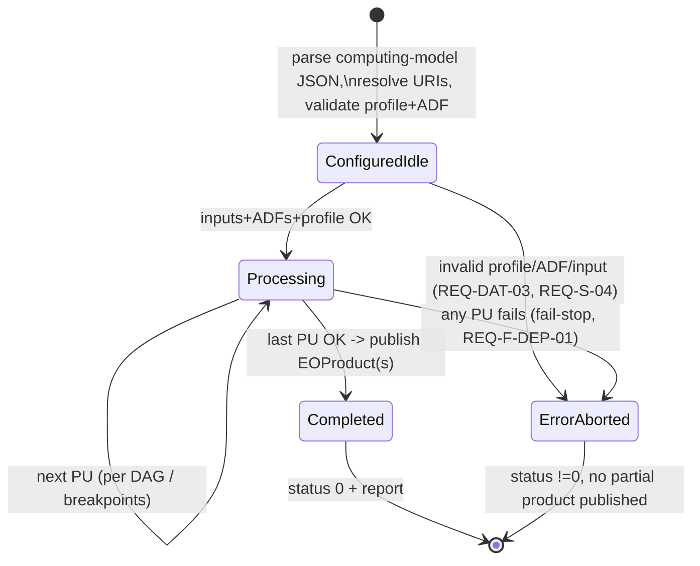
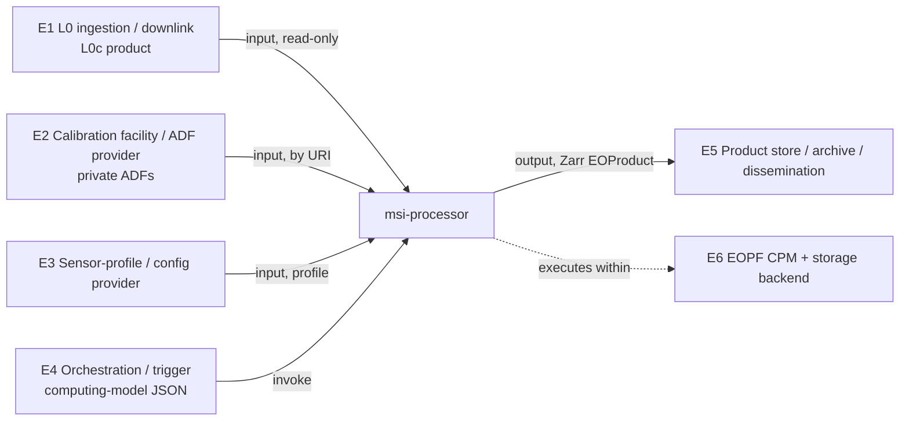

# Software Design Document (SDD) — Preliminary (Architectural)

| Field | Value |
|---|---|
| **Document** | SDD — Software Design Document (PRELIMINARY / architectural) |
| **DRD ref** | ECSS-E-ST-40C Rev.1, Annex F |
| **Container** | Design Definition File (DDF) — `compliance/drd/` (source), published subset in `docs/sdd/` |
| **Project** | `msi-processor` (gitlab.eopf.copernicus.eu/ipf/msi-processor) |
| **Software criticality** | Category C (ECSS-Q-ST-80C Rev.2 / ECSS-E-ST-40C Annex R) |
| **Baselined at** | **PDR** (preliminary architectural design); detailed per-component design + DJF baselined at **CDR** |
| **Status** | Draft for PDR |

> **Preliminary issue.** This is the **architectural** issue of the SDD, the design constituent of
> the DDF (Annex F, F.1.2). It establishes, for PDR, the software static and dynamic architecture,
> the processing-unit decomposition, the design patterns and the preliminary design→requirements
> traceability. Per the SDP (RD-1) §5.2.3 and §5.5.2 the SDD is **delivered in full at CDR**: the
> per-component *detailed* design (Annex F <5.4> element-level data structures with ranges/initial
> values, <5.5> file-level internal interface data, and the supporting DJF) is **deferred to CDR**
> and is explicitly marked as such where it occurs. Implementation (SDP WP-5) starts only after CDR.
> The document follows the ECSS-E-ST-40C Rev.1 Annex F section structure and the heading style of
> the SDP (RD-1) and SRS (RD-4). It does not re-specify requirements (SRS, RD-4) nor algorithm
> mathematics (DPM RD-6 / ATBD RD-7); it specifies *how the software is structured* to satisfy them.

---

## <1> Introduction

**Purpose.** This SDD describes the software design of `msi-processor`, a generic high-resolution
**pushbroom multispectral imager (MSI)** ground-segment processor that transforms downlinked RAW
**Level-0 (`L0c`)** data into calibrated, orthorectified, atmospherically corrected products up to
**Level-2 (`L2A`)**. At this (PDR) issue it describes the **architectural design**: the static
component structure, the dynamic/behavioural model, the design patterns, the standards, and the
mapping of the software requirements (SRS, RD-4) onto design components.

**Objective.** The SDD is the bridge from the baselined requirements (SRS, RD-4) to the
implementation (SDP WP-5). It is the parent of the detailed design (the same document at CDR) and of
the unit/integration test design (SUITP, RD-8). Every design component traces upward to one or more
`REQ-*` software requirements (clause <6>) and is the unit of work for implementation and unit test.

**Content.** Clause <2> lists applicable/reference documents; clause <3> adds design-specific terms.
Clause <4> gives the design overview — static architecture (<4.1>), dynamic architecture and
computational model (<4.2>), behaviour (<4.3>), interfaces context (<4.4>), long-lifetime design
(<4.5>), memory & PU budget (<4.6>), and design standards/conventions/trade-offs (<4.7>). Clause <5>
gives the software design proper — overall architecture (<5.2>), component design general (<5.3>),
per-component aspects (<5.4>, preliminary), and internal interface design (<5.5>). Clause <6> gives
the requirements→design traceability and the measures for critical components.

**Reason for preparation.** `msi-processor` is an **integration and ECSS productisation** effort:
the processing algorithms already exist as prior work (RD-9 / SRF RD-10) and the runtime platform is
the EOPF CPM (`eopf == 2.8.1`). This SDD records the architecture that turns that heritage into a
sensor-agnostic, configuration-driven, verifiable CPM product, and is produced at PDR to baseline
the architecture before detailed design and implementation begin.

---

## <2> Applicable and reference documents

### Applicable documents (AD)

| Id | Document | Reference |
|---|---|---|
| AD-1 | ECSS Space engineering — Software | ECSS-E-ST-40C Rev.1 (30 April 2025) |
| AD-2 | ECSS Space product assurance — Software product assurance | ECSS-Q-ST-80C Rev.2 |
| AD-3 | EOPF CPM — Product Structure & Format Definition (PSFD) / common data model | EOPF CPM docs (`eopf == 2.8.1`) |

### Reference documents (RD)

| Id | Document | Reference |
|---|---|---|
| RD-1 | `msi-processor` Software Development Plan (SDP) | `compliance/software-development-plan.md` |
| RD-2 | `msi-processor` Software System Specification (SSS) — `SYS-*` | `compliance/drd/sss-software-system-specification.md` |
| RD-3 | `msi-processor` Interface Requirements Document (IRD) — `REQ-IF-*` | `compliance/drd/ird-interface-requirements.md` |
| RD-4 | `msi-processor` Software Requirements Specification (SRS) — `REQ-*` | `compliance/drd/srs-software-requirements.md` |
| RD-5 | `msi-processor` Interface Control Document (ICD) — concrete interfaces | `compliance/drd/icd-interface-control.md` |
| RD-6 | `msi-processor` Detailed Processing Model (DPM) — per-level algorithm basis | `docs/dpm/` |
| RD-7 | `msi-processor` Algorithm Theoretical Basis Document (ATBD) | `docs/atbd/` |
| RD-8 | `msi-processor` V&V plan (SVerP/SValP/SUITP merged) | `compliance/drd/vv-plan.md` |
| RD-9 | Prior work — multispectral pushbroom preprocessing pipeline (algorithm/calibration heritage) | RD-10 |
| RD-10 | `msi-processor` Software Reuse File (SRF) | `compliance/drd/srf-software-reuse-file.md` |
| RD-11 | `msi-processor` Traceability matrix (forward/backward, design→test) | `compliance/traceability/traceability-matrix.md` (CDR) |
| RD-12 | EOPF CPM API documentation (`EOProduct`, `EOProcessingUnit`, `EOZarrStore`, triggering / computing model) | EOPF CPM (`eopf == 2.8.1`) |
| RD-13 | Cloud-native data conventions | Zarr v2/v3, CF metadata, STAC |

---

## <3> Terms, definitions and abbreviated terms

The SSS <3>, IRD <3> and SRS <3> glossaries apply in full. Only **design-specific** terms not
defined there are added here (per Annex F <3>).

| Term / abbr. | Definition |
|---|---|
| Processing Unit (PU) | An EOPF CPM `EOProcessingUnit`: the framework-facing executable component for one processing stage |
| Core | The pure, framework-independent algorithmic function set behind a PU (no CPM dependency); the unit of numerical test |
| Wrapper / adapter | The thin `EOProcessingUnit` subclass that adapts a Core to the CPM runtime (I/O, ADF, params, QA) |
| Computing model (JSON) | The CPM declarative description wiring PUs into a chain — inputs, ADFs, outputs, parameters, breakpoints (RD-12) |
| Profile | Per-sensor configuration set (schema-validated) specialising the generic chain; data only, no algorithm code |
| ADF | Auxiliary Data File (private instrument calibration / auxiliary input), referenced by URI at run time |
| DAG | Directed acyclic graph (the static PU chain / the Dask task graph) |
| Chunk / tile | A bounded spatial block processed independently to bound memory (Zarr/Dask unit) |
| DDF / DJF | Design Definition File / Design Justification File (ECSS-E-ST-40C) |
| Component aspect | The Annex F <5.4> description axes: identifier, type, purpose, function, subordinates, dependencies, interfaces, resources, references, data |

---

## <4> Software design overview

This clause introduces the system context and the design before the formal design in clause <5>.

### <4.1> Software static architecture

`msi-processor` is a **batch, non-interactive, single-process (optionally Dask-distributed) Python
library + CLI**. Its static architecture is a **layered, three-package decomposition** over the EOPF
CPM, where the processing chain is a sequence of `EOProcessingUnit`s and every product is an
`EOProduct` persisted as cloud-native Zarr (REQ-D-01, REQ-F-PRD-01).

The three top-level components and their relationship:

```
                     ┌─────────────────────────────────────────────────────────────┐
                     │                     msi_processor (item)                       │
                     │                                                               │
   trigger/payload   │   msi_processor.sensors        msi_processor.common          │
   ───────────────►  │   (C-SENSORS)                  (C-COMMON)                     │
   (computing model) │   profile schema + per-sensor  product/Zarr I/O, ADF access, │
                     │   profile data + ADF bindings  profile loader, provenance,   │
                     │        │  (config, data only)   QA-flag registry, chunking,   │
                     │        │                        URI/store map, orchestration  │
                     │        ▼            ▲   ▲   ▲        │                        │
                     │   ┌──────────────────────────────────────────────────────┐  │
                     │   │            msi_processor.computing (C-COMPUTING)       │  │
                     │   │   l0_decode → radiometric → [enhancement] → toa  ───►  │  │
                     │   │   coregistration → georeference → [pansharpen] ──►     │  │
                     │   │   atmospheric ;  qa (cross-cutting)                    │  │
                     │   │   each stage = pure Core + thin EOProcessingUnit Wrap  │  │
                     │   └──────────────────────────────────────────────────────┘  │
                     └─────────────────────────────────────────────────────────────┘
                          ▲ ADFs (private, by URI)        ▼ EOProduct (Zarr) out
```

- **`msi_processor.computing` (C-COMPUTING)** — the processing chain. One subpackage per stage; each
  contains a **pure Core** (algorithm, no CPM/IO) and a **thin Wrapper** (the `EOProcessingUnit`).
  This is where the heritage algorithms (RD-9) live.
- **`msi_processor.sensors` (C-SENSORS)** — the **adaptation layer**: the versioned profile schema
  and per-sensor profile data + ADF bindings. It contains **no instrument constants in code and no
  algorithm code** (REQ-AD-01, REQ-D-04); the first instantiated profile is the owner's sensor
  (REQ-AD-02).
- **`msi_processor.common` (C-COMMON)** — the **platform/services layer** shared by all PUs:
  `EOProduct`/`EOZarrStore` build and I/O, ADF resolution, profile load/validation, provenance
  assembly, QA-flag registry/propagation, chunking/Dask wiring, URI/store mapping, run configuration,
  chain orchestration + computing-model handling, and the CLI.

**Dependency rule (acyclic, downward only).** `computing` depends on `common` and consumes a
resolved `sensors` profile; `common` depends only on EOPF CPM and the reused stack (RD-10); a Core
depends on **neither** the CPM nor `common` (it takes plain arrays/parameters). `sensors` is data +
schema and depends on nothing. There is no upward or cyclic dependency.

**Main relationship between major components.** The chain is data-driven: each PU consumes the
upstream `EOProduct` (+ ADFs + profile-derived parameters), produces the next-level `EOProduct`, and
hands it on. The level breakpoints (`L1A`/`L1B`/`L1C`/`L2A`) are the inter-component contract
(internal interface, <5.5>). QA (`qa`) is cross-cutting: it is invoked by every measurement PU to
attach metrics and accumulate the per-pixel flag layer (REQ-F-QA-01/02).

**a. Architecture of the software item.** As above: a 3-layer package decomposition (`computing` /
`sensors` / `common`) realising a CPM PU pipeline with a pure-core + thin-wrapper pattern.

**b. System states/modes in which the software operates.** The processor implements the three
states/modes of SRS <4.1>/<8> and REQ-O-04: *configured/idle* (profile, inputs and ADFs resolved),
*processing* (one or more PUs executing), terminating in *completed* or *error/aborted* (fail-stop,
REQ-F-DEP-01). There is **no resident, cyclic or real-time mode** (SSS <4.2>). The behavioural model
is in <4.3>/<5.2>e.

**c. Separated mission and configuration data (Annex F <4.1>c).** All sensor-, mission- and
site-dependent data is **externalised from the code** into the profile and ADFs (REQ-AD-01/03/04,
REQ-D-04), classified per the Annex F NOTE categories:

| Data category (Annex F <4.1>c) | In `msi-processor` | Location / owner | Changeable without code change |
|---|---|---|---|
| Mission-analysis data, varies per mission | Orbit/attitude & viewing-model references, acquisition geometry sources | `L0c` telemetry + profile-referenced ADF (E1/E2) | Yes (by reference) |
| Reference data specific to a family of products | Profile schema defaults, band list / spectral-response references, output CRS/grid/tiling | `sensors/<profile>` (data) | Yes (profile edit) |
| Reference data that never changes | Physical constants (e.g. solar-spectrum integration constants) used by Cores | code constants in `common`, no instrument specificity | n/a (universal) |
| Data depending on the specific mission (e.g. sensor calibration) | Dark/DSNU, PRNU/flat-field, bad-pixel map, radiometric gain/offset, viewing model | **private ADFs**, referenced by URI (E2) | Yes (ADF swap, REQ-M-02) |
| Data varying with the higher-level system design | Output store target + chunking, breakpoints, optional-stage toggles, atmospheric source | run config / computing-model JSON (E4) | Yes (config) |

This separation is the mechanism by which the same software runs across sensors and contexts
(REQ-D-07, REQ-AD-01..04) and by which **no private calibration is ever embedded in the code**
(REQ-S-01/05).

### <4.2> Software dynamic architecture (computational model)

`msi-processor` has **no hard real-time constraint** (REQ-R-05): there are no cyclic/sporadic
threads, no scheduling-by-deadline, and no RMS/DMS/EDF analysis is applicable. The computational
model required by Annex F <4.2>/<5.2>c is therefore expressed as a **data-flow DAG of passive
components** with two interchangeable execution strategies:

- **Component types.** All components are *passive* (called, not self-scheduling). The active element
  is the **chain runner** (C-COM-ORC), which executes the PU DAG. PUs are stateless across
  invocations; state lives in the `EOProduct`s flowing between them.
- **Scheduling model.** Two modes selected by configuration: (1) **sequential** — the runner
  executes PUs in topological order in a single process (the CI / local-workstation path,
  REQ-PORT-03); (2) **distributed** — the per-PU Core operates on Zarr/Dask chunks and the Dask
  scheduler builds and runs the task graph across workers (REQ-F-ORC-02, REQ-R-04). The two share
  identical Cores; only the chunk mapping changes.
- **Means of communication.** Components communicate exclusively through **`EOProduct` objects**
  (in-memory `xarray`-backed) and, at level breakpoints, through **Zarr stores** read/written via
  `EOZarrStore` (REQ-F-PRD-01). There are no mailboxes, shared mutable globals or RPC; the only
  inter-process channel is the Dask task graph over chunked arrays.
- **Means of synchronisation.** None at application level beyond the DAG topology (a PU starts when
  its inputs are materialised). Concurrency control is delegated to the Dask scheduler; Cores are
  pure and free of shared state, so they are inherently safe to parallelise per chunk.
- **Distribution (Annex F <5.2>c).** Optional, via Dask only; nodes are Dask workers, the unit of
  distribution is the chunk. No custom inter-node protocol is defined.

**Computing-model (JSON) approach.** The static DAG is described declaratively by the **CPM
computing model** (RD-12): a JSON job order that names, for the requested chain or sub-chain, the
input product(s), the ADF set, the output target, the active profile, the per-PU parameters and the
**breakpoints** (start/stop level). The runner (C-COM-ORC) parses this model, resolves URIs
(C-COM-IO), validates the profile (C-COM-PROFILE), instantiates the required `EOProcessingUnit`s and
executes them. This is the single mechanism realising "run a level, a sub-chain, or the full
`L0c`→`L2A` chain" (REQ-F-ORC-01, REQ-I-05) and is the design's main configuration surface for the
orchestration layer (E4).

### <4.3> Software behaviour

A single run is a finite state machine (mirroring SRS <8>):



Behaviour is **deterministic and reproducible** for a fixed (input, ADF, profile, processor)
quadruple (REQ-F-DEP-02, REQ-REL-01). Error handling and fault tolerance are detailed in <5.2>g.

### <4.4> Interfaces context

The external interfaces are specified at requirements level in the IRD (RD-3, `REQ-IF-*`) and
**defined concretely in the ICD (RD-5)**; per Annex F <4.4>a this SDD **refers to the ICD** and does
not re-derive them. The context (IRD <4.1> external entities E1–E6) is:



Internal interfaces (between the design components of clause <5>) are designed in <5.5>; external
interfaces are bound by REQ-I-01..07 and controlled in the ICD (RD-5).

### <4.5> Long lifetime software

Design choices that minimise dependency on the operating system and hardware to support a long
planned lifetime and portability (Annex F <4.5>; REQ-PORT-01/02, REQ-D-09):

- **Pure Python 3.11, no native build, no GPU** (REQ-R-01): the only platform assumption is a POSIX
  x86-64 Linux host; the Cores use portable array libraries (numpy/xarray).
- **Open data format**: outputs are Zarr with CF/STAC metadata (RD-13, REQ-D-09) — readable
  independently of this software and of any vendor runtime.
- **Location-transparent I/O**: all inputs/outputs are referenced by **URI** and resolved through the
  EOPF store abstraction (C-COM-IO), so local-FS, POSIX and S3 backends are interchangeable without
  code change (REQ-PORT-02, REQ-I-06).
- **Externalised volatile data**: instrument constants, CRS/grid, and per-stage parameters live in
  the profile/ADFs, so sensor and mission evolution does not touch the code (REQ-AD-01, <4.1>c).
- **Single pinned platform dependency** (`eopf == 2.8.1`) with a documented, V&V-gated bump procedure
  (REQ-M-03), isolating the one component most likely to force change.
- **Pure-core isolation** keeps the algorithm bodies independent of the CPM, so a future platform
  change re-touches only the thin wrappers, not the numerics (REQ-D-03, REQ-M-04).

### <4.6> Memory and PU budget

Per Annex F <4.6>, the allocation of memory and processing time to components. The governing design
rule is **bounded, chunk-proportional memory**: peak per-worker memory is set by the configured
chunk/tile size, not by product size (REQ-F-ORC-02, REQ-P-05, REQ-R-04), and wall-time scales with
the number of tiles × workers (REQ-P-04). Absolute numeric budgets (`MEM_BUDGET`, `THRU_SCENE`) are
**per-profile parameters held in the private calibration/auxiliary store** (SRS <5.1>) and are
verified locally; they are **not reproduced here**. The **preliminary** qualitative allocation
(finalised with numbers per profile at CDR) is:

| PU (component) | Memory intensity | Compute intensity | Dominant cost | Mitigation |
|---|---|---|---|---|
| C-PU-L0 l0_decode | low–med | low | full-frame assembly | per-band/per-detector streaming |
| C-PU-RAD radiometric | low | low | element-wise per band | chunked, in-place where safe |
| C-PU-ENH enhancement *(opt)* | med | med–high | FFT/wavelet/deconv kernels | tiled with halo; default-off |
| C-PU-TOA toa | low | low | element-wise scaling | chunked |
| C-PU-COR coregistration | med | high | feature detect/match (SIFT/FLANN/RANSAC) | per-band-pair on reference-band overview |
| C-PU-GEO georeference | **high** | **high** | DEM ortho + resampling to grid | tiled resampling, windowed DEM reads |
| C-PU-PAN pansharpen *(opt)* | med–high | med | MS↔PAN fusion at PAN resolution | tiled; default-off |
| C-PU-ATM atmospheric | med | high | RT/retrieval per pixel + classification | chunked; LUT-based RT |
| C-PU-QA qa | low | low | metric reductions | streaming reductions |
| C-COMMON services | low | low | Zarr I/O, provenance | lazy/chunked store I/O |

`georeference` and `atmospheric` are the design's memory/compute hot-spots and are the priority
targets for chunking/Dask validation (REQ-P-04/05). The per-component numeric budget table is a CDR
deliverable.

### <4.7> Design standards, conventions and procedures

Per Annex F <4.7>a the adopted software methods are summarised here and **refer to the SDP (RD-1)
§5.3** for the toolchain and process detail. The Annex F <4.7>b items:

1. **Architectural design method.** EOPF CPM **processing-unit architecture**: the chain is a DAG of
   `EOProcessingUnit`s over `EOProduct`/Zarr, decomposed by processing stage, each stage realised as
   **pure Core + thin Wrapper**, specialised by an externalised **sensor-profile** layer (SDP §5.3).
2. **Detailed design method.** Structured, per-component description against the Annex F <5.4> aspect
   set (identifier/type/purpose/function/subordinates/dependencies/interfaces/resources/references/
   data), with element-level data structures and tolerances — **deferred to CDR** (this issue gives
   the preliminary, architectural-level aspects in <5.4>).
3. **Code documentation standards.** Module/class/function docstrings (NumPy/Sphinx style); the
   published design subset rendered to `docs/sdd/` via Sphinx (SDP §5.4/§5.5).
4. **Naming conventions.** PEP 8 for code; **EOPF data-model conventions** for product variables,
   bands, dimensions and command/payload fields (REQ-I-07); hierarchical component naming
   `package.module.Component` mirroring the package tree (Annex F <5.4.2>c).
5. **Programming standards.** Python 3.11, PEP 8 enforced by `black`/`ruff`/`flake8`/`isort`; typing
   by `mypy`; security by `bandit`/`trivy`; complexity bounded by `xenon`; quality gate `SonarQube`;
   tests by `pytest` (SDP §5.4; REQ-D-02, REQ-Q-01).
6. **Intended list of reuse components.** EOPF CPM (`EOProcessingUnit`/`EOProduct`/`EOZarrStore`),
   numpy, xarray, zarr, Dask, scikit-image, OpenCV, GDAL/rasterio, plus the prior-work algorithm
   heritage (RD-9). The authoritative reuse declaration and licences are in the SRF (RD-10); product
   I/O is implemented **only** through the CPM abstractions (REQ-D-06).
7. **Main design trade-offs.**
   - **Pure Core + thin Wrapper** (chosen) vs algorithm-in-PU. Cost: a small adapter per stage and a
     stable Core↔Wrapper contract. Benefit: Cores are unit-testable without the CPM runtime (runs on
     the CI shell runner, REQ-PORT-03, REQ-D-03), numerically verifiable in isolation, and portable
     across a future platform change (REQ-M-04).
   - **Sensor-agnostic profile layer** (chosen) vs per-sensor code forks. Benefit: a new sensor is a
     new profile + private ADFs, no core change (REQ-D-07, REQ-AD-01); no instrument constants in
     code (REQ-D-04, REQ-S-05). Cost: an up-front profile schema + validation (C-COM-PROFILE).
   - **One PU per stage with optional stages toggleable** (chosen) vs fused mega-stages. Benefit:
     level breakpoints, independent verification and re-run granularity (REQ-F-ORC-01, REQ-REL-02,
     REQ-M-04); enhancement/pansharpen default-off where unvalidated (REQ-F-ENH-03). Cost: more
     inter-PU `EOProduct` hand-offs (mitigated by lazy Zarr).
   - **Chunked + optional Dask** (chosen) vs whole-product in memory. Benefit: bounded memory and
     horizontal scaling (REQ-F-ORC-02, REQ-P-05). Cost: tiling/halo handling in spatial PUs.
   - **EOProduct/Zarr-exclusive I/O** (chosen) vs custom formats. Benefit: cloud-native, CPM-native,
     open (REQ-D-09, REQ-D-06). Cost: bound to the pinned `eopf` (REQ-M-03).
   - **Atmospheric correction as new development** (no heritage) vs reuse. The only non-reused Core;
     designed interface-first against the DPM (RD-6) so the rest of the chain is unaffected.

---

## <5> Software design

### <5.1> General

This clause describes the software **architectural** design and the component structure. The
architecture is described identifying the software components, their hierarchical relationships,
dependencies and interfaces (Annex F <5.1>b). Flight-software in-flight-modification design is **not
applicable** (ground software, REQ-D-08; Annex F <5.1>c). The structure of <5.2>–<5.5> is used
(Annex F <5.1>d). The **detailed** design (element-level <5.4> data, file-level <5.5> data) is
deferred to the CDR issue and to the DJF (<6>b).

### <5.2> Overall architecture

#### <5.2>a/b Static architecture (summary)

The software item decomposes into the three top-level components of <4.1> and, within `computing`,
nine processing-stage components plus the cross-cutting `common` services. The static hierarchy:

```
msi_processor                                   (software item)
├── computing            C-COMPUTING            (processing chain)
│   ├── l0_decode        C-PU-L0    {core, unit}
│   ├── radiometric      C-PU-RAD   {core, unit}
│   ├── enhancement      C-PU-ENH   {core, unit}   (opt)
│   ├── toa              C-PU-TOA   {core, unit}
│   ├── coregistration   C-PU-COR   {core, unit}
│   ├── georeference     C-PU-GEO   {core, unit}
│   ├── pansharpen       C-PU-PAN   {core, unit}   (opt)
│   ├── atmospheric      C-PU-ATM   {core, unit}
│   └── qa               C-PU-QA    {core, unit}   (cross-cutting)
├── sensors              C-SENSORS                 (profile schema + per-sensor data + ADF bindings)
└── common               C-COMMON
    ├── product          C-COM-PRODUCT  (EOProduct build + EOZarrStore I/O)
    ├── io               C-COM-IO       (URI / store mapping: local FS, POSIX, S3)
    ├── adf              C-COM-ADF      (ADF resolution + read, private, by URI)
    ├── profile          C-COM-PROFILE  (profile schema load + validation)
    ├── provenance       C-COM-PROV     (provenance metadata assembly)
    ├── qaflags          C-COM-QAFLAG   (QA/mask flag bit registry + propagation)
    ├── chunking         C-COM-CHUNK    (tile/chunk planning + Dask wiring)
    ├── config           C-COM-CONFIG   (run configuration / parameter resolution)
    ├── orchestration    C-COM-ORC      (chain runner + computing-model JSON)
    └── cli              C-COM-CLI      (`msi-processor` batch entry point)
```

Each `computing` stage subpackage holds exactly two subordinate components — a **`core`** (pure
algorithm, `package.stage.core`) and a **`unit`** (the `EOProcessingUnit`, `package.stage.unit`) —
realising the design pattern of REQ-D-03.

#### <5.2>c/d Dynamic architecture (computational model)

As <4.2>: a passive-component data-flow DAG executed by C-COM-ORC, sequential or Dask-distributed,
communicating through `EOProduct`/Zarr, with the CPM computing-model JSON as the declarative wiring.
There is no real-time scheduling/analytical model (REQ-R-05); the Annex F <5.2>d items (scheduling
type/model, analytical model, task priorities, timing) are **not applicable** and are recorded as
such.

#### <5.2>e Software behaviour

As <4.3>: the `ConfiguredIdle → Processing → {Completed | ErrorAborted}` automaton, fail-stop on any
PU error, deterministic for a fixed input/ADF/profile/processor quadruple (REQ-F-DEP-02).

#### <5.2>f Consistency with the design method

The static (package/PU), dynamic (DAG/Dask) and behavioural (state machine) views above are all
expressed in the adopted CPM PU + pure-core/thin-wrapper method (<4.7>), satisfying Annex F <5.2>f.

#### <5.2>g Error handling and fault tolerance principles

- **Detection.** Inputs/ADFs/profile validated before processing (REQ-F-L0-03, REQ-DAT-03,
  REQ-S-04); per-PU acceptance checks (e.g. co-registration match count REQ-F-COR-03); numerical
  range/saturation/no-data checks (REQ-F-RAD-04, REQ-D-05).
- **Containment region.** The **PU boundary** is the fault-containment region: a Core raises a typed
  exception, the Wrapper converts it to a flagged failure; faults do not propagate silently across
  the DAG.
- **Reporting & logging.** Structured logs + a machine-readable processing report carry success/
  failure, parameters and provenance (REQ-O-02/03, REQ-HF-02); per-pixel QA flags carry localised
  defects (REQ-F-QA-02).
- **Recovery policy.** **Fail-stop** (REQ-F-DEP-01): on any PU failure the run exits non-zero and
  **no partial or misleading product is published**; the chain is re-runnable at level granularity
  (REQ-REL-02, REQ-F-ORC-01). There is no in-run retry/redundancy (ground, reprocessable).
- **Residual-hazard alignment.** The residual hazard class is *product-data integrity* (REQ-SAF-01);
  the QA flags + provenance + fail-stop triad is its design mitigation.

### <5.3> Software components design — General

Per Annex F <5.3>a/b: the components, their relationships, purpose, **development type** (new vs
reused), and the **requirements allocation** (each component uniquely identified). Components written
for reuse expose their function and interfaces externally (Cores; <5.4>). Handling of reused
components is governed by the SRF (RD-10), per Annex N.

| Id | Component (package path) | Type | Purpose (one line) | Dev type | Allocated `REQ-*` |
|---|---|---|---|---|---|
| C-COMPUTING | `msi_processor.computing` | package | Processing chain container | new | REQ-D-01, REQ-F-ORC-01 |
| C-PU-L0 | `…computing.l0_decode` | PU (core+unit) | Decode/reformat `L0c`→`L1A`, loss handling, assembly | reuse-adapt (RD-9 `level_0.Decoder`) | REQ-F-L0-01..05 |
| C-PU-RAD | `…computing.radiometric` | PU (core+unit) | Dark/DSNU, NUC/PRNU, BPR, saturation/no-data | reuse-adapt (RD-9 `level_1.NUC`) | REQ-F-RAD-01..05 |
| C-PU-ENH | `…computing.enhancement` | PU (core+unit) *(opt)* | Denoise + sharpen, radiometry-preserving | reuse-adapt (RD-9 `level_1.Denoiser`,`sharpening`) | REQ-F-ENH-01..03 |
| C-PU-TOA | `…computing.toa` | PU (core+unit) | DN→TOA radiance (+opt reflectance), emit `L1B` | reuse-adapt (RD-9 `level_1.TOA`) | REQ-F-TOA-01..03 |
| C-PU-COR | `…computing.coregistration` | PU (core+unit) | Inter-band co-registration to reference band | reuse-adapt (RD-9 `band_coreg`) | REQ-F-COR-01..03 |
| C-PU-GEO | `…computing.georeference` | PU (core+unit) | Viewing-model geoloc + GCP + DEM ortho → `L1C` | reuse-adapt (RD-9 `georeferencing_v1`) | REQ-F-GEO-01..04 |
| C-PU-PAN | `…computing.pansharpen` | PU (core+unit) *(opt)* | MS↔PAN fusion to high-res MS | reuse-adapt (RD-9 `pansharp`) | REQ-F-PAN-01/02 |
| C-PU-ATM | `…computing.atmospheric` | PU (core+unit) | AOT/WV, TOA→BOA, scene class + masks → `L2A` | **new** (DPM RD-6) | REQ-F-ATM-01..04 |
| C-PU-QA | `…computing.qa` | PU/library (core+unit) | QA metrics + per-pixel flag propagation | reuse-adapt (RD-9 `metrics_ips`) | REQ-F-QA-01/02 |
| C-SENSORS | `msi_processor.sensors` | data + schema | Profile schema + per-sensor profile data + ADF bindings | new | REQ-AD-01..04, REQ-DAT-03 |
| C-COM-PRODUCT | `…common.product` | library | Build `EOProduct`, write/read Zarr via `EOZarrStore` | new (over CPM) | REQ-F-PRD-01, REQ-DAT-01, REQ-D-09 |
| C-COM-IO | `…common.io` | library | URI resolution / store mapping (local/POSIX/S3) | new (over CPM) | REQ-I-06, REQ-PORT-02/03 |
| C-COM-ADF | `…common.adf` | library | Resolve + read private ADFs by URI, validity check | new | REQ-F-RAD-01, REQ-DAT-02, REQ-S-04 |
| C-COM-PROFILE | `…common.profile` | library | Load + schema-validate the sensor profile | new | REQ-AD-01/02, REQ-DAT-03 |
| C-COM-PROV | `…common.provenance` | library | Assemble provenance metadata | new | REQ-F-PRD-02, REQ-S-05 |
| C-COM-QAFLAG | `…common.qaflags` | library | QA/mask flag bit registry + propagation | new | REQ-F-QA-02 |
| C-COM-CHUNK | `…common.chunking` | library | Tile/chunk planning + optional Dask wiring | new (over Dask) | REQ-F-ORC-02, REQ-R-04, REQ-P-05 |
| C-COM-CONFIG | `…common.config` | library | Resolve run config / parameters | new | REQ-AD-04, REQ-O-01 |
| C-COM-ORC | `…common.orchestration` | executable | Chain runner; parse/execute computing-model JSON | new (over CPM) | REQ-F-ORC-01, REQ-F-DEP-01, REQ-I-05 |
| C-COM-CLI | `…common.cli` | executable | `msi-processor` batch CLI entry point | new | REQ-I-02, REQ-O-01, REQ-HF-01 |

**Relationships.** `C-COM-ORC` drives the `C-PU-*` chain; every `C-PU-*` Wrapper uses
`C-COM-PRODUCT`, `C-COM-ADF`, `C-COM-PROFILE`, `C-COM-PROV`, `C-COM-QAFLAG`, `C-COM-CHUNK`; every
`C-PU-*` Core uses **none** of `common` (pure). `C-SENSORS` is consumed (as data) by
`C-COM-PROFILE`. `C-COM-CLI` is the entry point to `C-COM-ORC`. The backward (component→requirement)
trace is the inverse of the allocation column above and is consolidated in <6> and RD-11.

### <5.4> Software components design — Aspects of each component (preliminary)

Per Annex F <5.4.1>a / <5.3>c each component is described against the aspect set. At this **PDR**
issue the description is at **architectural granularity**; the element-level `<Data>` definitions
(dtype, dimension, value range, initial value — Annex F <5.4.11>c) and the full `<Function>` process
descriptions are **deferred to the CDR detailed-design issue**. The shared aspects of the recurring
**PU** type are stated once, then specialised per stage.

**Common PU aspects (apply to all C-PU-*).**
- **Type.** Logical: a stage subpackage in `msi_processor.computing` exposing `core` (pure functions,
  non-executable from the CPM's view) and `unit` (an executable `EOProcessingUnit` subclass).
  Physical: Python package (two modules).
- **Subordinates.** `core` (algorithm) and `unit` (CPM adapter); `unit` *uses* `core`.
- **Dependencies (constraints on use).** The upstream-level `EOProduct` must exist; the required
  ADFs and profile parameters must be resolved (C-COM-PROFILE/ADF) before the `unit` runs; `core` has
  no precondition beyond valid array arguments.
- **Interfaces.** *Control flow:* `unit.run()` invoked by C-COM-ORC (start = call, terminate =
  return product or raise). *Data flow:* in = upstream `EOProduct` + ADF arrays + parameters; out =
  next-level `EOProduct` + updated QA layer (detailed in <5.5>).
- **Resources.** CPU + RAM bounded by chunk size (<4.6>); no GPU, no special device.
- **References.** SRS <5.2> (the stage's `REQ-F-*`), DPM (RD-6) for the maths, SRF (RD-10) /
  prior-work (RD-9) for the reused Core.
- **Data.** Internal data = the stage's working arrays and parameter set; element-level definition at
  CDR.

| Id / name | Purpose (trace) | Function (what it does) — preliminary | Reused Core (RD-9) → new Core |
|---|---|---|---|
| **C-PU-L0** l0_decode | REQ-F-L0-01..05 | Decode source packets to per-band/per-detector arrays in focal-plane geometry; detect/handle line/packet loss; assemble telemetry; legality checks; resolve profile+ADF; emit `L1A` | `level_0.Decoder.decode`, `.lost_package` |
| **C-PU-RAD** radiometric | REQ-F-RAD-01..05 | Subtract dark/DSNU; apply PRNU/flat-field gain+offset; detect+interpolate bad pixels; clip+flag saturation/no-data; *(opt)* derive NUC from dark+flat | `level_1.NUC.compute_nuc`, `.apply_nuc_and_bpr`, `.read_nuc_files`; `Denoiser.dark_noise_removal`, `.analyse_dark_current` |
| **C-PU-ENH** enhancement *(opt)* | REQ-F-ENH-01..03 | Profile-selected denoise (Butterworth LP, wavelet VisuShrink, PCA, moving-average, Gaussian, FFT dark-noise) + deconvolution sharpening; clip to range; report radiometric impact; default-off where unvalidated | `level_1.Denoiser.*`, `level_1.sharpening.deconvolution_kernel` |
| **C-PU-TOA** toa | REQ-F-TOA-01..03 | DN→TOA radiance (gain/offset); *(opt)* radiance→TOA reflectance (ESUN, sun zenith, Earth–Sun distance); emit `L1B` | `level_1.TOA.dn_to_radiance`, `.get_ESUN`, `.get_sun_el_esdist`, `.toa_rad_to_ref` |
| **C-PU-COR** coregistration | REQ-F-COR-01..03 | CLAHE + feature detect/match (SIFT/FLANN) + robust transform (RANSAC homography) + warp to reference band; residual QA; fail-stop on insufficient matches | `band_coreg.BandRegister.shifting_sift`, `.run_algorithm` |
| **C-PU-GEO** georeference | REQ-F-GEO-01..04 | Viewing-model geolocation from orbit/attitude + GSD; optional GCP refine; DEM orthorectify; resample to profile CRS/grid; emit `L1C` with CRS + geoloc layers | `georeferencing_v1.getSatelliteInfo`, `geoReferencing`, `reprojection`, `.run_georef` |
| **C-PU-PAN** pansharpen *(opt)* | REQ-F-PAN-01/02 | MS↔PAN alignment + fusion to PAN resolution; spectral-fidelity QA; default-off | `pansharp.PanSharpening.pan_sharpen` |
| **C-PU-ATM** atmospheric | REQ-F-ATM-01..04 | Retrieve/ingest AOT+water vapour; TOA→BOA surface reflectance; scene classification + cloud/cloud-shadow masks; emit `L2A` | **new** (DPM RD-6); no prior-work Core |
| **C-PU-QA** qa | REQ-F-QA-01/02 | Compute SNR/RMSE/PSNR/MSE/variance vs reference/input; accumulate + propagate per-pixel flags | `metrics_ips.calculateMetrics.*`, `.run_validation` |

**Selected non-PU component aspects (preliminary).**
- **C-COM-ORC** (executable). *Purpose:* REQ-F-ORC-01, REQ-F-DEP-01, REQ-I-05. *Function:* parse the
  computing-model JSON, resolve URIs (C-COM-IO), validate profile (C-COM-PROFILE), topologically
  order and execute the requested PUs honouring breakpoints, enforce fail-stop, publish on success.
  *Subordinates:* uses all `C-PU-*` Wrappers + the `C-COM-*` services. *Interfaces:* in = computing
  model + run config; out = exit status + report + published `EOProduct`(s).
- **C-COM-PRODUCT** (library). *Purpose:* REQ-F-PRD-01, REQ-DAT-01, REQ-D-09. *Function:* build the
  `EOProduct` group/variable tree (measurement bands, QA/mask layers, geolocation, metadata) and
  write/read it as chunked Zarr via `EOZarrStore`. *Data:* product structure per ICD/PSFD (RD-5).
- **C-COM-PROFILE** (library). *Purpose:* REQ-AD-01/02, REQ-DAT-03. *Function:* load and **schema-
  validate** the versioned profile; an invalid/incomplete profile triggers a controlled, reported
  failure before processing. *Data:* the profile schema (identifiers assigned within the schema/ICD
  for traceability, per Annex F <5.3>b.2).
- **C-COM-QAFLAG** (library). *Purpose:* REQ-F-QA-02. *Function:* define the QA/mask bit registry
  (saturation, defective, no-data, lost-packet, cloud, cloud-shadow, …) and the merge/propagate
  operation each PU applies. *Data:* a fixed bitfield (values defined at CDR).
- **C-COM-ADF / C-COM-IO / C-COM-PROV / C-COM-CHUNK / C-COM-CONFIG / C-COM-CLI / C-SENSORS** — as
  per the <5.3> allocation table; detailed aspects at CDR.

### <5.5> Internal interface design

Per Annex F <5.5>a/b the internal interfaces among the identified components, organised as the
interfaces map. The **logical/physical data structure of the files** that interface major components
(the on-disk `EOProduct`/Zarr layout and the profile-file schema) is, per Annex F <5.5>d,
**postponed to the detailed-design (CDR) issue**; only the architectural-level data elements are
given here.

**Interface inventory (component ↔ component).**

| If id | From → To | Mechanism | Data (architectural) |
|---|---|---|---|
| IF-CHAIN-01 | C-COM-ORC → C-PU-* | `unit.run(inputs, adfs, params)` call | resolved inputs, ADF handles, parameters |
| IF-PROD-01 | C-PU-L0 → C-PU-RAD | in-memory `EOProduct` (`L1A`) | detector samples (focal-plane), telemetry, QA |
| IF-PROD-02 | C-PU-RAD → C-PU-ENH → C-PU-TOA | `EOProduct` | corrected DN; QA flags |
| IF-PROD-03 | C-PU-TOA → C-PU-COR (`L1B`) | `EOProduct` + Zarr breakpoint | TOA radiance(/reflectance), instrument geometry, QA, provenance |
| IF-PROD-04 | C-PU-COR → C-PU-GEO → C-PU-PAN (`L1C`) | `EOProduct` + Zarr breakpoint | co-registered → orthorectified TOA reflectance, CRS/geoloc layers, QA |
| IF-PROD-05 | C-PU-GEO/PAN → C-PU-ATM (`L2A`) | `EOProduct` + Zarr breakpoint | BOA reflectance, scene class, masks, QA, provenance |
| IF-CORE-01 | C-PU-*.unit → C-PU-*.core | pure function call (plain arrays + params) | numpy/xarray arrays in, arrays + QA out (no CPM/IO) |
| IF-SVC-01 | C-PU-*.unit → C-COM-PRODUCT | function call | `EOProduct` build/read/write (Zarr) |
| IF-SVC-02 | C-PU-*.unit → C-COM-ADF | function call (URI) | ADF arrays/tables (dark, PRNU, gain/offset, BPM, viewing model, DEM, AOT/WV) |
| IF-SVC-03 | C-PU-*.unit → C-COM-PROFILE | function call | validated profile parameters (per-stage) |
| IF-SVC-04 | C-PU-*.unit → C-COM-QAFLAG | function call | per-pixel flag layer (merge/propagate) |
| IF-SVC-05 | C-PU-*.unit → C-COM-PROV | function call | provenance record (ids/versions/params/timestamp) |
| IF-SVC-06 | C-COM-ORC/PRODUCT → C-COM-IO | function call | URI→store handle (local FS / POSIX / S3) |
| IF-TRIG-01 | E4 → C-COM-CLI/ORC | computing-model JSON (RD-5/RD-12) | inputs, ADFs, output target, profile, params, breakpoints |

**Interface-map notes.**
- The **level-breakpoint `EOProduct`** (IF-PROD-03/04/05) is the dominant internal interface and the
  point of optional Zarr persistence; its element-level schema (variables, dtypes, dims, chunking,
  CRS encoding, QA bitfield, provenance fields, ranges, fill values) is the CDR detailed-design
  deliverable and is governed by the ICD/PSFD (RD-5).
- The **Core↔Wrapper interface** (IF-CORE-01) is deliberately CPM-free — plain arrays and a parameter
  object — so Cores are testable off-platform (REQ-D-03, REQ-PORT-03). Its element-level data
  definition is at CDR.
- The cross-cutting service interfaces (IF-SVC-*) are uniform across PUs, which is what lets a new
  stage or a new profile slot in without touching the others (REQ-M-04, REQ-D-07).

---

## <6> Requirements to design components traceability

Per Annex F <6>a this clause gives the forward (requirement→component) and backward
(component→requirement) traceability. The **authoritative, tool-maintained** matrix — including the
downward trace to unit/integration test cases — is RD-11, delivered at CDR; per Annex F <6>b this
clause is its design-level summary and the DJF reference.

### <6.1> Forward trace — SRS `REQ-*` → design component

| SRS requirement group | Design component(s) |
|---|---|
| REQ-F-L0-01..05 | C-PU-L0 (+ C-COM-PRODUCT, C-COM-PROFILE, C-COM-ADF, C-COM-QAFLAG) |
| REQ-F-RAD-01..05 | C-PU-RAD (+ C-COM-ADF, C-COM-QAFLAG) |
| REQ-F-ENH-01..03 | C-PU-ENH (+ C-PU-QA) |
| REQ-F-TOA-01..03 | C-PU-TOA (+ C-COM-ADF, C-COM-PRODUCT, C-COM-PROV) |
| REQ-F-COR-01..03 | C-PU-COR (+ C-COM-QAFLAG, fail-stop via C-COM-ORC) |
| REQ-F-GEO-01..04 | C-PU-GEO (+ C-COM-ADF, C-COM-PRODUCT) |
| REQ-F-PAN-01/02 | C-PU-PAN (+ C-PU-QA) |
| REQ-F-ATM-01..04 | C-PU-ATM (+ C-COM-ADF, C-COM-PRODUCT) |
| REQ-F-QA-01/02 | C-PU-QA, C-COM-QAFLAG |
| REQ-F-PRD-01/02 | C-COM-PRODUCT, C-COM-PROV |
| REQ-F-ORC-01/02 | C-COM-ORC, C-COM-CHUNK |
| REQ-F-DEP-01/02 | C-COM-ORC (fail-stop), all Cores (determinism, REQ-D-05) |
| REQ-P-01..05 | C-PU-RAD/TOA (RAD_ACC), C-PU-COR/GEO (GEO_CE90/BAND_COREG), C-PU-ATM (BOA_ACC), C-COM-CHUNK (THRU/MEM) |
| REQ-I-01..07 | C-COM-CLI, C-COM-ORC, C-COM-IO, C-COM-PRODUCT (ICD-bound) |
| REQ-O-01..04 | C-COM-CLI, C-COM-ORC (logs/report/status/modes) |
| REQ-R-01..05 | architecture-wide (pure Python/CPU; C-COM-CHUNK sizing; REQ-R-05 N/A) |
| REQ-D-01..09 | the architecture itself (PU pattern, profile layer, reuse, numerics, Zarr) |
| REQ-S-01..05 | C-COM-ADF (private by URI), C-COM-PROV (no calib in output), C-COM-IO |
| REQ-PORT-01..03 | C-COM-IO, Core/Wrapper split, C-COM-CHUNK (local-FS path) |
| REQ-Q/REL/M/SAF/DEL/DAT/HF/AD-* | toolchain + C-COM-PROFILE/PROV/QAFLAG + C-SENSORS + <4.5>/<4.7> |

### <6.2> Backward trace — component → SRS `REQ-*`

The backward trace is the inverse of the <5.3> allocation table (each component's *Allocated `REQ-*`*
column) and of <6.1>; it is consolidated and kept current in RD-11. Every design component traces to
at least one `REQ-*` (no orphan components), and every `REQ-*` is allocated to at least one component
(no unimplemented requirement) at this architectural level; the closure to test cases is added at
CDR.

### <6.3> Measures for critical software components (Annex F <6>c)

`msi-processor` is **Category C** (degraded/incorrect data only; reprocessable; SDP §5.6). The
residual hazard class is *product-data integrity* (REQ-SAF-01). The design measures, per
ECSS-Q-ST-80 6.2.2.4 (minimising critical components):

- **No hard-coded instrument constants in the core** — all externalised to the profile/ADFs
  (REQ-D-04, <4.1>c), so a calibration error is a data fix, not a code fix.
- **Pure-core isolation behind a tested interface** — numerical kernels are unit-verifiable in
  isolation and off-platform (REQ-D-03), with per-stage tolerances documented (REQ-D-05).
- **Bounded cyclomatic complexity** (`xenon` thresholds) per unit (REQ-D-04, REQ-Q-04).
- **Determinism/reproducibility** for a fixed input/ADF/profile/processor quadruple (REQ-F-DEP-02).
- **Fail-stop + QA flags + provenance** as the integrity triad (REQ-F-DEP-01, REQ-F-QA-02,
  REQ-F-PRD-02); no partial product is ever published as complete.

No software-criticality-driven *special* design measures beyond the above (e.g. redundancy, watchdog,
N-version) are levied at Category C; this is recorded to close Annex F <6>c. The detailed
justification is carried in the DJF at CDR.

---

*End of SDD (preliminary / architectural issue). Authored per ECSS-E-ST-40C Rev.1 Annex F. This
issue baselines the architecture at PDR; the detailed per-component design (<5.4> element-level data,
<5.5> file-level interface data) and the DJF are delivered at CDR. Requirements are in the SRS
(RD-4); algorithm basis in the DPM (RD-6) / ATBD (RD-7); concrete interfaces in the ICD (RD-5); the
maintained traceability matrix is RD-11.*
