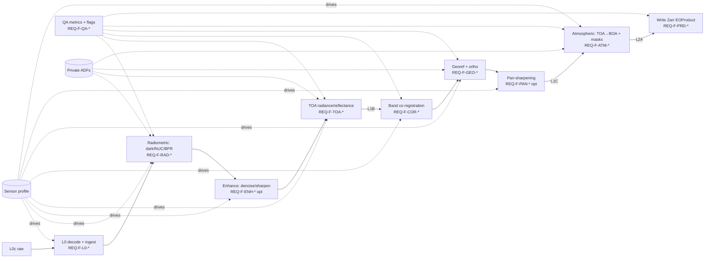

# Software Requirements Specification (SRS)

| Field | Value |
|---|---|
| **Document** | SRS — Software Requirements Specification |
| **DRD ref** | ECSS-E-ST-40C Rev.1, Annex D |
| **Container** | Technical Specification (TS) — `compliance/drd/` (source), published subset in `docs/` |
| **Project** | `msi-processor` (gitlab.eopf.copernicus.eu/ipf/msi-processor) |
| **Software criticality** | Category C (ECSS-Q-ST-80C Rev.2 / ECSS-E-ST-40C Annex R) |
| **Baselined at** | PDR (Preliminary Design Review) |
| **Status** | Draft for PDR |

> This SRS is a major constituent of the Technical Specification of `msi-processor`. It decomposes
> the system requirements (`SYS-*`, SSS / RD-2, Annex B) and the interface requirements
> (`REQ-IF-*`, IRD / RD-3, Annex C) into uniquely identified **software requirements (`REQ-*`)**.
> It follows the ECSS-E-ST-40C Rev.1 Annex D section structure and the heading style of the SDP
> (RD-1). The processing-algorithm mathematical basis is *not* (re)specified here: it is the subject
> of the DPM (RD-6) and ATBD (RD-7); this SRS states *what the software shall do* and binds each
> requirement to a verification method (**T** Test / **A** Analysis / **I** Inspection / **R** Review
> of design). Concrete interface and product-structure definitions remain controlled in the ICD
> (RD-4) per the IRD. The footprint is tailored to a Category C, single-developer ground-segment
> processor.

---

## <1> Introduction

**Purpose.** This document specifies the software requirements for `msi-processor`, a generic
high-resolution **pushbroom multispectral imager (MSI)** ground-segment data processor that
transforms downlinked **RAW Level-0 (`L0c`)** MSI data into calibrated, orthorectified,
atmospherically corrected products **up to Level-2 (`L2A`)**. It describes the functional and
non-functional requirements applicable to the software item.

**Objective.** The SRS is the parent specification for the design (SDD, RD-5) and the verification
and validation activities (V&V plan, RD-8). Every `REQ-*` requirement traces upward to a system
requirement (`SYS-*`, RD-2) and/or an interface requirement (`REQ-IF-*`, RD-3), and downward to a
verification method (clause <6>) and, at CDR, to a design element and a test case (traceability
matrix, RD-9).

**Content.** Clause <4> gives the software overview (function, environment, relations,
constraints). Clause <5> states the requirements grouped per Annex D type: functional requirements
per processing stage (<5.2>), then performance (<5.3>), interface (<5.4>), operational (<5.5>),
resources (<5.6>), design (<5.7>), security/privacy (<5.8>), portability (<5.9>), quality (<5.10>),
reliability (<5.11>), maintainability (<5.12>), safety (<5.13>), configuration/delivery (<5.14>),
data/database (<5.15>), human-factors (<5.16>) and adaptation/installation (<5.17>). Clause <6>
gives the validation approach and matrix, clause <7> the traceability, clause <8> the logical
model.

**Reason for preparation.** The project is an **integration and ECSS productisation** effort: the
processing chain (decode → radiometric → geometric → atmospheric, plus enhancement and QA) already
exists as prior-work algorithms (RD-10, see SRF). This SRS turns that algorithmic heritage plus the
EOPF CPM platform into a documented, verifiable, sensor-agnostic, configuration-driven product. It
is produced at PDR to baseline the software requirements before detailed design begins.

---

## <2> Applicable and reference documents

### Applicable documents (AD)

| Id | Document | Reference |
|---|---|---|
| AD-1 | ECSS Space engineering — Software | ECSS-E-ST-40C Rev.1 (30 April 2025) |
| AD-2 | ECSS Space product assurance — Software product assurance | ECSS-Q-ST-80C Rev.2 |
| AD-3 | ECSS System engineering — General requirements | ECSS-E-ST-10C Rev.1 |
| AD-4 | EOPF CPM — Product Structure & Format Definition (PSFD) / common data model | EOPF CPM docs (`eopf == 2.8.1`) |

### Reference documents (RD)

| Id | Document | Reference |
|---|---|---|
| RD-1 | `msi-processor` Software Development Plan (SDP) | `compliance/software-development-plan.md` |
| RD-2 | `msi-processor` Software System Specification (SSS) — `SYS-*` | `compliance/drd/sss-software-system-specification.md` |
| RD-3 | `msi-processor` Interface Requirements Document (IRD) — `REQ-IF-*` | `compliance/drd/ird-interface-requirements.md` |
| RD-4 | `msi-processor` Interface Control Document (ICD) — concrete interfaces (PDR/CDR) | `compliance/drd/icd-interface-control.md` |
| RD-5 | `msi-processor` Software Design Document (SDD) | `compliance/drd/sdd-software-design.md` (CDR) |
| RD-6 | `msi-processor` Detailed Processing Model (DPM) — per-level algorithm basis | `docs/dpm/` |
| RD-7 | `msi-processor` Algorithm Theoretical Basis Document (ATBD) | `docs/atbd/` |
| RD-8 | `msi-processor` V&V plan (SVerP/SValP/SUITP merged) | `compliance/drd/vv-plan.md` |
| RD-9 | `msi-processor` Traceability matrix | `compliance/traceability/traceability-matrix.md` (CDR) |
| RD-10 | Prior work — multispectral pushbroom preprocessing pipeline (algorithm/calibration heritage; see SRF) | RD-11 |
| RD-11 | `msi-processor` Software Reuse File (SRF) | `compliance/drd/srf-software-reuse-file.md` |
| RD-12 | EOPF CPM API documentation (`EOProduct`, `EOProcessingUnit`, `EOZarrStore`, triggering) | EOPF CPM (`eopf == 2.8.1`) |
| RD-13 | Cloud-native data conventions | Zarr v2/v3, CF metadata, STAC |

---

## <3> Terms, definitions and abbreviated terms

Only terms/abbreviations not already defined in the AD/RD (in particular the SSS <3> and IRD <3>
glossaries, which apply in full) are listed.

| Term / abbr. | Definition |
|---|---|
| BPR | Bad-pixel replacement (defective-pixel detection + interpolation) |
| DSNU / PRNU | Dark-signal non-uniformity / photo-response non-uniformity |
| NUC | Non-uniformity correction (combined flat-field + offset normalisation) |
| TOA / BOA | Top-of-atmosphere / bottom-of-atmosphere |
| ESUN | Mean exo-atmospheric (band-integrated) solar irradiance |
| GSD | Ground sampling distance |
| GCP | Ground control point |
| PAN / MS | Panchromatic band / multispectral band set |
| SNR / RMSE / PSNR / MSE | Signal-to-noise ratio / root-mean-square error / peak SNR / mean-square error (QA metrics) |
| L1A / L1B / L1C / L2A | Processing levels (per SSS <3>): focal-plane samples / TOA radiance(/reflectance), instrument geometry / orthorectified TOA reflectance / atmospherically corrected BOA reflectance |
| PU | EOPF CPM `EOProcessingUnit` |
| ADF | Auxiliary Data File (private instrument calibration / auxiliary input) |
| Profile | Per-sensor configuration set specialising the generic chain |
| T / A / I / R | Verification methods: Test / Analysis / Inspection / Review of design |

---

## <4> Software overview

### <4.1> Function and purpose

`msi-processor` is a batch, non-interactive payload-data processor. It ingests consolidated
Level-0 (`L0c`) raw MSI data plus a per-acquisition set of private calibration/auxiliary ADFs,
selected through an active **sensor profile**, and produces cloud-native **Zarr** `EOProduct`s up
to Level-2. The processing chain is a sequence of EOPF CPM `EOProcessingUnit`s with defined product
breakpoints. The level decomposition and the stages realised in each level (grounded in the
prior-work heritage RD-10) are:

| Level transition | Stage(s) | Functional reqs |
|---|---|---|
| `L0c` → `L1A` | Source-packet decode/reformat; lost-packet & line-loss handling; detector/focal-plane assembly; geo-annotation from telemetry | REQ-F-L0-* |
| `L1A` → `L1B` | Radiometric: dark/offset (DSNU) subtraction, NUC/flat-field (PRNU), BPR; image-quality enhancement (denoise/sharpen); DN→TOA radiance (and optional TOA reflectance) | REQ-F-RAD-*, REQ-F-ENH-*, REQ-F-TOA-* |
| `L1B` → `L1C` | Geometric: inter-band co-registration; viewing-model + DEM/GCP orthorectification; resampling to the profile CRS/grid; optional pan-sharpening | REQ-F-COR-*, REQ-F-GEO-*, REQ-F-PAN-* |
| `L1C` → `L2A` | Atmospheric: AOT/water-vapour ingest/retrieval, TOA→BOA surface reflectance, scene classification, cloud/cloud-shadow masking | REQ-F-ATM-* |
| all levels | QA metrics & per-pixel quality flags; product generation; chain orchestration; provenance | REQ-F-QA-*, REQ-F-PRD-*, REQ-F-ORC-* |

**States and modes (link per Annex D <5.2>b).** The processor exhibits *configured/idle* (profile
and inputs resolved), *processing* (one or more PUs executing) and *error/aborted* (a stage failed;
outputs flagged, no partial product published). There is no resident or real-time mode (SSS <4.2>).

### <4.2> Environmental considerations

- **Physical / hardware environment (target).** x86-64 Linux host, multi-core CPU, **no GPU
  required**; RAM and storage scale with tile/chunk size; optional Dask cluster for horizontal
  scaling. I/O against S3-compatible object storage or a POSIX filesystem.
- **Operating environment.** The reference runtime is the **EOPF SDE** container image
  (`registry.eopf.copernicus.eu/sde/cpm-build-environment`) providing the CPM (`eopf == 2.8.1`),
  Python 3.11 and the scientific stack (numpy, xarray, zarr, Dask, scikit-image, OpenCV,
  GDAL/rasterio). The same software runs unchanged on a local workstation for numerical
  verification against private real data.
- **Constrained verification environment.** The public CI runner is a **shell executor** with no
  container runtime, Dask gateway or S3; tests requiring those, or requiring private data, run
  non-blocking in CI and are executed locally.

### <4.3> Relation to other systems

`msi-processor` is one software item within a larger EO ground segment; it is **not** an integrated
HW–SW product and has no embedded/on-board element. Its external counterparts (detailed in the IRD
<4.1> and ICD) are: upstream **L0 ingestion/downlink** (E1, input), the **calibration facility /
ADF provider** (E2, input, private), the **sensor-profile/configuration provider** (E3, input), the
**processing orchestration/trigger** (E4, input), the **product store/archive/dissemination** (E5,
output), and the host **EOPF CPM framework + storage backend** (E6). The processor consumes E1–E4
and feeds E5, executing within E6. The block diagram and the per-interface definitions are in the
IRD <4.1> and the ICD (RD-4); they are not duplicated here.

### <4.4> Constraints

The following items limit the developer's options (background and justification in the SSS <4.3> /
<5.10> and IRD <4.2>; carried here as design constraints in <5.7>):

- Built on the **EOPF CPM** (`EOProcessingUnit`, `EOProduct`, `EOZarrStore`) pinned to
  **`eopf == 2.8.1`**; the version is not upgraded (build-environment lock).
- Outputs **shall be cloud-native Zarr** conforming to the EOPF data model; no other product format.
- Implementation language **Python 3.11**.
- Algorithms **reuse the existing mathematical basis** (RD-6/RD-10); no new-algorithm research.
- **Data policy:** source code is public (Apache-2.0); raw `L0` inputs and instrument calibration
  ADFs are **private** — never committed, never used in public CI.
- **Sensor-agnostic:** no instrument constants hard-coded in the processing core; all
  sensor-specific data is supplied via the profile.
- **Single-developer, Category C:** process rigour from automated tooling and checklists.

---

## <5> Requirements

### <5.1> General

- **a.** Each requirement is uniquely identified by a `REQ-<group>-<nn>` tag and is baselined at
  this issue (PDR).
- **b.** Where a requirement is expressed through a schema/model (profile schema, EOProduct/Zarr
  data model), identifiers are assigned within the schema/ICD for traceability.
- **c.** Each requirement carries an inline **Verify:** field stating the method(s) — **T** (Test),
  **A** (Analysis), **I** (Inspection), **R** (Review of design) — and a **Trace:** field to the
  upstream `SYS-*` / `REQ-IF-*`. The consolidated validation matrix is in clause <6>; the full
  bidirectional trace is in clause <7> and maintained in RD-9.
- **d.** Functional requirements (<5.2>) are grouped by subject (processing stage), and each stage
  is described as **General / Inputs / Outputs / Processing** before its requirements are listed.
- **e.** Requirements may be characterised by priority. Unless flagged *(optional)*, a requirement
  is **essential** and stable. *(optional)* requirements are profile-toggleable enhancement stages
  not required for a valid baseline `L2A` product.

> **Per-profile numeric budgets.** Performance figures that depend on instrument calibration —
> radiometric accuracy `RAD_ACC`, geolocation `GEO_CE90`, inter-band co-registration `BAND_COREG`,
> surface-reflectance accuracy `BOA_ACC`, throughput `THRU_SCENE`, per-worker memory `MEM_BUDGET` —
> are **per-profile budget parameters**. Their baseline values are held in the private
> auxiliary/calibration repository and verified locally; they are not reproduced here, in
> conformance with the data policy (SSS <5.1>).

---

### <5.2> Functional requirements

Functional requirements implement SSS capabilities `SYS-CAP-*` and the staged interface model
`REQ-IF-CAP-01`. The full chain and any sub-chain shall be runnable at level breakpoints
(REQ-F-ORC-01).

#### <5.2.1> L0 decoding and ingestion (`L0c` → `L1A`)

- **General.** Decode/reformat the raw downlinked product into per-band, per-detector sample arrays
  in focal-plane geometry, validate it, resolve the applicable profile and ADF set, and emit an
  `L1A` `EOProduct`. (Heritage: `level_0.py` `Decoder.decode`, `lost_package`.)
- **Inputs.** `L0c` product (image source data + acquisition/ancillary telemetry: timing,
  instrument mode/configuration, orbit/attitude); active sensor profile.
- **Outputs.** `L1A` `EOProduct` (radiometrically uncorrected detector samples, geo-annotated) with
  initial QA flags.
- **Processing.** Source-packet decode, line/packet-loss detection and handling, detector assembly,
  telemetry annotation, structural/metadata legality checks.

- **REQ-F-L0-01** — The software shall decode/reformat the `L0c` source data into per-band,
  per-detector sample arrays in focal-plane geometry.
  *Trace:* SYS-CAP-01, REQ-IF-IN-L0-01, REQ-IF-SW-04. *Verify:* T.
- **REQ-F-L0-02** — The software shall detect lost-packet / line-loss conditions in the decoded
  data, handle them deterministically (truncate/flag affected lines) and record the loss in the QA
  layer and processing report.
  *Trace:* SYS-CAP-01, SYS-OBS-02. *Verify:* T.
- **REQ-F-L0-03** — The software shall perform structural and metadata legality checks on the input
  and reject or flag inputs that fail them **before** any radiometric processing; it shall resolve
  the applicable sensor profile and ADF set from the `L0` identification metadata
  (instrument/sensor id, acquisition time, instrument mode).
  *Trace:* SYS-CAP-01, REQ-IF-IN-L0-02, REQ-IF-SEC-01. *Verify:* T.
- **REQ-F-L0-04** — The software shall assemble the decoded detector samples and the required
  telemetry (timing, mode, orbit/attitude) into a self-describing `L1A` `EOProduct`.
  *Trace:* SYS-CAP-01, REQ-IF-IN-L0-01, REQ-IF-OUT-02. *Verify:* T, I.
- **REQ-F-L0-05** — The software shall treat the `L0` input as **read-only** and shall not modify
  it.
  *Trace:* REQ-IF-IN-L0-03, REQ-IF-SEC-03. *Verify:* A, I.

#### <5.2.2> Radiometric correction — dark, NUC/PRNU, BPR (`L1A` →)

- **General.** Convert raw detector samples to a uniform, defect-free detector response by removing
  dark signal, normalising detector-to-detector response, and replacing defective pixels. (Heritage:
  `level_1.py` `NUC.compute_nuc`, `apply_nuc_and_bpr`, `noise_remover`, `dark_noise_removal`.)
- **Inputs.** `L1A` product; ADFs: dark/offset reference, flat-field/PRNU table (or per-detector
  gain/offset), defective/bad-pixel map; profile thresholds.
- **Outputs.** Radiometrically corrected detector array; updated QA flags (defective, saturated,
  no-data).
- **Processing.** `corrected = sample · gain + offset − dark_offset`; bad-pixel replacement by
  neighbour interpolation; saturation/no-data masking.

- **REQ-F-RAD-01** — The software shall subtract the dark-signal / offset (DSNU) reference from the
  detector samples, per band, using the ADF valid for the acquisition.
  *Trace:* SYS-CAP-02, REQ-IF-IN-ADF-01, REQ-IF-IN-ADF-02. *Verify:* T, A.
- **REQ-F-RAD-02** — The software shall apply non-uniformity / flat-field correction (PRNU) via the
  per-detector gain and offset supplied (or derived) per band, equalising detector response.
  *Trace:* SYS-CAP-02, REQ-IF-IN-ADF-01. *Verify:* T, A.
- **REQ-F-RAD-03** — The software shall detect defective/bad pixels (from the bad-pixel-map ADF
  and/or gain-threshold criteria) and replace them by interpolation of valid neighbouring detectors,
  flagging each replaced pixel in the QA layer.
  *Trace:* SYS-CAP-02, SYS-OBS-02. *Verify:* T.
- **REQ-F-RAD-04** — The software shall detect saturated and no-data samples, clip corrected values
  to the valid dynamic range and flag them in the QA layer.
  *Trace:* SYS-CAP-02, SYS-OBS-02. *Verify:* T.
- **REQ-F-RAD-05** *(optional, calibration support)* — The software shall be able to derive
  per-detector gain/offset (NUC) tables from dark-field and flat-field reference acquisitions and
  emit them as a versioned calibration ADF, for use by REQ-F-RAD-02.
  *Trace:* SYS-CAP-02, SYS-MNT-02. *Verify:* T, A.

#### <5.2.3> TOA radiance and reflectance (`→ L1B`)

- **General.** Convert corrected digital numbers to physical at-sensor (TOA) spectral radiance and,
  optionally, TOA reflectance, and emit the `L1B` product. (Heritage: `level_1.py` `TOA.dn_to_radiance`,
  `get_ESUN`, `get_sun_el_esdist`, `toa_rad_to_ref`.)
- **Inputs.** Radiometrically corrected detector array; ADFs: radiometric gain/offset; profile:
  ESUN per band, illumination geometry source (sun zenith, Earth–Sun distance).
- **Outputs.** `L1B` `EOProduct`: TOA spectral radiance (and optional TOA reflectance) in instrument
  geometry, with QA and provenance.
- **Processing.** `radiance = (DN − offset) · gain`; reflectance via ESUN / cos(sun zenith) /
  Earth–Sun-distance² normalisation.

- **REQ-F-TOA-01** — The software shall convert corrected DN to at-sensor (TOA) spectral radiance
  per band using the radiometric gain/offset ADF.
  *Trace:* SYS-CAP-02, SYS-CAP-03, REQ-IF-IN-ADF-01. *Verify:* T, A.
- **REQ-F-TOA-02** *(optional)* — The software shall convert TOA radiance to TOA reflectance using
  per-band ESUN, solar zenith angle and Earth–Sun distance derived from the acquisition geometry.
  *Trace:* SYS-CAP-03. *Verify:* T, A.
- **REQ-F-TOA-03** — The software shall emit the `L1B` `EOProduct` (TOA radiance/reflectance,
  instrument geometry) carrying per-pixel QA flags and processing provenance.
  *Trace:* SYS-CAP-08, REQ-IF-OUT-02. *Verify:* T, I.

#### <5.2.4> Image-quality enhancement — denoise and sharpen

- **General.** Optionally improve image quality by noise suppression and resolution restoration,
  without compromising radiometric integrity. (Heritage: `level_1.py` `Denoiser` — butterworth LP,
  wavelet VisuShrink, PCA, moving-average, gaussian, FFT dark-noise removal — and `sharpening.deconvolution_kernel`.)
- **Inputs.** Radiometrically corrected band(s); profile: filter selection and parameters
  (cutoff, order, kernel), per-band overrides.
- **Outputs.** Enhanced band(s), values clipped to valid range; QA metrics on noise/sharpness change.
- **Processing.** Selected denoising filter; deconvolution/sharpening kernel convolution.

- **REQ-F-ENH-01** *(optional)* — The software shall provide configurable per-band denoising with a
  profile-selected method (at least: Butterworth low-pass, wavelet VisuShrink, PCA, moving-average,
  Gaussian, FFT dark-noise removal) and parameters.
  *Trace:* SYS-CAP-02, SYS-ADP-01. *Verify:* T, A.
- **REQ-F-ENH-02** *(optional)* — The software shall provide image restoration / sharpening via a
  profile-selected deconvolution kernel, per band, clipping the result to the valid dynamic range.
  *Trace:* SYS-CAP-02, SYS-ADP-01. *Verify:* T, A.
- **REQ-F-ENH-03** — Enhancement stages shall be individually toggleable per profile and shall
  default to disabled where not validated for the active sensor; when enabled, their radiometric
  impact shall be reported via QA metrics (REQ-F-QA-01).
  *Trace:* SYS-ADP-01, SYS-QUA-04. *Verify:* T, R.

#### <5.2.5> Inter-band co-registration (`L1B` →)

- **General.** Spatially align the spectral bands to a common reference band so that a pixel maps to
  the same ground location across bands. (Heritage: `band_coreg.py` — CLAHE, SIFT, FLANN, RANSAC
  homography, `warpPerspective`.)
- **Inputs.** `L1B` bands; profile: reference band, feature/matcher parameters, acceptance
  thresholds.
- **Outputs.** Co-registered band stack; co-registration residual QA; failure flag on insufficient
  matches.
- **Processing.** Feature detection + matching + robust transform estimation + resampling/warp.

- **REQ-F-COR-01** — The software shall co-register the spectral bands to a profile-defined
  reference band using feature detection, robust transform estimation and resampling.
  *Trace:* SYS-CAP-04, REQ-IF-CAP-01. *Verify:* T, A.
- **REQ-F-COR-02** — Inter-band co-registration residual shall meet the per-profile `BAND_COREG`
  budget, verified locally against ground/reference data.
  *Trace:* SYS-CAP-05. *Verify:* A, T.
- **REQ-F-COR-03** — On insufficient matches or a co-registration solution outside acceptance
  thresholds, the software shall flag the affected band and apply the fail-stop policy (REQ-F-DEP-01)
  rather than silently producing a misregistered product.
  *Trace:* SYS-CAP-05, SYS-RAM-02. *Verify:* T.

#### <5.2.6> Geo-referencing / orthorectification (`→ L1C`)

- **General.** Geolocate the imagery using the viewing/geometric model and orbit/attitude, refine
  with GCPs, orthorectify with a DEM and resample onto the profile cartographic grid/CRS. (Heritage:
  `georeferencing_v1.py` — orbit/TLE sub-point, GSD, GCP/reference matching, GDAL/`osr` CRS,
  georeferenced raster output.)
- **Inputs.** Co-registered `L1B` product; ADFs: viewing/geometric model, DEM, GCP/reference;
  profile: output CRS, grid, resolution, resampling method.
- **Outputs.** `L1C` `EOProduct`: orthorectified TOA reflectance on a cartographic grid, with CRS
  encoding and geolocation layers, QA and provenance.
- **Processing.** Viewing-model geolocation, GCP refinement, DEM orthorectification, resampling.

- **REQ-F-GEO-01** — The software shall geolocate the product by applying the viewing/geometric
  model driven by the orbit/attitude telemetry and GSD.
  *Trace:* SYS-CAP-04, REQ-IF-IN-ADF-01, REQ-IF-IN-L0-01. *Verify:* T, A.
- **REQ-F-GEO-02** — The software shall orthorectify using the DEM, optionally refine geolocation
  with GCPs, and resample to the profile-defined CRS, grid and resolution.
  *Trace:* SYS-CAP-04, SYS-ADP-02. *Verify:* T, A.
- **REQ-F-GEO-03** — Geolocation error of the `L1C` product shall meet the per-profile `GEO_CE90`
  (circular error, 90 %) budget, verified locally against ground reference.
  *Trace:* SYS-CAP-05. *Verify:* A, T.
- **REQ-F-GEO-04** — The software shall emit the `L1C` `EOProduct` with CRS encoding and
  geolocation/geo-referencing information, QA flags and provenance.
  *Trace:* SYS-CAP-08, REQ-IF-OUT-02. *Verify:* T, I.

#### <5.2.7> Pan-sharpening *(optional)*

- **General.** Fuse the co-registered multispectral bands with a higher-resolution panchromatic band
  to produce a high-resolution multispectral product. (Heritage: `pansharp.py` `PanSharpening.pan_sharpen`.)
- **Inputs.** Co-registered MS stack; PAN band; profile: enable flag, fusion method, alignment
  parameters.
- **Outputs.** Pan-sharpened MS product at PAN resolution; spectral-fidelity QA.
- **Processing.** MS↔PAN alignment + fusion.

- **REQ-F-PAN-01** *(optional)* — The software shall, when enabled by the profile, fuse the
  co-registered MS bands with the PAN band to produce a high-resolution MS product, including MS↔PAN
  alignment.
  *Trace:* SYS-CAP-04, SYS-ADP-01. *Verify:* T, A.
- **REQ-F-PAN-02** *(optional)* — Pan-sharpening shall preserve spectral fidelity within the
  per-profile budget and report the achieved fidelity via QA metrics.
  *Trace:* SYS-QUA-04. *Verify:* A, T.

#### <5.2.8> Atmospheric correction (`L1C` → `L2A`)

- **General.** Remove atmospheric effects to derive bottom-of-atmosphere (surface) reflectance and
  classify the scene. (Specified from SSS SYS-CAP-06/07; algorithm basis in DPM RD-6.)
- **Inputs.** `L1C` TOA reflectance; ADFs/auxiliaries: AOT, water vapour, atmospheric model
  parameters; DEM; profile: retrieval vs ingest mode, classification options.
- **Outputs.** `L2A` `EOProduct`: BOA surface reflectance + scene classification + cloud/cloud-shadow
  masks + QA + provenance.
- **Processing.** Atmospheric-parameter retrieval/ingest, TOA→BOA conversion, scene classification,
  masking.

- **REQ-F-ATM-01** — The software shall obtain the atmospheric parameters (AOT, water vapour) by
  retrieval from the imagery and/or ingest of auxiliary meteorological data, per the DPM and profile.
  *Trace:* SYS-CAP-06, REQ-IF-IN-ADF-01. *Verify:* T, A.
- **REQ-F-ATM-02** — The software shall convert TOA reflectance to BOA (surface) reflectance using
  the atmospheric model and parameters.
  *Trace:* SYS-CAP-06. *Verify:* T, A.
- **REQ-F-ATM-03** — The software shall produce a scene classification and a cloud / cloud-shadow
  mask as part of the `L2A` product.
  *Trace:* SYS-CAP-07, SYS-OBS-02. *Verify:* T.
- **REQ-F-ATM-04** — The software shall emit the `L2A` `EOProduct` (BOA reflectance + scene class +
  masks + QA + provenance).
  *Trace:* SYS-CAP-08, REQ-IF-OUT-02. *Verify:* T, I.

#### <5.2.9> QA metrics and quality indicators

- **General.** Compute quantitative quality metrics and propagate per-pixel quality flags throughout
  the chain. (Heritage: `metrics_ips.py` — SNR, RMSE, PSNR, MSE, variance, `run_validation`.)
- **Inputs.** Stage input/output products; optional reference/raw products.
- **Outputs.** Per-stage metrics (in the processing report); per-pixel QA flag layers (in products).
- **Processing.** Metric computation; flag accumulation and propagation.

- **REQ-F-QA-01** — The software shall compute per-band/per-stage quality metrics (at least SNR,
  RMSE, PSNR, MSE, variance) against the reference/input product and record them in the processing
  report.
  *Trace:* SYS-OBS-02, SYS-OBS-03, SYS-QUA-04. *Verify:* T.
- **REQ-F-QA-02** — The software shall carry per-pixel QA flag layers (at least saturation,
  defective pixel, no-data, lost-packet, cloud, cloud-shadow) through every stage to the output
  product.
  *Trace:* SYS-OBS-02, SYS-CAP-08. *Verify:* T.

#### <5.2.10> Product generation and chain orchestration

- **General.** Persist products in the EOPF Zarr data model with full provenance, and orchestrate the
  PUs as a chainable, breakpoint-able, chunked pipeline.
- **Inputs.** Stage output `EOProduct`s; profile; run/triggering parameters.
- **Outputs.** Cloud-native Zarr `EOProduct`s; completion status and diagnostics.
- **Processing.** Zarr write via `EOZarrStore`; provenance assembly; PU chaining; chunked execution.

- **REQ-F-PRD-01** — The software shall write each output as a cloud-native Zarr `EOProduct` via the
  EOPF `EOZarrStore`, carrying measurement bands, QA/mask layers, geolocation and product/processing
  metadata.
  *Trace:* SYS-CAP-08, REQ-IF-OUT-01, REQ-IF-OUT-02. *Verify:* T, I.
- **REQ-F-PRD-02** — Each output product shall carry processing provenance: input product id(s), ADF
  id(s)+version(s), profile id+version, processor/baseline version, processing parameters and
  timestamp.
  *Trace:* SYS-OBS-01, REQ-IF-CAP-03, REQ-IF-OUT-04. *Verify:* I, T.
- **REQ-F-ORC-01** — Each processing stage shall be an `EOProcessingUnit` declaring its mandatory
  inputs, ADFs, outputs and parameters; the chain shall be runnable as a single level, a sub-chain
  or the full `L0c`→`L2A` chain, with start/stop at level breakpoints.
  *Trace:* SYS-CAP-10, REQ-IF-CAP-01, REQ-IF-SW-01. *Verify:* T, R.
- **REQ-F-ORC-02** — The software shall process in chunks/tiles within bounded memory and shall
  support optional distribution via Dask, without requiring a whole product resident in memory.
  *Trace:* SYS-CAP-11, REQ-IF-CAP-02. *Verify:* T, A.

#### <5.2.11> Functional requirements related to safety and dependability (Annex D <5.2>e)

- **REQ-F-DEP-01** — On any stage failure the software shall apply a **fail-stop** policy: exit with
  a non-zero status, flag/withhold affected outputs, and never publish a partial or misleading
  product as complete.
  *Trace:* SYS-OPS-02, SYS-RAM-02, SYS-SAF-01. *Verify:* T.
- **REQ-F-DEP-02** — Given identical inputs, ADF set, profile version and processor version, the
  software shall be **deterministic and reproducible** (bit-identical where the algorithm is
  deterministic; otherwise within a documented numerical tolerance).
  *Trace:* SYS-RAM-01, REQ-IF-CAP-04. *Verify:* T, A.

---

### <5.3> Performance requirements

Numeric values are per-profile budgets held privately (note in <5.1>); verification is local on
mission-representative real data.

- **REQ-P-01** — Radiometric output (`L1B`) shall meet the per-profile radiometric accuracy budget
  `RAD_ACC`. *Trace:* SYS-CAP-03, SYS-QUA-04. *Verify:* A, T.
- **REQ-P-02** — Geolocation (`L1C`) shall meet `GEO_CE90` and inter-band co-registration shall meet
  `BAND_COREG`. *Trace:* SYS-CAP-05. *Verify:* A, T.
- **REQ-P-03** — Surface reflectance (`L2A`) shall meet the per-profile `BOA_ACC` budget.
  *Trace:* SYS-QUA-04. *Verify:* A, T.
- **REQ-P-04** — End-to-end `L0c`→`L2A` throughput shall meet the per-profile objective
  `THRU_SCENE` on the stated reference configuration. *Trace:* SYS-RES-04. *Verify:* A, T.
- **REQ-P-05** — Peak per-worker memory shall be bounded by the configured chunk/tile size to within
  `MEM_BUDGET`. *Trace:* SYS-RES-03. *Verify:* A, T.

---

### <5.4> Interface requirements

External interfaces are specified at requirements level in the IRD (RD-3, `REQ-IF-*`) and defined
concretely in the ICD (RD-4); they are not re-derived here. The following bind the software item to
them.

- **REQ-I-01** — The software shall comply with all interface requirements `REQ-IF-*` (IRD) and with
  their concrete definitions in the ICD (PSFD as normative product-structure reference).
  *Trace:* REQ-IF-CAP-01..05, REQ-IF-IN-*, REQ-IF-OUT-*, REQ-IF-SW-*, REQ-IF-COM-*, REQ-IF-AD-*.
  *Verify:* R, I.
- **REQ-I-02** — The software shall expose its capabilities through a CPM-based Python API and a
  non-interactive command-line interface for batch invocation.
  *Trace:* SYS-IF-01, REQ-IF-HMI-01, REQ-IF-SW-01. *Verify:* T, I.
- **REQ-I-03** — The software shall consume `L0c` products and ADFs in the formats defined in the
  ICD, with the active profile selecting concrete sources/versions; the inputs shall be read-only.
  *Trace:* SYS-IF-02, REQ-IF-IN-L0-01, REQ-IF-IN-ADF-01, REQ-IF-IN-L0-03, REQ-IF-IN-ADF-04.
  *Verify:* T.
- **REQ-I-04** — The software shall produce `L1B`/`L1C`/`L2A` `EOProduct`s as Zarr stores on
  S3-compatible object storage or a POSIX filesystem, chunked for partial/lazy downstream reads, per
  the ICD. *Trace:* SYS-IF-03, REQ-IF-OUT-01, REQ-IF-OUT-03. *Verify:* T, I.
- **REQ-I-05** — The software shall be invocable through the CPM triggering payload (JSON job order)
  declaring inputs, ADFs, output target, profile and parameters/breakpoints, per the ICD.
  *Trace:* SYS-OPS-01, REQ-IF-COM-01. *Verify:* T, I.
- **REQ-I-06** — All input/output interfaces shall reference products, ADFs and targets by **URI**
  (location-transparent local/remote), resolved through the EOPF store/mapper, with a
  local-filesystem path that does not require a container runtime, Dask gateway or S3.
  *Trace:* SYS-IF-04, REQ-IF-COM-02, REQ-IF-COM-03. *Verify:* T.
- **REQ-I-07** — The naming of product variables, bands, dimensions and command/payload fields shall
  follow the EOPF data-model conventions (data/command interface naming, Annex D <5.4>c).
  *Trace:* SYS-DES-06, REQ-IF-OUT-02. *Verify:* I.

---

### <5.5> Operational requirements

- **REQ-O-01** — The software shall be operable as a batch job (CLI or Python API) invoked with a
  profile, an input reference and an auxiliary-data reference, optionally restricted to a single
  level or sub-chain. *Trace:* SYS-OPS-01, REQ-IF-COM-01, REQ-IF-CAP-01. *Verify:* T.
- **REQ-O-02** — Each run shall emit structured logs and a processing report sufficient to determine
  success/failure, the parameters used and the product provenance.
  *Trace:* SYS-OPS-02, SYS-OBS-01. *Verify:* T.
- **REQ-O-03** — The software shall expose, at its external boundary, a completion status
  (success/failure) and machine-readable structured diagnostics (errors, warnings, per-product QA
  flags) consumable by the orchestration layer. *Trace:* REQ-IF-CAP-05. *Verify:* T.
- **REQ-O-04** — The software shall implement the operational modes and transitions of <4.1>
  (configured/idle → processing → error/aborted); there shall be no resident/real-time mode.
  *Trace:* SYS-CAP-10 (states & modes, SSS <4.2>). *Verify:* R, T.

---

### <5.6> Resources requirements

- **REQ-R-01** — The software shall run on x86-64 Linux with a multi-core CPU and shall not require a
  GPU. *Trace:* SYS-RES-01. *Verify:* T.
- **REQ-R-02** — The software shall operate against S3-compatible object storage or a POSIX
  filesystem and shall require no other specialised hardware.
  *Trace:* SYS-RES-02, REQ-IF-OUT-03, REQ-IF-HW-01. *Verify:* T.
- **REQ-R-03** — The software shall run on Python 3.11 with EOPF CPM `eopf == 2.8.1` and the declared
  dependency stack (numpy, xarray, zarr, Dask, scikit-image, OpenCV, GDAL/rasterio) recorded in the
  SRF; no proprietary runtime shall be required.
  *Trace:* SYS-RES-05, REQ-IF-SW-03, SYS-DES-03. *Verify:* I, T.
- **REQ-R-04** *(sizing)* — Memory shall scale with, and be bounded by, the configured chunk/tile
  size; CPU/wall-time shall scale with the number of tiles/workers (see REQ-P-04, REQ-P-05).
  *Trace:* SYS-RES-03, SYS-CAP-11. *Verify:* A, T.
- **REQ-R-05** *(timing / real-time)* — The software has **no hard real-time constraint** and no
  input-validity deadline; timing is expressed only as the throughput objective REQ-P-04.
  *Trace:* SYS-RES-04 (SSS <5.2> real-time note). *Verify:* R.

---

### <5.7> Design requirements and implementation constraints

- **REQ-D-01** *(architecture)* — Each processing stage shall be a CPM `EOProcessingUnit` and each
  product an `EOProduct`; the architecture shall be a config-driven, sensor-agnostic pipeline.
  *Trace:* SYS-DES-01, REQ-IF-SW-01. *Verify:* R.
- **REQ-D-02** *(software standards)* — The software shall conform to the project coding standards
  (PEP 8 enforced by black/ruff/flake8/isort, typing by mypy) and to the ECSS-E-ST-40C/Q-ST-80C
  tailoring of the SDP. *Trace:* SYS-DES-02, SYS-QUA-01. *Verify:* I.
- **REQ-D-03** *(design method)* — Each stage shall be implemented as a pure, framework-independent
  algorithmic core callable without the CPM runtime, with the `EOProcessingUnit` as a thin adapter
  over it. *Trace:* REQ-IF-SW-04. *Verify:* T.
- **REQ-D-04** *(minimising critical components, ECSS-Q-ST-80 6.2.2.4)* — The processing core shall
  contain no hard-coded instrument constants (all externalised to the profile) and shall keep
  per-unit cyclomatic complexity within the `xenon` thresholds, isolating any complex numerical kernel
  behind a tested interface. *Trace:* SYS-CAP-09, SYS-QUA-05. *Verify:* I, A.
- **REQ-D-05** *(numerical accuracy management)* — Numerical processing shall use explicit float
  precision, clip results to the declared valid dynamic range, document per-stage tolerances, and use
  deterministic operations so that REQ-F-DEP-02 and the accuracy budgets (REQ-P-01..03) are met.
  *Trace:* SYS-RAM-01, SYS-QUA-04. *Verify:* A, T.
- **REQ-D-06** *(reused-software constraints)* — The software shall reuse only the components
  declared in the SRF (EOPF CPM, numpy, xarray, zarr, Dask, scikit-image, OpenCV, GDAL/rasterio) and
  shall comply with their open-source licences; product I/O shall not be implemented outside the CPM
  `EOProduct`/`EOZarrStore` abstractions. *Trace:* SYS-DES-03, REQ-IF-SW-02. *Verify:* I.
- **REQ-D-07** *(designed for reuse / flexibility)* — Adding a new sensor shall be achievable by
  adding a profile (and its private ADFs) without modifying the processing core.
  *Trace:* SYS-DES-07, SYS-CAP-09, REQ-IF-AD-01. *Verify:* T, R.
- **REQ-D-08** *(in-flight modification)* — No in-flight/in-orbit modification capability is
  required (ground software); this is stated to close Annex D <5.7>b.5. *Trace:* SSS <5.12>.
  *Verify:* R.
- **REQ-D-09** *(data standard)* — Outputs shall use Zarr with EOPF/CF-style metadata and
  STAC-compatible cataloguing fields. *Trace:* SYS-DES-04, REQ-IF-OUT-02. *Verify:* I, T.

---

### <5.8> Security and privacy requirements

- **REQ-S-01** — Source code shall be public (Apache-2.0); raw `L0` inputs and instrument
  calibration ADFs shall remain **private**, never committed to the repository nor used in public CI;
  the interfaces shall reference them by runtime URI only.
  *Trace:* SYS-SEC-01, REQ-IF-SEC-02, REQ-IF-IN-ADF-03. *Verify:* I, R.
- **REQ-S-02** — Credentials and access tokens (storage, registry, Dask, SonarQube) shall be
  supplied exclusively via environment / CI variables and shall never appear in source or product
  artefacts. *Trace:* SYS-SEC-02. *Verify:* I, T.
- **REQ-S-03** — The software shall require only **read** access to its inputs/ADFs/profile and
  **write** access to the designated output store (least privilege).
  *Trace:* SYS-SEC-03, REQ-IF-SEC-03. *Verify:* A, I.
- **REQ-S-04** — The software shall verify that the `L0` input, ADFs and profile used in a run are
  exactly those identified (id/version) and shall reject or flag inputs whose validity does not match
  the selected profile/acquisition. *Trace:* REQ-IF-SEC-01. *Verify:* T.
- **REQ-S-05** — Output products shall embed only the provenance identifiers/versions required by
  REQ-F-PRD-02 and shall not embed private calibration coefficients.
  *Trace:* REQ-IF-SEC-02, REQ-IF-CAP-03. *Verify:* I, A.

---

### <5.9> Portability requirements

- **REQ-PORT-01** — The software shall be relocatable between the EOPF SDE and a local workstation
  without code changes (configuration only). *Trace:* SYS-QUA-03. *Verify:* T, I.
- **REQ-PORT-02** — I/O shall be location-transparent (local filesystem and remote object store)
  through the EOPF store abstraction. *Trace:* REQ-IF-COM-02. *Verify:* T.
- **REQ-PORT-03** — The software shall provide a local-filesystem execution path that runs on the CI
  shell runner (no container runtime, Dask gateway or S3) for non-blocking verification.
  *Trace:* REQ-IF-COM-03, SYS-VV-02. *Verify:* T.

---

### <5.10> Software quality requirements

- **REQ-Q-01** — The software shall conform to ECSS-Q-ST-80C Rev.2 for Category C and to the project
  coding/quality gates (black, isort, flake8, mypy, bandit, xenon, SonarQube).
  *Trace:* SYS-QUA-01. *Verify:* I.
- **REQ-Q-02** — Automated test coverage shall meet the project gate (inherited EOPF threshold),
  measured by the unit-test CI job. *Trace:* SYS-QUA-02. *Verify:* T.
- **REQ-Q-03** — The numerical product-quality objectives (REQ-P-01..03) shall be validated locally
  on mission-representative real data. *Trace:* SYS-QUA-04. *Verify:* A, T.
- **REQ-Q-04** — Maintainability/quality shall be supported by reuse of the generic chain across
  profiles and by bounded cyclomatic complexity (xenon thresholds).
  *Trace:* SYS-QUA-05. *Verify:* I, A.

---

### <5.11> Software reliability requirements

- **REQ-REL-01** — Processing shall be deterministic and reproducible (implemented by REQ-F-DEP-02).
  *Trace:* SYS-RAM-01. *Verify:* T, A.
- **REQ-REL-02** — Processing shall be resumable / re-runnable at level granularity; a failed run
  shall not leave a partial product presented as complete (implemented by REQ-F-DEP-01, REQ-F-ORC-01).
  *Trace:* SYS-RAM-02. *Verify:* T.
- **REQ-REL-03** — No continuous-availability target is levied on the software; availability is a
  property of the hosting ground segment. *Trace:* SYS-RAM-03. *Verify:* R.

---

### <5.12> Software maintainability requirements

- **REQ-M-01** — Maintenance shall be performed under a GitLab issue → branch → merge-request
  workflow with SemVer releases. *Trace:* SYS-MNT-01. *Verify:* R.
- **REQ-M-02** — Calibration/auxiliary updates shall be deliverable by replacing the referenced
  private data, without changing the software. *Trace:* SYS-MNT-02, REQ-IF-IN-ADF-03. *Verify:* T, R.
- **REQ-M-03** — A documented procedure shall govern bumping the pinned `eopf` version and re-running
  the full V&V before re-baselining. *Trace:* SYS-MNT-03, REQ-IF-SW-03. *Verify:* R.
- **REQ-M-04** — The per-stage modular structure (pure core + PU wrapper + profile layer) shall
  allow each stage to be modified and re-verified independently. *Trace:* SYS-QUA-05, REQ-IF-SW-04.
  *Verify:* I.

---

### <5.13> Software safety requirements

- **REQ-SAF-01** — The product has no command authority over the space segment and no direct
  human-safety hazard; no safety-critical functions are defined. The residual hazard class is
  **product-data integrity** (mislabelled or silently corrupted product), mitigated by per-pixel QA
  flags (REQ-F-QA-02), provenance metadata (REQ-F-PRD-02) and fail-stop behaviour (REQ-F-DEP-01).
  *Trace:* SYS-SAF-01. *Verify:* R.

---

### <5.14> Software configuration and delivery requirements

- **REQ-DEL-01** — Releases shall be delivered as versioned Python wheels published to the GitLab
  package registry and as versioned documentation via GitLab Pages, built reproducibly by CI from a
  tagged commit. *Trace:* SYS-DEL-01. *Verify:* T, I.
- **REQ-DEL-02** — Delivered artefacts shall contain no private data; delivery integrity shall be
  anchored to the Git tag and registry record of the delivered version.
  *Trace:* SYS-DEL-02, REQ-IF-SEC-02. *Verify:* I.
- **REQ-DEL-03** — The Zarr `EOProduct` specification (product structure, per ICD/PSFD) shall be part
  of the delivered configuration. *Trace:* SYS-DES-04 (SDP <5.5.3>). *Verify:* I.

---

### <5.15> Data definition and database requirements

- **REQ-DAT-01** — The output product data model — `EOProduct`/Zarr group-variable tree, band
  naming, dtypes, chunking, CRS encoding — shall conform to the ICD with the EOPF PSFD as normative
  reference. *Trace:* SYS-DES-04, SYS-DES-06, REQ-IF-OUT-02. *Verify:* I, T.
- **REQ-DAT-02** — The private auxiliary/calibration store (the "system database" of
  ECSS-E-ST-40 §5.2.4.4) shall be external to the source repository; ADF identification, versioning,
  validity and schemas shall follow the ICD. *Trace:* SYS-ADP-02 (SSS <5.4> note),
  REQ-IF-IN-ADF-01, REQ-IF-IN-ADF-02. *Verify:* I, R.
- **REQ-DAT-03** — The sensor-profile schema shall be versioned and shall be validated at load time;
  an invalid/incomplete profile shall cause a controlled, reported failure before processing.
  *Trace:* SYS-ADP-03, REQ-IF-AD-04. *Verify:* T.

---

### <5.16> Human factors related requirements

- **REQ-HF-01** — Human interaction shall be limited to the CLI, configuration files and
  logs/reports; no graphical user interface shall be provided. Operator interaction is limited to
  supplying the triggering payload and consuming logs and exit status.
  *Trace:* SYS-IF-05, REQ-IF-HMI-01. *Verify:* I.
- **REQ-HF-02** — Diagnostics and the processing report shall be both human-readable and
  machine-readable and shall be sufficient for an operator to diagnose a run outcome without access
  to the private data. *Trace:* SYS-OPS-02. *Verify:* T, I.

---

### <5.17> Adaptation and installation requirements

- **REQ-AD-01** — The chain shall be sensor-agnostic and parametrised through the sensor profile;
  all sensor-specific data (band list/centre wavelengths/spectral response refs, detector and
  focal-plane geometry, calibration-ADF bindings, viewing-model ref, output CRS/grid/resolution/
  tiling, per-stage parameters and toggles) shall be supplied via the profile and not hard-coded.
  *Trace:* SYS-ADP-01, SYS-CAP-09, REQ-IF-AD-01. *Verify:* R, T.
- **REQ-AD-02** — Each profile shall be uniquely identified and versioned and selectable per run via
  the triggering payload; the first instantiated profile is the project owner's sensor.
  *Trace:* SYS-ADP-01, REQ-IF-AD-02. *Verify:* I, T.
- **REQ-AD-03** — Site- and epoch-dependent data (DEM, atmospheric auxiliaries) shall be selected by
  reference from the profile/run configuration, not embedded in the software.
  *Trace:* SYS-ADP-02, REQ-IF-AD-03. *Verify:* T.
- **REQ-AD-04** — Operations-/site-dependent settings (output store target and chunking, baseline
  selection, optional-stage enable/disable, breakpoints, atmospheric source selection) shall be
  externalised to the profile/configuration so the same software runs across contexts without code
  change. *Trace:* SYS-ADP-02, REQ-IF-AD-03. *Verify:* I, T.
- **REQ-AD-05** *(installation)* — A clean installation (`pip install`) into the SDE and into a local
  environment shall succeed, and the acceptance test set shall execute against it.
  *Trace:* SYS-VV-06. *Verify:* T, I.

---

## <6> Validation requirements

**Approach.** Per <5.1>c, each requirement carries an inline verification method (T/A/I/R). The
process combines (RD-8): automated **unit/integration tests** (`pytest`) in public CI for everything
not requiring private data, a container runtime, a Dask gateway or S3; **static analysis** and
review/inspection against this SRS; and **numerical analysis / test on real data** performed
**locally** against the DPM (RD-6) and reference products for the accuracy/performance budgets
(REQ-P-*, REQ-Q-03). Requirements whose means need the constrained services or private data are
marked non-blocking in CI and validated locally (SYS-VV-02). The detailed requirement→test-case
trace is maintained in RD-9 at CDR.

**Validation matrix (requirement → method → means / milestone).** *(Per Annex D <6>b. Method codes:
T/A/I/R.)*

| Requirement(s) | Method | Means / milestone |
|---|---|---|
| REQ-F-L0-01, -04 | T, I | Decode a sample `L0c` (local); assert `L1A` arrays + EOProduct structure (PDR→CDR) |
| REQ-F-L0-02 | T | Inject line/packet loss; assert truncation + QA flag |
| REQ-F-L0-03 | T | Malformed/mismatched input → reject/flag; profile/ADF resolution test |
| REQ-F-L0-05 | A, I | Static analysis / inspection: no write path to `L0` |
| REQ-F-RAD-01, -02 | T, A | Unit test on synthetic + local real data vs DPM expected response |
| REQ-F-RAD-03, -04 | T | Bad-pixel/saturation fixtures → replacement + QA flags |
| REQ-F-RAD-05 | T, A | Derive gain/offset from dark+flat fixtures; compare to reference (local) |
| REQ-F-TOA-01, -02 | T, A | DN→radiance(/reflectance) vs DPM closed-form on fixtures |
| REQ-F-TOA-03 | T, I | `L1B` EOProduct emitted with QA + provenance |
| REQ-F-ENH-01, -02 | T, A | Filter/kernel unit tests; metric-impact analysis on real data (local) |
| REQ-F-ENH-03 | T, R | Toggle test; review default-off policy per profile |
| REQ-F-COR-01, -03 | T, A | Co-register synthetic-shifted bands; failure-path test |
| REQ-F-COR-02 | A, T | Residual vs `BAND_COREG` on real data (local) |
| REQ-F-GEO-01, -02 | T, A | Geolocation/ortho on local scene with DEM/GCP |
| REQ-F-GEO-03 | A, T | `GEO_CE90` vs ground reference (local) |
| REQ-F-GEO-04 | T, I | `L1C` EOProduct with CRS + geolocation layers |
| REQ-F-PAN-01, -02 | T, A | Pan-sharpen MS+PAN fixtures; spectral-fidelity analysis (local) |
| REQ-F-ATM-01, -02 | T, A | AOT/WV ingest+retrieve; TOA→BOA vs DPM/reference (local) |
| REQ-F-ATM-03, -04 | T | Scene-class + cloud/shadow mask; `L2A` EOProduct |
| REQ-F-QA-01 | T | Compute SNR/RMSE/PSNR/MSE/variance on fixtures; assert report |
| REQ-F-QA-02 | T | Flag propagation across stages to output |
| REQ-F-PRD-01, -02 | T, I | Zarr round-trip via `EOZarrStore`; inspect provenance fields |
| REQ-F-ORC-01 | T, R | Sub-chain/full-chain runs at breakpoints; review CPM computing-model JSON |
| REQ-F-ORC-02 | T, A | Chunked larger-than-memory run; memory-footprint analysis |
| REQ-F-DEP-01 | T | Forced stage failure → non-zero exit, no published product |
| REQ-F-DEP-02 | T, A | Re-run identical inputs → bit-identical / within-tolerance compare |
| REQ-P-01..03 | A, T | Accuracy budgets vs reference products (local) |
| REQ-P-04, -05 | A, T | Throughput + memory benchmark on reference config (local) |
| REQ-I-01 | R, I | Review compliance to IRD/ICD/PSFD |
| REQ-I-02, -05 | T, I | Invoke via CLI/API and triggering payload |
| REQ-I-03, -04, -06 | T | Input read-only test; Zarr write POSIX(CI)/S3(when avail.); URI local+remote |
| REQ-I-07 | I | Inspect naming vs EOPF data model |
| REQ-O-01, -02, -03 | T | Batch/sub-chain run; logs+report+status+diagnostics asserted |
| REQ-O-04 | R, T | Review state/mode model; exercise error/aborted transition |
| REQ-R-01, -02 | T | Run on CPU-only x86-64 Linux against POSIX/S3 |
| REQ-R-03 | I, T | Inspect pin `eopf == 2.8.1` + stack; clean install run |
| REQ-R-04 | A, T | Sizing analysis + chunked benchmark |
| REQ-R-05 | R | Review: no real-time/validity-deadline constraint |
| REQ-D-01, -08 | R | Architecture / N-A review |
| REQ-D-02, -06, -09 | I | Toolchain gate logs; SRF/licence inspection; data-standard inspection |
| REQ-D-03 | T | Unit-test core without CPM runtime |
| REQ-D-04 | I, A | xenon thresholds; no hard-coded constants (grep/review) |
| REQ-D-05 | A, T | Numerical-tolerance analysis + determinism test |
| REQ-D-07 | T, R | Run a second (synthetic) profile; review externalisation |
| REQ-S-01, -05 | I, A | Repo/CI scan: no private data committed; output carries only provenance ids |
| REQ-S-02 | I, T | Secret-leak scan; env-var injection test |
| REQ-S-03 | A, I | Access-mode inspection (read inputs, write output store only) |
| REQ-S-04 | T | Mismatched ADF/profile validity → reject/flag |
| REQ-PORT-01, -02 | T, I | SDE↔local relocation; local+remote URI run |
| REQ-PORT-03 | T | Trigger + verify on CI shell runner (local FS path) |
| REQ-Q-01 | I | Quality-gate CI logs |
| REQ-Q-02 | T | Coverage CI job vs gate |
| REQ-Q-03 | A, T | Accuracy budgets (local) |
| REQ-Q-04 | I, A | xenon + reuse review |
| REQ-REL-01 | T, A | Determinism/reproducibility (see REQ-F-DEP-02) |
| REQ-REL-02 | T | Resume-from-level; no partial-as-complete |
| REQ-REL-03 | R | Review: no availability target |
| REQ-M-01, -03 | R | Review workflow + eopf-bump/V&V procedure |
| REQ-M-02 | T, R | Swap ADF without code change → product updates |
| REQ-M-04 | I | Module-structure inspection |
| REQ-SAF-01 | R | Hazard review (QA flags + provenance + fail-stop) |
| REQ-DEL-01 | T, I | Tagged CI build → wheel + versioned docs |
| REQ-DEL-02 | I | Artefact scan: no private data; tag/registry integrity |
| REQ-DEL-03 | I | Zarr product spec present in delivery |
| REQ-DAT-01 | I, T | Product structure vs ICD/PSFD |
| REQ-DAT-02 | I, R | ADF store external + id/version/validity/schema review |
| REQ-DAT-03 | T | Invalid/incomplete profile → rejected with diagnostic |
| REQ-HF-01 | I | Confirm no GUI dependency |
| REQ-HF-02 | T, I | Report human+machine readable; no private-data dependency |
| REQ-AD-01 | R, T | Externalisation review + second-profile run |
| REQ-AD-02 | I, T | Profile id/version; per-run selection via payload |
| REQ-AD-03, -04 | T, I | DEM/atmos by reference; change a setting without code change |
| REQ-AD-05 | T, I | Clean `pip install` (SDE + local) + acceptance run |

A requirement excluded from validation against the baseline, with rationale, is recorded in RD-9
(none at this issue: REQ-D-08 and REQ-R-05 are not-applicable closure statements verified by review).

---

## <7> Traceability

This clause reports the bidirectional traceability required by Annex D <7>. The authoritative,
tool-maintained matrix (including the downward trace to design and test cases) is RD-9, delivered at
CDR; the tables below are its requirements-level summary.

### <7.1> Backward trace — `REQ-*` → upstream `SYS-*` / `REQ-IF-*`

The upstream reference(s) for each requirement are stated inline in its **Trace:** field in clause
<5>. They are consolidated in RD-9. Every `REQ-*` in this SRS has at least one upstream `SYS-*`
and/or `REQ-IF-*` parent (no orphan requirements).

### <7.2> Forward trace — upstream coverage by `REQ-*`

Each upper-level requirement is covered by at least one software requirement:

| Upstream (SSS `SYS-*`) | Covered by `REQ-*` |
|---|---|
| SYS-CAP-01 | REQ-F-L0-01..04 |
| SYS-CAP-02 | REQ-F-RAD-01..05, REQ-F-ENH-01/02, REQ-F-TOA-01 |
| SYS-CAP-03 | REQ-F-TOA-01/02, REQ-P-01 |
| SYS-CAP-04 | REQ-F-COR-01, REQ-F-GEO-01/02, REQ-F-PAN-01 |
| SYS-CAP-05 | REQ-F-COR-02, REQ-F-GEO-03, REQ-P-02 |
| SYS-CAP-06 | REQ-F-ATM-01/02 |
| SYS-CAP-07 | REQ-F-ATM-03 |
| SYS-CAP-08 | REQ-F-TOA-03, REQ-F-GEO-04, REQ-F-ATM-04, REQ-F-PRD-01 |
| SYS-CAP-09 | REQ-D-04, REQ-D-07, REQ-AD-01 |
| SYS-CAP-10 | REQ-F-ORC-01, REQ-O-04 |
| SYS-CAP-11 | REQ-F-ORC-02, REQ-R-04 |
| SYS-IF-01..05 | REQ-I-02..07, REQ-HF-01 |
| SYS-ADP-01..03 | REQ-AD-01..04, REQ-DAT-03 |
| SYS-RES-01..05 | REQ-R-01..05, REQ-P-04/05 |
| SYS-SEC-01..03 | REQ-S-01..03 |
| SYS-SAF-01 | REQ-SAF-01, REQ-F-DEP-01 |
| SYS-RAM-01..03 | REQ-REL-01..03, REQ-F-DEP-01/02 |
| SYS-QUA-01..05 | REQ-Q-01..04, REQ-D-02/04, REQ-P-01..03 |
| SYS-DES-01..08 | REQ-D-01..09, REQ-S-01, REQ-I-07 |
| SYS-OPS-01/02 | REQ-O-01..03, REQ-F-DEP-01, REQ-HF-02 |
| SYS-MNT-01..03 | REQ-M-01..04, REQ-F-RAD-05 |
| SYS-OBS-01..03 | REQ-F-PRD-02, REQ-F-QA-01/02 |
| SYS-DEVSEC-01..03 | REQ-S-02, REQ-Q-01, REQ-PORT-03 |
| SYS-DEL-01/02 | REQ-DEL-01..03 |
| SYS-VV-01..09 | REQ-Q-02/03, REQ-AD-05, REQ-PORT-03, clause <6> |

| Upstream (IRD `REQ-IF-*`) | Covered by `REQ-*` |
|---|---|
| REQ-IF-CAP-01..05 | REQ-F-ORC-01/02, REQ-F-PRD-02, REQ-F-DEP-02, REQ-O-03, REQ-I-01 |
| REQ-IF-IN-L0-01..03 | REQ-F-L0-01..05, REQ-I-03 |
| REQ-IF-IN-ADF-01..04 | REQ-F-RAD-01/02, REQ-F-TOA-01, REQ-F-ATM-01, REQ-DAT-02, REQ-M-02, REQ-I-03 |
| REQ-IF-OUT-01..04 | REQ-F-PRD-01/02, REQ-I-04, REQ-DAT-01, REQ-D-09 |
| REQ-IF-SW-01..04 | REQ-D-01/03, REQ-F-ORC-01, REQ-R-03, REQ-M-03/04 |
| REQ-IF-COM-01..03 | REQ-I-05/06, REQ-O-01, REQ-PORT-02/03 |
| REQ-IF-HW-01 | REQ-R-02 |
| REQ-IF-HMI-01 | REQ-I-02, REQ-HF-01 |
| REQ-IF-SEC-01..03 | REQ-S-03/04/05, REQ-F-L0-03 |
| REQ-IF-AD-01..04 | REQ-AD-01..04, REQ-D-07, REQ-DAT-03 |

> The traceability information of clause <7> is consolidated and kept current in RD-9
> (`compliance/traceability/`); this satisfies Annex D <7>b (DJF reference).

---

## <8> Logical model description

Formal specification-language logical models (executable/model-checked) are **tailored out** for
this Category C, single-developer project (consistent with SSS <7>). The logical model is described
top-down through the concrete project artefacts that play its role; the full design is the SDD (RD-5).

**Method.** The model is expressed as a **directed pipeline of `EOProcessingUnit`s** (functional
view) over the EOPF `EOProduct`/Zarr **data model**, specialised by the **sensor-profile** schema
(adaptation view), with the **DPM** (RD-6) as the per-level behavioural/algorithm model. Each unit is
a thin CPM adapter over a pure, testable algorithmic core (REQ-D-03).

**Functional view (level-by-level walkthrough).**

- **`L0c` → `L1A`** (REQ-F-L0-*): decode/reformat, loss handling, assembly, validation.
- **`L1A` → `L1B`** (REQ-F-RAD-*, REQ-F-ENH-*, REQ-F-TOA-*): dark/NUC/BPR, optional
  denoise/sharpen, DN→TOA radiance/reflectance.
- **`L1B` → `L1C`** (REQ-F-COR-*, REQ-F-GEO-*, REQ-F-PAN-*): co-registration, georef/ortho to the
  profile CRS/grid, optional pan-sharpening.
- **`L1C` → `L2A`** (REQ-F-ATM-*): TOA→BOA, scene classification, cloud/shadow masks.
- **Cross-cutting** (REQ-F-QA-*, REQ-F-PRD-*, REQ-F-ORC-*): QA metrics/flags, Zarr product
  generation with provenance, PU orchestration with breakpoints and chunking.

**Behavioural view.** The processor transitions *configured/idle* → *processing* → (*completed* |
*error/aborted*). The error transition enforces fail-stop (REQ-F-DEP-01): no partial product is
published, the QA layer and report carry the cause, and a non-zero status is returned to the
orchestration layer. There is no resident or real-time behaviour; schedulability analysis and model
checking are not applicable (SSS <7>).

---

*End of SRS. Authored per ECSS-E-ST-40C Rev.1 Annex D. Algorithm basis is in the DPM (RD-6) / ATBD
(RD-7); concrete interfaces are controlled in the ICD (RD-4); the maintained traceability matrix is
RD-9.*
